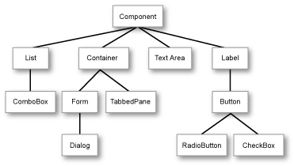

# Inheritance


This lesson introduces the concept of **inheritance** in object-oriented programming, which allows creating new classes based on existing classes. It also presents the concept of **polymorphism**, which enables functions and methods to work with objects of different types in a consistent manner.

## Concept of inheritance

Let's consider that in our program we have a class to represent animals:

```python
class Animal:

    name: str
    age: int

    def __init__(self, name, age):
        self.name = name
        self.age = age

    def make_a_noise(self):
        print('grr')
```

Here is a simple example of usage:

```python
cat = Animal('Mixet', 3)
dog = Animal('Blaqui', 3)
cat.make_a_noise()            # prints grr
dog.make_a_noise()            # prints grr
```

But maybe, after some time, we want to make the behavior of dogs and cats more realistic: dogs bark making _bub_, but cats meow making _meu_. So we could modify the `Animal` class like this:

```python
class Animal:

    name: str
    age: int
    type: str  # cat or dog

    def __init__(self, name, age, type):
        assert type in ['cat', 'dog']
        self.name = name
        self.age = age
        self.type = type

    def make_a_noise(self):
        if self.type == 'cat':
            print('meu')
        else:
            print('bub')
```

Well... But when more types of animals are needed, we will have to review the code inside the `Animal` class again. In this case it is simple enough, but with classes with many more methods, it quickly becomes tedious and repetitive and, therefore, it is easy to miss cases. And nobody wants to read code with so many conditionals.

In these cases, the mechanism of **inheritance** is the solution. Inheritance is a fundamental concept in object-oriented programming that allows the creation of new classes based on existing classes.

With inheritance, we would start by defining the `Animal` class as at the beginning:

```python
class Animal:

    name: str
    age: int

    def __init__(self, name, age):
        self.name = name
        self.age = age

    def make_a_noise(self):
        print('grr')
```

and, from it, we would define a new `Cat` class and a new `Dog` class:

```python
class Cat(Animal):

    def make_a_noise(self):
        print('meu')


class Dog(Animal):

    def make_a_noise(self):
        print('bub')
```

The syntax `class Cat(Animal)` and `class Dog(Animal)` indicates that the `Cat` and `Dog` classes inherit from the `Animal` class. This reflects the fact that cats and dogs are animals. At the Python level, this also means that objects of the `Cat` class have the same attributes as those of the `Animal` class, and the same for objects of the `Dog` class. Therefore, we can do something like

```python
cat = Cat('Mixet', 3)
print(cat.age)         # prints 3
```

because every cat (and every dog), by being an animal, has an `age` attribute and a `name` attribute.

Now, the definition of the classes has **redefined** the `make_a_noise` method, so each object will now make the noise corresponding to its type:

```python
animal = Animal('Campió', 6)
cat = Cat('Mixet', 3)
dog = Dog('Blaqui', 4)
animal.make_a_noise()         # grr
cat.make_a_noise()            # meu
dog.make_a_noise()            # bub
```

Note that, since an object of type `Animal` has not been specialized, it continues to make _grr_.

Redefining methods of inherited classes is not mandatory, but when done, the same interface must be respected.

Inherited classes can have new methods, but these are specific to elements of that type. For example, cats can purr, while dogs cannot. Therefore, if we now add the `purr` method to `Cat`:

```python
class Cat(Animal):

    def make_a_noise(self):
        print('meu')

    def purr(self):
        print('ron-ron')
```

we can apply this operation to cats, but not to dogs:

```python
cat = Cat('Mixet', 3)
dog = Dog('Blaqui', 4)
cat.purr()            # ron-ron
dog.purr()            # ❌ AttributeError: 'Dog' object has no attribute 'purr'
```

Similarly, if we now add a `dangerous` attribute to the `Dog` class to indicate whether a dog is potentially dangerous or not:

```python
class Dog(Animal):

    dangerous: bool
    ...
```

we can access this property for dogs, but cats will not have it:

```python
dog = Dog('Blaqui', 4)
cat = Cat('Mixet', 3)
print(dog.dangerous)        # prints True or False
print(cat.dangerous)        # ❌ AttributeError: 'Cat' object has no attribute 'dangerous'
```

Often, the parent class constructor is reused in the child class constructor. This can be done by explicitly invoking the parent class constructor from the child class constructor via `super()`. For example, in the `Dog` class, we can invoke the `Animal` constructor to initialize the `name` and `age` attributes:

```python
class Dog(Animal):

    dangerous: bool

    def __init__(self, name, age, dangerous):
        super().__init__(name, age) # invokes the Animal constructor
        self.dangerous = dangerous

    def make_a_noise(self):
        print('bub')
```

Inheritance thus allows new classes (called **child** or **derived** classes) to inherit the attributes and methods of existing classes (called **parent**, **base**, or **super** classes). This implies that child classes can reuse and extend the behavior of parent classes, avoiding code duplication. Moreover, inheritance facilitates hierarchical organization of code, as classes can be grouped into more general categories (parent classes) and more specific categories (child classes). This hierarchical structure improves code understandability and allows changes in parent classes to automatically affect all child classes, promoting consistency and maintainability of the system.

## Inheritance and polymorphism

A great advantage of inheritance is that functions can handle objects without knowing exactly their type but invoking the functions that correspond to their type.

To see its usefulness in a concrete example, let's revisit the previous class hierarchy:

```python
class Animal:
    def make_a_noise(self):
        print('grr')

class Cat(Animal):
    def make_a_noise(self):
        print('meu')

class Dog(Animal):
    def make_a_noise(self):
        print('bub')
```

Suppose we have a function that makes an animal make noise a certain number of times:

```python
def make_many_noises(animal, times):
    for _ in range(times):
        animal.make_a_noise()
```

In this case, it is obvious that the following code

```python
animal = Animal('Campió', 6)
make_many_noises(animal, 3)
```

will print _grr_, _grr_, _grr_. But what is not so clear is that, since cats and dogs are animals, the `make_many_noises` function can also be applied to objects of type `Cat` and `Dog`! And, moreover, the `make_a_noise` method invoked by the `make_many_noises` function corresponds to the object it receives:

```python
cat = Cat('Mixet', 3)
dog = Dog('Blaqui', 4)
make_many_noises(cat, 3)       # meu, meu, meu
make_many_noises(dog, 3)       # bub, bub, bub
```

This is great, because although the `make_many_noises` function was written for animals, its final behavior depends on the type of animal passed as a parameter. Thanks to inheritance, functions can be written that manipulate objects of types whose details are not yet fully known.

This concept is called **polymorphism**. Polymorphism is the ability of objects of different classes to respond to the same method or message in a unique and consistent way, allowing uniform treatment despite the particular differences of each class.

Note: this behavior can only be performed for derived classes. If we have a function that accepts objects of type `Cat`, it can assume that cats (and all classes derived from them) have the `purr` method, but objects of type `Dog` do not have it and therefore cannot be passed as a parameter. This error can be easily detected with mypy or PyLance: INSERT IMAGE. If type error detection is ignored, this error will manifest at runtime.

Polymorphism works not only with functions but also with methods. For example, if we have an `Animal` class with a `make_a_noise` method and a `Cat` class that redefines this method, we can call `make_many_noises` on an object of type `Cat` and the `make_a_noise` method that will be executed is the one from the `Cat` class:

```python
class Animal:
    def make_a_noise(self):
        print('grr')
    def make_many_noises(self, times):
        for _ in range(times):
            self.make_a_noise()

class Cat(Animal):
    def make_a_noise(self):
        print('meu')

class Dog(Animal):
    def make_a_noise(self):
        print('bub')
```

Indeed:

```python
animal = Animal()
animal.make_many_noises(3)    # grr, grr, grr
cat = Cat()
cat.make_many_noises(3)       # meu, meu, meu
dog = Dog()
dog.make_many_noises(3)       # bub, bub, bub
```

In fact, polymorphism is not a feature of methods or functions, but of objects.

## Class hierarchy

It is very common for a base class to give rise to more than one base class. For example, `Cat`, `Dog`, and `FarmAnimal` can derive from `Animal`. And `Cow` and `Sheep` can derive, in turn, from `FarmAnimal`.

This is usually represented like this:


When using libraries, it is very common to encounter very complex class hierarchies, such as this one for graphical elements of an app:



## Application: Geometric shapes

```python
from dataclasses import dataclass
import math


@dataclass
class Point:
    """A point in a 2D space."""

    x
    y


class Shape:
    """A base class for geometric shapes."""

    _name = "shape"  # Class attribute for the name of the shape
    _center  # Center of the shape

    def __init__(self, center):
        self._center = center

    def center(self):
        return self._center

    def area(self):
        return 0.0

    def __str__(self):
        return f"{self._name} with center ({self._center.x}, {self._center.y})"


class Circle(Shape):
    """A class representing a circle shape."""

    _name = "circle"
    _radius

    def __init__(self, center, radius):
        super().__init__(center)
        self._radius = radius

    def area(self):
        return math.pi * (self._radius**2)

    def perimeter(self):
        return 2 * math.pi * self._radius


class Rectangle(Shape):
    _name = "rectangle"
    _width
    _height

    def __init__(self, center, width, height):
        super().__init__(center)
        self._width = width
        self._height = height

    def area(self):
        return self._width * self._height

    def perimeter(self):
        return 2 * (self._width + self._height)

if __name__ == "__main__":
    s = Shape(Point(0, 0))
    c = Circle(Point(1, 1), 5)
    r = Rectangle(Point(-1, -1), 4, 6)
    print(f"{s} and area {s.area()}")
    print(f"{c}, area {c.area()} and perimeter {c.perimeter()}")
    print(f"{r}, area {r.area()} and perimeter {r.perimeter()}")
```

## Multiple inheritance

**Multiple inheritance** is a concept in object-oriented programming where a class can inherit attributes and methods from two or more parent classes. This feature allows a new class to obtain characteristics from multiple sources, combining them into a single child class.

An example in Python could be a class that inherits from two different parent classes:

```python
class Shape:
    ...

class Color:
    ...

class FilledShape(Shape, Color):
    ...
```

In this example, the `FilledShape` class inherits from both the `Shape` class and the `Color` class. This means that a filled shape created with this class can access the methods of shapes and the methods of colors. Likewise, a `FilledShape` can be passed as an actual parameter to any function that receives a formal parameter of type `Shape` and to any function that receives a formal parameter of type `Color`.

Multiple inheritance is an advanced topic: The dangers of multiple inheritance include complexity and difficulty in maintaining code, as multiple sources of behavior could collide or cause conflicts. Moreover, it can lead to excessive dependency between classes, making future modifications difficult and reducing system flexibility. The multiple inheritance hierarchy can also cause readability and comprehension problems, especially in large projects.

<Authors authors="jpetit"/>