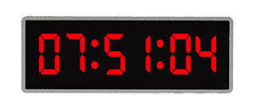

# Application: Adding One Second



This lesson reinforces the use of conditional statements with a program that adds one second to a given time of day, provided as hours, minutes, and seconds.


## Problem Description

Consider the following problem: Given a time of day (through the values corresponding to hours, minutes, and seconds), we want to add one second to this time. Additionally, the result should be written in the usual clock format: hours, minutes, and seconds are written with two digits and separated by colons. For example, given the time ~~14:09:59~~, the output should be ~~14:10:00~~.

### Input

The input consists of three natural numbers `h`, `m`, and `s` representing a time of day, that is, such that 0 ≤ `h` < 24, 0 ≤ `m` < 60, and 0 ≤ `s` < 60.

### Output

The new time defined by h, m, and s plus one second must be printed in the format ~~HH:MM:SS~~.

### Examples

- For input ~~10 20 30~~ the output should be ~~10:20:31~~.
- For input ~~0 0 59~~   the output should be ~~00:01:00~~.
- For input ~~23 59 59~~ the output should be ~~00:00:00~~.


## Solution

To solve the problem, we will divide the program into three steps:

1. First, read the input data (a time of day).
2. Then, add one second to this time of day.
3. Finally, print the resulting time of day in the required format.

It is very common to divide a program into these three steps (reading, calculation, and writing). We detail them below:

### 1. Reading the time

As stated, the input consists of three natural numbers `h`, `m`, and `s` representing a time of day.

Reading is straightforward: just read the three values one after another:

```python
h = yogi.read(int)
m = yogi.read(int)
s = yogi.read(int)
```

Remember that these instructions read three integers and store them in order in the variables `h`, `m`, and `s` respectively.


### 2. Incrementing one second

To add one second to the time, we need to add one unit to the variable `s`, which represents the number of seconds. How do we do it? With the instruction

```python
s = s + 1
```

For example, suppose `s` is 23 before executing this line. First, the value of `s + 1` is calculated, which is 24. Then, this value is copied to `s`. The final effect is an increment of `s`, in this case from 23 to 24.

If the resulting number in `s` is less than 60, we are done. Otherwise, the number of seconds is exactly 60 (because we know from the problem statement it was between 0 and 59), so we set the number of seconds `s` to zero and add one to the variable `m`, which represents the number of minutes. If the resulting number is less than 60, we are done as well. Otherwise, we need to set the number of minutes `m` to zero and add one to the variable `h`, which represents the number of hours. Finally, if the resulting number of hours is 24, we also set `h` to zero, because ~~24:00:00~~ is not a valid time: it should be ~~00:00:00~~.

We can implement this whole process as follows with nested conditionals:

```python
s = s + 1
if s == 60:
    s = 0
    m = m + 1
    if m == 60:
        m = 0
        h = h + 1
        if h == 24:
            h = 0
```

In this program, phrases like "*If the resulting number is less than 60, we are done. Otherwise, ...*" have been coded in reverse: `if s == 60: ...`. This way we avoid constructions with empty bodies.

> 👁️ Remember that the comparison operator is written with two equals signs (`==`) and the assignment statement uses a single equals sign (`=`). Therefore, when checking if `h` has reached 24, the condition `h == 24` is used, but when setting its value to zero, the instruction `h = 0` is used. Also, note that in computer science, the assignment operator `=` (read as *assign by value*) means that the value expressed on the right is stored in the variable on the left. In mathematics, *s* = *s* + 1 would be nonsense.


### 3. Printing the result

Once the time has been incremented by one second, it's time to print the result: the values of the variables `h`, `m`, and `s` separated by `:`. Also, each number must be printed with two digits. How to achieve this? By printing a zero before the number if its value is less than ten.

We could try to print the hour part like this:

```python
if h < 10:
    print(0, h)
else:
    print(h)
```

But this has two drawbacks:

1. In `print(0, h)`, the `0` and `h` are printed separated by a space.

2. Each of the two `print`s ends with a newline, which will cause the next text to appear on the next line.

Therefore, we need to specify two additional parameters to the function:

1. `sep` indicates what text will separate the given elements,

2. `end` indicates what text will be printed at the end of the `print`.

We can use them like this:

```python
if h < 10:
    print(0, h, sep='', end=':')
else:
    print(h, end=':')
```

so that the separation between `0` and `h` is empty and the colon is printed at the end.

Then we just need to complete it in the same way for the minutes and seconds parts:

```python
if m < 10:
    print(0, m, sep='', end=':')
else:
    print(m, end=':')
if s < 10:
    print(0, s, sep='')
else:
    print(s)
```

For minutes, it's the same as for hours; for seconds, no end parameter is needed because the default value of `end` is a newline, which is what we want.


### Complete solution

The complete program is as follows:

```python
import yogi

# read the time of day
h = yogi.read(int)
m = yogi.read(int)
s = yogi.read(int)

# add one second
s = s + 1
if s == 60:
    s = 0
    m = m + 1
    if m == 60:
        m = 0
        h = h + 1
        if h == 24:
            h = 0

# print the resulting time of day in the proper format
if h < 10:
    print(0, h, sep='', end=':')
else:
    print(h, end=':')
if m < 10:
    print(0, m, sep='', end=':')
else:
    print(m, end=':')
if s < 10:
    print(0, s, sep='')
else:
    print(s)
```


### Alternative solution

To solve this problem, we can also be inspired by the time decomposition program. The calculation part would be like this:

```python
# add one second
n = 3600*h + 60*m + s + 1       # calculate total number of seconds
if n == 3600 * 24:              # to avoid 24:00:00
    n = 0
h = n // 3600                   # calculate number of hours
m = (n % 3600) // 60            # calculate number of minutes
s = n % 60                      # calculate number of seconds
```


<Authors authors="jpetit roura"/>