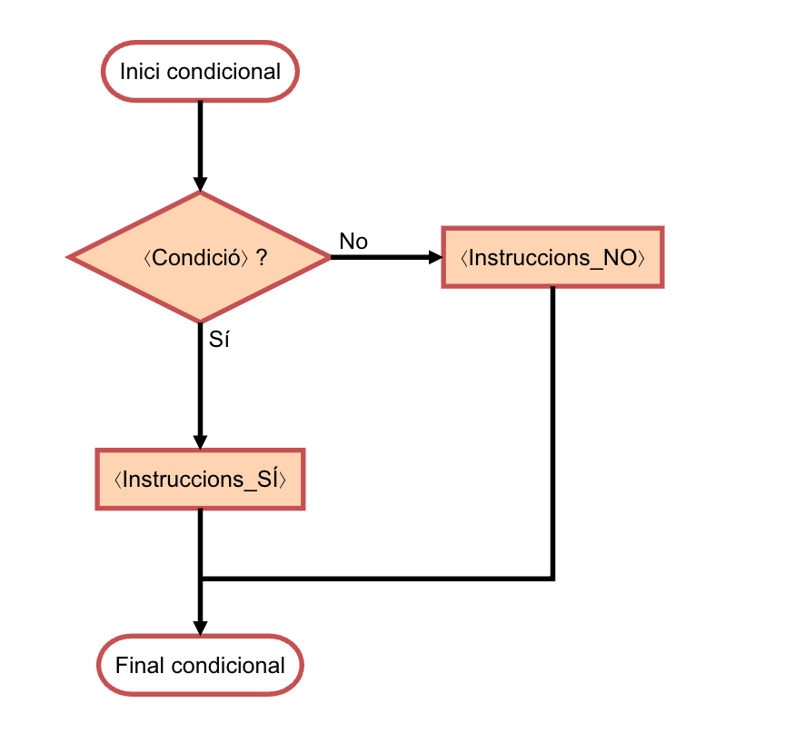
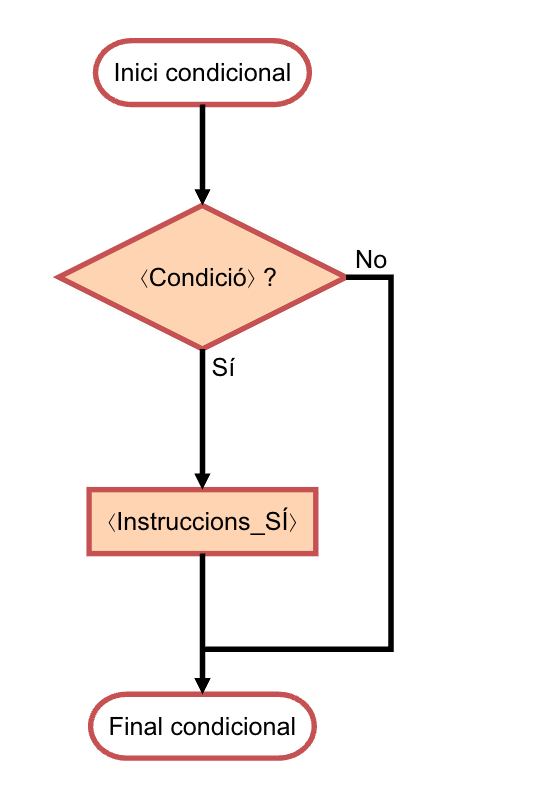
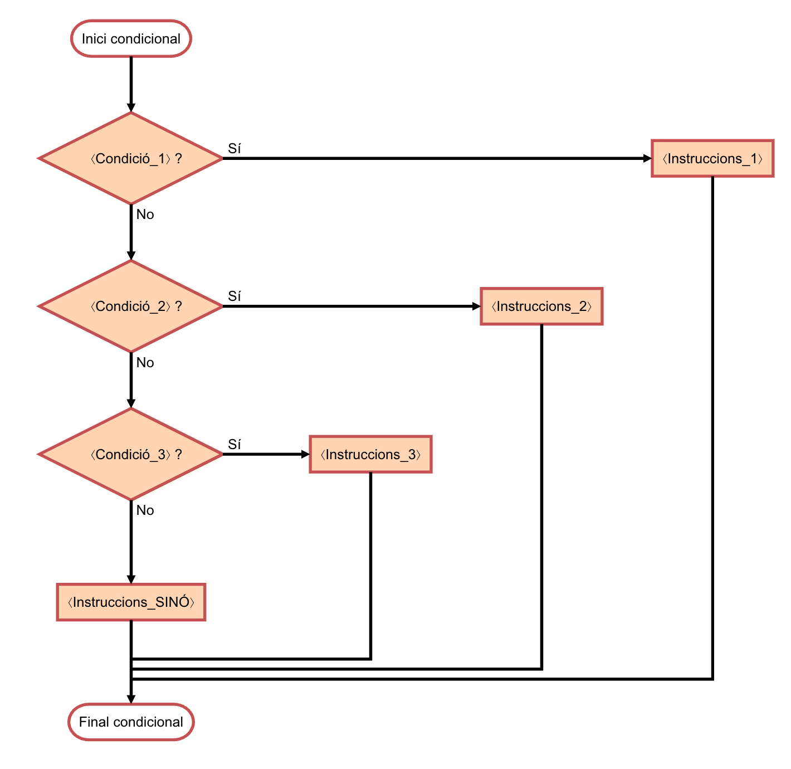

# Conditionals


This lesson introduces the conditional statement, which allows
the computer to execute certain instructions or others
depending on whether a certain condition is met or not.
Thanks to conditional statements, we can write programs
that make decisions.

## Maximum of two integers

Suppose we want to write a program that reads two integers, say `a` and `b`, and
prints an integer, say `m`, which is the greater of `a`
and `b` (that is, the maximum of `a` and `b`).

Using a previous program as a pattern, we can write an almost complete program like this:

```python
from yogi import read

# reading input data
a = read(int)
b = read(int)

# calculation of m as the maximum of a and b
...

# printing the result
print(m)
```

The program is not finished because we have not yet specified how to calculate the result,
that is, what the value of `m` should be based on the values of `a` and `b`. How to do it?

Since there is no operator that directly calculates the maximum between two numbers,
we will use a **conditional statement**, which allows
executing one instruction or another depending on a certain condition.
In Python, the conditional statement is written using the keywords `if`
and `else`, in the following form:

```python
if ⟨Condition⟩:
    ⟨Instructions_IF⟩
else:
    ⟨Instructions_ELSE⟩
```

The operation is simple: If the ⟨Condition⟩ is true, the block of ⟨Instructions_IF⟩ is executed;
otherwise, the block of ⟨Instructions_ELSE⟩ is executed.
The following flowchart shows how the conditional statement works:



The `else` part
is optional: if it is not provided, nothing will be done when the condition is not met.
In this case, it is written as follows:

```python
if ⟨Condition⟩:
    ⟨Instructions_IF⟩
```

The following flowchart shows how the conditional statement works without `else`:



Note that the instructions ⟨Instructions_IF⟩ and ⟨Instructions_ELSE⟩ are written **indented**, that is,
more to the right (typically with four spaces). This way the computer can know when they start and end,
and humans can visually understand it.

Thus, to calculate the maximum between `a` and `b`, we can use the conditional statement
as follows:

```python
if a > b:
    m = a
else:
    m = b
```

This snippet says that when the value of `a` is greater than that of `b`,
the value of `a` should be copied to the variable `m`. Otherwise (that is, when
the value of `a` is less than or equal to that of `b`), the value
of `b` should be copied to the variable `m`. In either case, the final value of `m`
will be the maximum between the values of `a` and `b`, as required.

The complete program is thus:

```python
from yogi import read

# reading input data
a = read(int)
b = read(int)

# calculation of m as the maximum of a and b
if a > b:
    m = a
else:
    m = b

# printing the result
print(m)
```

In this program, we wrote the condition of the conditional statement using the operator
`>`, which indicates if the first value is greater than the second. There are also operators
`<` (less than), `>=` (greater than or equal to), `<=` (less than or equal to),
`==` (equal to), and `!=` (not equal to). These operators are called **relational operators** and are given in the following table:

| operator | meaning        |
| -------- | -------------- |
| `==`     | equal          |
| `!=`     | different      |
| `<`      | strictly less  |
| `>`      | strictly greater |
| `<=`     | less or equal  |
| `>=`     | greater or equal |

👁️
Note that `x == y` (with two equals)
compares if the values of `x` and `y` are equal,
while `x = y` (with one equal) assigns the value of `y` to `x`. Do not confuse them.

👁️
Some editors and viewers display symbols like `<=` as `≤`, because it is more aesthetically pleasing. Still, you must type <code>&lt;</code> <code>=</code>.

## Exercise

Below are some alternatives for the previous program.
Can you differentiate the correct ones from the incorrect ones?

```python
# Fragment 1: Correct or incorrect?
if a >= b:
    m = a
else:
    m = b
```

```python
# Fragment 2: Correct or incorrect?
if a < b:
    m = b
else:
    m = a
```

```python
# Fragment 3: Correct or incorrect?
if a <= b:
    m = b
else:
    m = a
```

```python
# Fragment 4: Correct or incorrect?
if a > b:
    m = a
if b >= a:
    m = b
```

```python
# Fragment 5: Correct or incorrect?
if a > b:
    m = a
if a < b:
    m = b
```

::: details Click to see the solution
All are correct except fragment 5. This fragment is incorrect because when `a` is equal to `b`, neither instruction is executed and, therefore, `m` remains undefined.
:::

## Minimum and maximum of two integers

Suppose now we want to write a program that reads two numbers,
and prints the minimum and maximum on one line,
separated by a space.
Here is one possible solution (note that we often omit
the `import` to save space):

```python
a = read(int)
b = read(int)
if a < b:
    minimum = a
    maximum = b
else:
    minimum = b
    maximum = a
print(minimum, maximum)
```

Another possible implementation would be to dispense with the variables
`maximum` and `minimum` and print the values of `a` and `b`
in the correct order:

```python
a = read(int)
b = read(int)
if a < b:
    print(a, b)
else:
    print(b, a)
```

For a program as short as this, any of the solutions is
equally acceptable, but in slightly longer programs it is often convenient
not to mix calculations with printing results.

## Maximum of four integers

Now suppose we want to write a program that reads four numbers,
and prints the maximum. Here is one possible solution:

```python
a = read(int)
b = read(int)
c = read(int)
d = read(int)
if b > a:
    a = b
if c > a:
    a = c
if d > a:
    a = d
print(a)
```

Let's look at the first `if`:

```python
if b > a:
    a = b
```

What this line does is update the value of `a` if `b` is greater.
Otherwise, it does nothing (because there is no `else` branch;
remember it is optional).
The result is that after executing this line,
`a` contains the maximum between the initial values of `a` and `b`.
Similarly, after the second `if`,
`a` contains the maximum among the initial values of `a`, `b`, and `c`.
And after the last `if`,
`a` contains the maximum of the four numbers read,
that is, the requested result,
which can now be printed.

In this solution, we did not explicitly use any variable to store the
output, but took advantage of one of the input variables to do so
(`a`, specifically). This is allowed in this case because we do not need to keep the original value of the
input variables. In slightly longer programs, this can be detrimental.

## Nested conditionals

Suppose we want a program that reads a number and says whether it is positive, negative, or zero.
Taking into account what we have explained, we could write it like this:

```python
x = read(int)
if x > 0:
    print('positive')
else:
    if x < 0:
        print('negative')
    else:
        print('zero')
```

Note that, in this case, the instruction corresponding to the first `else` (when `x >= 0`) is a new conditional.
These are called **nested conditionals**. Notice how the nesting relationship can be seen through indentation.

The program could be written in many other ways. For example, the following solution nests the second conditional inside the first `if`:

```python
x = read(int)
if x >= 0:
    if x == 0:
        print('zero')
    else:
        print('positive')
else:
    print('negative')
```

To reduce nesting in programs (nesting is useful but complicates reading the program),
Python has the `elif` statement which is a contraction of `else if` and does not require a new indentation level:

```python
x = read(int)
if x > 0:
    print('positive')
elif x < 0:
    print('negative')
else:
    print('zero')
```

Thus, first the condition `x > 0` is evaluated. If true, `positive` is printed and the conditional block ends.
Otherwise, the condition `x < 0` is evaluated. If this is true, `negative` is printed and the conditional block ends.
Otherwise (when neither `x > 0` nor `x < 0`), `zero` is printed and the conditional block ends.

This is the general structure and flow of the conditional statement, the number of `elif`s is arbitrary and the `else` is optional:

```python
if ⟨Condition_1⟩:
    ⟨Instructions_1⟩
elif ⟨Condition_2⟩:
    ⟨Instructions_2⟩
elif ⟨Condition_3⟩:
    ⟨Instructions_3⟩
else:
    ⟨Instructions_ELSE⟩
```



<Authors authors="jpetit roura"/>