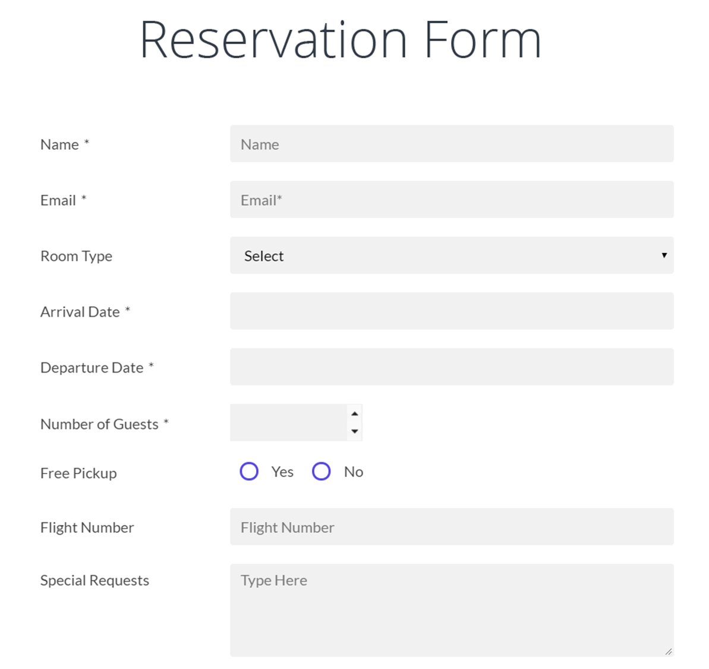

# Dataclasses


This lesson introduces how to create another very common data type: dataclasses (also called _records_ or _cards_). Dataclasses allow storing a fixed number of data of different types in a single variable and accessing any of them directly through their name. Although tuples also share this purpose, dataclasses are more flexible because they are mutable and accesses are through an identifier rather than a number.

## Introduction

A **dataclass** is a collection of related data stored in one place, as a whole. Each piece of data in a dataclass is called a **field** and has a name and a type. For example, a point could be described with a dataclass with two fields representing its X and Y coordinates. And a circle could be described with a dataclass with two fields: a point for its center and a float for its radius. Similarly, a dataclass to store information about a worker could store their name, address, and birth date, which would be a value of another dataclass for storing dates.

It is easy to imagine dataclasses as form templates: In a form template, there are different fields, each with a name and a type. Each user will fill out the form template with their own data. For example, this is a form for booking a hotel room:

<center>

</center>

You can see there are fields for the client's name, their email address, the type of room, the number of guests, the arrival and departure dates... Each of these fields' values can be of different types: text for name and email, integer for number of guests, dates for arrival and departure dates, boolean for whether pickup is needed or not...

Records differ from lists and tuples in that their number of values is fixed, each field has a name instead of a position, and each field can be of a different type.

## Declaration and use of dataclasses

To declare a dataclass in Python we will use _dataclasses_; there are other ways to do it but this seems the most versatile to start with. This would be a dataclass corresponding to the information of a movie:

```python
from dataclasses import dataclass

@dataclass
class Movie:
    identifier
    title
    director
    year
    black_and_white
```

This code snippet declares a new type `Movie` as a dataclass containing fields for its identifier (an integer), its title and director (two strings), the production year (another integer), and a boolean indicating whether it is black and white or not. The title of a movie is stored in its `title` field.

Dataclasses are defined inside **classes**, a Python construct that has many more applications than what we will see for now. Also, for these classes to have some cool properties, they must be annotated with `@dataclass`, which must be imported from the standard module `dataclasses`. Inside the class, each field has a name and a type annotation, as if declaring a variable.

Once a dataclass is defined, variables of that type can be created. Look at this example:

```python
p1 = Movie(
    1001,
    "Star Wars IV",
    "George Lucas",
    1977,
    False,                  # this last comma is optional
)

p2 = Movie(
    1234,
    "The Kid",
    "Buster Keaton",       # incorrect: should be "Charlie Chaplin"
    1921,
    True,
)
```

The variables `p1` and `p2` have been initialized by using the name of their type as if it were a function (in fact, this is called a **constructor**), and providing the list of values for their fields, in the same order in which they were declared. Obviously, these values must be compatible with the declared fields.

Once created, the variables `p1` and `p2` are now of type `Movie`:

```python
>>> type(p1)
<class '__main__.Movie'>
```

The only operation that can be done on a variable of dataclass type is selecting one of its fields. This is done by writing the variable name, a dot, and the field name.

For example, this snippet says whether `p1` is earlier or later than `p2`:

```python
if p1.year < p2.year:
    print("Earlier")
else:
    print("Later")
```

And this piece of code corrects the director of _The Kid_:

```python
p2.director = "Charlie Chaplin"
```

In the first case, the `year` fields were selected to query them. In the second case, the `director` field of `p2` was selected to modify it.

In Python, dataclasses are also objects, like lists. Therefore, dataclasses are manipulated through references, with the advantages and risks that this entails.

There are two fundamental differences between tuples and dataclasses:

1. While tuples had fields identified by numbers starting at zero, dataclasses have their fields identified by names. When there are many fields, this makes manipulation easier (no need to remember that 3 represents the title).

2. While tuples were immutable, changing the values of dataclass fields is possible (and common).

And that's it! There's nothing more: Dataclasses are very simple to declare and use. Below we give some applications and see more details.

<Authors authors="jpetit"/>
