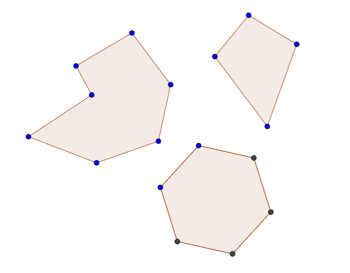
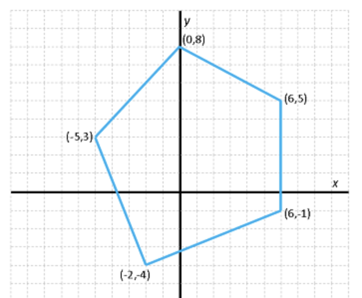

# Application: Simple polygons



A **simple polygon** is a polygon whose non-adjacent sides do not intersect. In this section, we want to define data types to manipulate simple polygons and to calculate their perimeter and area. Along the way, we will introduce a type for points in the plane and see how to define lists of structures.

## Point type

To start, we see that a polygon is given by the positions of its points in the plane. Therefore, we need some way to represent points. Since a point has two coordinates, we can represent them with a structure with two fields of real type, one for the X coordinate and one for the Y coordinate:

```python
@dataclass
class Point:
    x
    y
```

Now we could define useful functions to handle points in the plane, such as obtaining their modulus or argument, or applying a translation or scaling... Think about how to do them! As an example, here is a function that, given two points, returns their distance:

```python
def distance(p, q):
    """Returns the Euclidean distance between two points."""

    return math.sqrt((p.x - q.x) ** 2 + (p.y - q.y) ** 2)
```

## Polygon type

Next, consider how to represent a polygon. Surely, the simplest option is to describe a polygon by listing its points from the first to the last, understanding that there is an edge between every pair of consecutive points and between the last and the first. Since all points of a polygon must be of the same type (`Point`) but their number is undetermined, we can use a list to represent them! Therefore, we can define a new type for polygons using lists of points:

```python
Polygon = list[Point]
```



Defining lists of structures is very common. In this case, we could define a polygon corresponding to the figure on the right as follows:

```python
pol = [
    Point(6, 5),           # first point
    Point(0, 8),           # second point
    Point(-5, 3),          # third point
    Point(-2, -4),         # fourth point
    Point(6, -1),          # fifth point
]
```

Notice that the variable `pol` is nothing more than a list containing five points, and that we could list them using list and structure notation, writing each point inside the list. Also, if we ever wanted to access the X coordinate of the second point of this polygon, we would write `pol[1].x`: `pol` is a list, so we can apply the `[]` operator to index it; and `pol[1]` is a point, so we can apply the `.` operator to select one of its fields (`x` in this case). On the other hand, `pol.x[1]` would not make sense.

## Perimeter

Now that we can represent polygons, we can define a function to get their perimeter. We just need to sum all the distances between pairs of consecutive points, not forgetting to add the distance from the first to the last:

```python
def perimeter(polygon):
    """Returns the perimeter of a simple polygon."""

    n = len(polygon)  # number of points in polygon
    p = distance(polygon[-1], polygon[0])
    for i in range(n - 1):
        p += distance(polygon[i], polygon[i + 1])
    return p
```

Obviously, this function is only correct if the polygon is simple and we have documented it in its comment. Notice how we passed the polygon points to the distance function. The whole puzzle fits together!

And, with list comprehensions, we can make the little program even nicer:

```python
def perimeter(polygon):
    """Returns the perimeter of a simple polygon."""

    n = len(polygon)  # number of points in polygon
    return sum([distance(polygon[i], polygon[i + 1]) for i in range(-1, n - 1)]) 
```

## Area

Similarly, we can calculate the area of a simple polygon using the *Gauss's formula* [$\small[\mathbb{W}]$](https://en.wikipedia.org/wiki/Shoelace_formula):

```python
def area(polygon):
    """Returns the area of a simple polygon."""

    n = len(polygon)  
    s = polygon[n - 1].x * polygon[0].y - polygon[0].x * polygon[n - 1].y
    for i in range(n - 1):
        s += polygon[i].x * polygon[i + 1].y - polygon[i + 1].x * polygon[i].y
    return s / 2
```

**Exercise:** Use `sum` and list comprehensions to avoid the loops in the two previous functions.

<Autors autors="jpetit"/> 