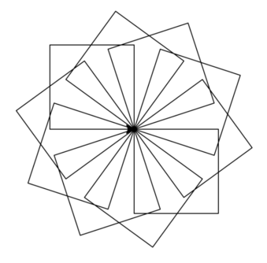

# Actions


This lesson introduces actions, a new type of subprogram, similar to functions. Instead of returning a value, an **action** is a subprogram that produces effects during its execution. Additionally, this lesson shows how breaking a program into different subprograms makes it easier to write, read, understand, and maintain.


## Drawing many rotated squares with actions

In [a previous lesson](/iterations/polygons.html) we saw how to draw a nice geometric figure with many rotated squares. The solution we wrote was this:

```python
import turtle
import yogi

size = yogi.read(int)
rotations = yogi.read(int)
angle = 360 / rotations

j = 0
while j < rotations:
    i = 0
    while i < 4:
        turtle.forward(size)
        turtle.right(90)
        i = i + 1
    turtle.right(angle)
    j = j + 1

turtle.done()
```

And it produced drawings like this:



First, the size of the sides (`size`) and the desired number of rotations (`rotations`) are read. Then, a value `angle` is calculated to avoid recalculating it each time. Then, for each rotation, each square is drawn and the turtle is rotated. To draw the square, the turtle moves forward and turns four times. The solution contains two nested loops, which shows that the program is already somewhat complicated.

Indeed, programs written this way quickly become a bit more complex than one would like. When drawing shapes, the initial values of variables like `i` and `j` are delicate, and having to maintain all of them at once becomes more and more difficult as the number of lines in the program increases. Breaking the program into different subprograms could be a way to simplify it.

To do this, we decide that a subprogram will handle the part corresponding to drawing our rotated squares. Then the main program becomes much slimmer:

```python
import yogi
import turtle

size = yogi.read(float)
rotations = yogi.read(int)
draw_rotated_squares(size, rotations)
```

Basically, we have abstracted the code that should draw the figure into the invocation of a subprogram called `draw_rotated_squares` that receives two parameters: the size of the sides and the number of rotations to draw.

Here, `draw_rotated_squares(size, rotations)` is similar to a function call, but unlike functions, this call is not part of an expression but is a statement. This is because this call does not return any value, but causes a certain effect. In this case, the effect caused is the drawing of a geometric shape in a window. For this reason, we talk about an **action** and not a **function**.

Subprograms corresponding to actions are defined similarly to functions. But since actions do not return any result, their header indicates that the return type is `None`. This is the header and specification of the action `draw_rotated_squares`:


```python
def draw_rotated_squares(size, rotations):
    """Action that draws rotated squares with sides of length size arranged in a circle."""
```

The body of actions is also defined very similarly to functions but they do not have any `return` since they do not deliver any value as a result. This could be the implementation of the action `draw_rotated_squares`:

```python
def draw_rotated_squares(size, number):
    """Action that draws number squares with sides of length size rotating them in a circle."""

    angle = 360 / number
    for i in range(number):
        draw_square(size)
        turtle.right(angle)
```

Notice that, just like with functions, the names of the formal parameters of actions do not have to correspond with those of the actual parameters used when invoking them, but they can. Also note that this action `draw_rotated_squares` uses another action called `draw_square`.


The action `draw_square` could be defined like this:

```python
def draw_square(size):
    """Action that draws a square with sides of length size starting at the current point where the turtle is."""

    for i in range(4):
        turtle.forward(size)
        turtle.right(90)
```

The complete program would then be the following:

```python
import yogi
import turtle


def draw_square(size):
    """Action that draws a square with sides of length size starting at the current point where the turtle is."""

    for i in range(4):
        turtle.forward(size)
        turtle.right(90)


def draw_rotated_squares(size, number):
    """Action that draws number squares with sides of length size rotating them in a circle."""

    angle = 360 / number
    for i in range(number):
        draw_square(size)
        turtle.right(angle)


size = yogi.read(float)
rotations = yogi.read(int)
draw_rotated_squares(size, rotations)
```


Thanks to the introduction of the actions `draw_rotated_squares` and `draw_square`, the main program has become simpler and, in the future, when we want to draw other more complex figures, we will be able to reuse these subprograms, which no longer depend on the main program, because all the interaction they maintain is through their parameters.

Clearly, the previous code is longer than the initial one, but thanks to the decomposition into subprograms, each part is also simpler. Since each part is simpler, it is easier to understand and, therefore, less likely to contain errors and, if it does, they will be easier to detect and fix, thus facilitating the maintainability of the program. Moreover, each of the included subprograms is a candidate to be reused in future projects, thus saving programming time. The use of specifications that describe the effect of each action also increases the readability of the program. The choice of good identifiers for functions and actions also helps to self-document the programs.

Structuring programs this way (that is, breaking them into small functions and/or actions as independent as possible) is always a good practice. In fact, from now on, we will make it our main design tool.


## Difference between function/action in Python

In reality, in Python there is no difference between functions and actions.
Actions are simply functions that implicitly return a value
`None` of type `None` (we will talk about this later).
This conceptual difference is established by us to reflect more
appropriately on programs, but you will see that other sources may not
use it.


<Autors autors="jpetit"/> 
