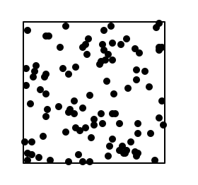

# Using Functions


This lesson introduces how to use functions. Through predefined functions or functions imported from other modules, our programs can perform more or less complex tasks without having to write so much code and, therefore, with less chance of errors.

## Using Predefined Functions

Python offers a small repertoire of **predefined functions**, that is, functions that can be used directly. A function has a name and computes a value from certain parameters. Functions can be **called** (or **invoked**) within any expression, since they produce a value.

Suppose we wanted to write the maximum of two numbers stored in the variables `a` and `b`. We have already seen how to do this using a conditional, but it is much more practical to use the predefined function `max`. For example, we could do:

```python
m = max(a, b)
```

or

```python
print(max(a, b))
```

The calculation of the maximum of `a` and `b` is now delegated to the predefined function `max`, which probably implements internally the conditional just as we would have done. But thanks to the use of the function, the purpose of our code is much clearer.

`max` is a function that, given two values, returns the larger one. We can use the `max` function anywhere an expression can appear. If we needed to write the maximum of three values `a`, `b`, and `c`, we could use two calls to `max` like this:

```python
print(max(a, max(b, c)))
```

This shows that the result of a `max` can be used as a value for a parameter of another `max`.

Even better, we can take advantage of the fact that `max` can receive any number of parameters:

```python
print(max(a, b, c))
```

Similarly, the predefined function `min` calculates the minimum of different values. Also, the predefined function `abs` calculates the absolute value of numbers:

```python
max(10, 20, 15)     👉 20
min(31, 37, 11)     👉 11
abs(12)             👉 12
abs(-12)            👉 12
abs(-4 * max(1, 3)) 👉 12
```

Similarly, the predefined function `round` rounds a real number to the nearest integer. And, if given a second parameter, it indicates that the rounding should be returned as a real number with that many decimal digits:

```python
round(4.1)          👉 4
round(4.9)          👉 5
round(3.1111, 2)    👉 3.11
round(3.1991, 2)    👉 3.20
```

The predefined function `len` is used to calculate the length of different objects. For texts, it returns their number of characters:

```python
len('Frank Zappa')  👉 11
len('')             👉 0
```

There are many more predefined functions. You can find documentation at https://docs.python.org/3/library/functions.html, but I believe the above are the ones you might need now.

## Functions for Data Type Conversion

Sometimes, programmers need to convert values from one type to values of another type. For this, the notation `type(value)` is used, where the type name is used as if it were a predefined function. These functions are called **conversion functions**. Here are some examples:

```python
>>> int(3.1)
3
>>> int(3.9)
3
>>> int('123')
123
>>> float(13)
13.0
>>> float('3.50')
3.5
>>> str(45)
'45'
>>> str(45.5)
'45.5'
>>> bool(666)
True
>>> bool(0)         # 0 is the only integer that converts to False
False
>>> bool('something')
True
>>> bool('')        # '' is the only string that converts to False
False
```

## Using Mathematical Functions

The `math` module is a standard Python module used to work with complex scientific calculations. This math module offers usual mathematical functions such as rounding, trigonometric operations, logarithmic operations, etc.

Here is a list of the most common functions in `math`:

| Function  | Description                                               |
| --------- | --------------------------------------------------------- |
| sin       | sine                                                     |
| cos       | cosine                                                   |
| tan       | tangent                                                 |
| asin      | arcsine                                                  |
| acos      | arccosine                                                |
| atan      | arctangent                                              |
| degrees   | conversion from radians to degrees                       |
| radians   | conversion from degrees to radians                       |
| sqrt      | square root                                              |
| pow       | power                                                    |
| log       | logarithm                                                |
| ceil      | rounding up                                             |
| floor     | rounding down                                           |
| trunc     | rounds up for negatives, down for positives             |
| factorial | factorial                                               |
| gcd       | greatest common divisor                                  |

For example, suppose we want to calculate the distance between two points in the plane \( p = (x_p, y_p) \) and \( q = (x_q, y_q) \). Recall that their Euclidean distance is \(\sqrt{(x_p-x_q)^2 + (y_p-y_q)^2}\). The following program implements this:

```python
from yogi import read
from math import sqrt, pow

xp = read(float)
yp = read(float)
xq = read(float)
yq = read(float)

distance = sqrt(pow(xp - xq, 2) + pow(yp - yq, 2))

print(distance)
```

There are many more functions in the math library. You can find documentation at https://docs.python.org/3/library/math.html. Also, there is a math library for complex numbers, see https://docs.python.org/3/library/cmath.html

Besides functions, the math module also offers constants such as `math.pi` (for the number π) and `math.e` (for Euler's constant). It is important to use these constants to have the most accurate values possible and not leave magic values like `3.1416` in the code.

## Using Random Functions

The standard module `random` provides functions related to generating random numbers (or, more precisely, pseudorandom numbers). These functions are somewhat different from the previous ones, in the sense that they usually do not return the same value each time they are called with the same parameters.

For example, the function `randint` returns a random number between two given numbers. These calls show how it can be used to simulate rolling a six-sided die:

```python
>>> import random
>>> random.randint(1, 6)  # you will probably get different values!
4
>>> random.randint(1, 6)  # you will probably get different values!
6
>>> random.randint(1, 6)  # you will probably get different values!
1
```

If you want to get the sum of two dice, you can write the expression `random.randint(1, 6) + random.randint(1, 6)`. Notice that in this case, you do not want to write `2 * random.randint(1, 6)`. Do you understand why?

The function `random` (inside the `random` module) returns real numbers randomly uniformly distributed between 0 and 1:

```python
>>> import random
>>> random.random()     # you will probably get different values!
0.21020758023523933
>>> random.random()     # you will probably get different values!
0.5707826663140387
```

Similarly, the function `uniform` returns real numbers randomly uniformly distributed between the two given parameters:

```python
>>> import random
>>> random.uniform(0, 1/3)  # you will probably get different values!
0.25364034594325036
>>> random.uniform(0, 1/3)  # you will probably get different values!
0.17085249688605977
```

As an application, this program visualizes the throwing of 100 random points inside a square:

```python
import turtle
import random

points = 100
size = 100

# draw the square
for i in range(4):
    turtle.forward(size)
    turtle.right(90)

# draw the points
for i in range(points):
    turtle.penup()
    turtle.goto(random.uniform(0, size), -random.uniform(0, size))
    turtle.pendown()
    turtle.dot()

turtle.done()
```

This was the output obtained in one execution:



You can find additional documentation for the `random` module at https://docs.python.org/3/library/random.html.

## Using Time-Related Functions

The standard module `time` provides functions related to time. For example, the function `time` from the `time` module (yes, they have the same name) returns a real number with the number of seconds elapsed since some arbitrary moment in the past. It is useful to measure the elapsed time in a code fragment by calculating the difference between the times after and before that fragment:

```python
import time
start = time.time()
... # code fragment we want to measure
end = time.time()
print('elapsed time:', end - start, 'seconds')
```

<Authors authors="jpetit"/>