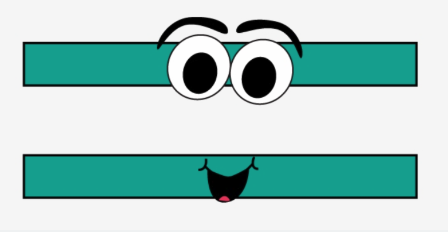

# Variables, assignments and expressions



This lesson explores in more detail the concepts of assignments, variables and expressions. For this, we first provide more information about how they work and see some examples of their use, including incrementing a variable and swapping two variables.

## Variables and assignments

When programming, it is essential to store data in variables. The way to store a particular piece of data in a variable is through the assignment statement. In Python, the assignment statement is written with the `=` operator. The effect of executing the statement

```python
variable = data
```

is to store the information `data` in the variable `variable`. This statement is read as "_variable takes the value data_". For example,

```python
player10 = 'Messi'
```

stores the text `'Messi'` inside the variable `player10`. Similarly,

```python
shirt_size = 52
```

makes the variable `shirt_size` take the value `52`.

A variable corresponds to a position in the computer's memory that stores a piece of data. You can think of a variable as a drawer with a label. The label on the drawer corresponds to the variable's name and the content of the drawer corresponds to the data it stores. Drawers have names so they can be identified and found within the vast memory of the computer.

:::tip Tip
When you see an assignment like `v = e`, do not read

"<i>v is equal to e</i>"

but rather

"<i>v takes the value e</i>".
:::

## Variable identifiers

In Python, variable names must be **identifiers**. Essentially, an identifier must start with a letter, and can be followed by zero or more letters, digits, or underscores (there are identifiers that can start with an underscore, but they have a special meaning). Lowercase and uppercase letters are considered different. Therefore, `x`, `y`, `Delta`, `player10` and `shirt_size` are valid identifiers and thus admissible variable names. On the other hand, `3turns`, `pants-size` and `💖` are not.

It is recommended that variable names (and, in general, all identifiers) be informative and reflect their purpose. For example, the name `shirt_size` is much more descriptive than `m`. But it is also useful to use variables with short names like `i` and `x` if these designate abstract entities and are only used in a few lines of code.

## Variables are variable 😀

Unlike in mathematics, in computer science, the values stored in variables can change over time, that is, during the execution of the program. That is precisely why they are called _variables_. The following program illustrates this:

<PyWeb
:code="`x = 10
print(x)
x = 20
print(x)
`"
:height="200"
/>

Run it to see that it first prints `10` and then prints `20`.

To understand what happens, let's do a **trace** of the program, that is, follow it line by line:

1. First, on line 1, the variable `x` takes the value `10`. Therefore, from this moment on, and until it is changed, the value of `x` is `10`.

2. Next, on line 2, `x` is printed. Since `x` is `10`, it prints a `10`.

3. Now, on line 3, the variable `x` takes the value `20`. The variable was `10`, but with this new assignment the value `10` is lost and replaced by `20`. Therefore, from this moment on, and until it is changed, the value of `x` is `20`. Note: When making an assignment, the old value of the variable is lost. Once lost, it cannot be recovered!

4. Next, on line 4, `x` is printed again. Since now `x` is `20`, it prints a `20`.

It is thanks to the changes in variable values that we can make interesting programs in Python, but the changing nature of variables will also make us scratch our heads more than once...

To be able to see traces of Python programs interactively in your browser, in some lessons we will use [Python Tutor](https://pythontutor.com/visualize.html#mode=edit). Here is the previous program visualized with Python Tutor:

<iframe width="800" height="500" frameborder="0" src="https://pythontutor.com/iframe-embed.html#code=x%20%3D%2010%0Aprint%28x%29%0Ax%20%3D%2020%0Aprint%28x%29&codeDivHeight=400&codeDivWidth=350&cumulative=false&curInstr=0&heapPrimitives=nevernest&origin=opt-frontend.js&py=3&rawInputLstJSON=%5B%5D&textReferences=false"> </iframe>

If you keep clicking the <kbd>Next></kbd> button you will see how the program executes, instruction by instruction. The red arrow points to the next instruction to execute, the green arrow points to the last executed instruction. As the program progresses, at the bottom right you have a representation of the current state of memory: the _global frame_ shows the defined variables and their current value. In the upper right box you can see the program's output.

Trace the program to understand how the variable `x` appears in memory and how the values it stores change.

Okay? Try to predict what the following program will print and check if you got it right by executing it step by step and watching the variable values at each moment.

<iframe width="800" height="500" frameborder="0" src="https://pythontutor.com/iframe-embed.html#code=x%20%3D%202%0Ay%20%3D%203%0Az%20%3D%20x%20%2B%20y%0Aprint%28x,%20y,%20z%29&codeDivHeight=400&codeDivWidth=350&cumulative=false&curInstr=0&heapPrimitives=nevernest&origin=opt-frontend.js&py=3&rawInputLstJSON=%5B%5D&textReferences=false"> </iframe>

## Variable initialization

Variables are not created in memory until they receive a first value. We say a variable is **initialized** when it receives this first value. For example, in the following program

```python
x = 3
y = 9
x = 12
```

the first line initializes `x`, the second initializes `y`, but the third does not initialize `x` because `x` was already initialized.

It is important to ensure that a variable is initialized before consulting its value, otherwise, we will get a runtime error. For example, if we try to run the following program

```python
print(x)      # 💣 uninitialized variable!
x = 52
```

we will get the error ~~NameError: name 'x' is not defined on line 1~~ because the variable `x` had not yet been assigned when we tried to print it. Probably the programmer of this fragment should have swapped the order of the lines.

When a program makes a runtime error (such as consulting the value of an uninitialized variable) we say that **the program crashes**. After showing the error, Python **aborts** the program, stopping its execution. Obviously, it is not desirable for programs to crash, but try to crash the program below (really, nothing bad happens!):

<PyWeb
:code="`print('Hello')
print(x)
x = 20
print('Goodbye')
`"
:height="200"
/>

On line 1, the program prints "Hello" but on line 2 it crashes and never reaches to print "Goodbye".

## An important assignment: increment

Next, we will see a very important type of assignment. It is essential to understand what happens because this type of statement is crucial.

Suppose that at a certain moment, a variable `i` has the value 12. What happens when we execute the following statement?

```python
i = i + 1
```

🤔 Hmm... At first glance, this does not seem to make any sense! How can a number be equal to itself plus one??? Every sixth grader knows this is impossible!

Yes, yes... but what we wrote is not a mathematical equation saying that the left side is the same as the right side. What we wrote is an assignment in Python. The symbol `=` does not mean _equality_, it means _assignment_. Specifically, it means that first, the right side is evaluated. Once done, this result is stored in the variable on the left. By doing this, the previous value is lost.

Therefore, if `i` is 12, when `i = i + 1` is executed, first `i + 1` is calculated, which is 13 because `i` is 12. Once the right side is calculated, this 13 is stored in `i`, causing the 12 that was there to be lost. Therefore, after `i = i + 1`, `i` is 13.

Got it? You can check it by tracing step by step below:

<iframe width="800" height="500" frameborder="0" src="https://pythontutor.com/iframe-embed.html#code=i%20%3D%2012%0Aprint%28i%29%0Ai%20%3D%20i%20%2B%201%0Aprint%28i%29&codeDivHeight=400&codeDivWidth=350&cumulative=false&curInstr=0&heapPrimitives=nevernest&origin=opt-frontend.js&py=3&rawInputLstJSON=%5B%5D&textReferences=false"> </iframe>

The statement `i = i + 1` thus increments the value of `i` by one! It first had a certain value, then it has that value plus one.

## Exercises

-   Suppose `s` is 42. What is the value of `s` after doing `s = s + 1`?

-   Suppose `x` is 14. What is the value of `x` after doing `x = x * 2`?

-   Suppose `n` is 23. What is the value of `n` after doing `n = n // 2`? Remember that `//` means integer division.

-   What are the values of the variables at the end of the following program?

    ```python
    a = 12
    b = 15
    c = a * (b - 5)
    a = a + 1
    b = b - a
    ```

:::details Solutions

-   `s` is 43.
-   `x` is 28.
-   `n` is 11.
-   `a` is 13, `b` is 2 and `c` is 168.

:::

## A common error to avoid

Throughout my teaching experience, I have encountered students who, at this point, make a common error that prevents them from progressing until it is diagnosed. So, let's pause a bit to talk about it.

Consider this program:

```python
a = 6
b = a * 2
a = a + 1
```

From everything we have explained, the final value of `a` is 7, and that of `b` is 12.

However, some people think that the final value of `b` should be 14, since `a` is 7 and `b` is double `a`. No! NO! **NO!** Instructions are executed sequentially, on the current values of the variables, and have no holistic or retroactive effects.

People who fall into this error are often very intelligent with perfect logical reasoning, but expect more from the computer than this simple machine offers them. Instructions execute one after the other, assignments only change the value on the left side based on the current values of the variables on the right side.

## Swapping two variables

Now consider a small problem: We have two variables, say `a` and `b`, each storing a value. How can we make the values of `a` and `b` swap? For example, if `a` is 12 and `b` is 14, we want to perform some instructions that lead to `a` being 14 and `b` being 12. In general, if `a` has a certain value _A_ and `b` has a certain value _B_, how do we make `a` have _B_ and `b` have _A_?

Think about it a bit before continuing. 🧠

Probably, the first approach is to say something like this: _Since `a` should have the value of `b`, I will make `a` take the value of `b`. And since `b` should have the value of `a`, I will make `b` take the value of `a`._ This leads to this fragment:

```python
a = b
b = a
```

but you immediately see the mistake, right? With the first assignment, we indeed make `a` take the value of `b`. Half the job is done. But now, `a` and `b` are equal, so why make `b` take the value of `a`? Darn! And worse: the original value of `a` is lost! 💩.

Obviously, by symmetry, reversing the order of the instructions does not fix the error either: When we transfer one variable into another, we lose the value of the assigned variable.

The solution is to make a copy of the value before it is lost. Thus, we can copy, for example, the initial value of `a` into a new variable `c`, copy `b` into `a`, and now give `b` the initial value of `a`, which is no longer in `a` but we were clever enough to copy it first into `c`:

```python
c = a
a = b
b = c
```

This is the auxiliary variable technique to swap the values of two variables. Notice that the program is analogous to the steps you take in real life when you have to swap two heavy objects: first you move the first one somewhere temporary, then put the second one in the place of the first, and finally move the first (which was in the temporary place) to the place of the second.

:::info Exercise
Write a code fragment that rotates the values of three variables: If initially `a` is _A_, `b` is _B_ and `c` is _C_, how do you make `a` be _C_, `b` be _A_ and `c` be _B_ at the end?
:::

## Expressions

An **expression** is a combination of values, variables, parentheses, operands and operators that represents a value (later we will see many more elements in expressions). Python takes care of **evaluating** expressions, that is, calculating their corresponding value. As we have seen, when a variable appears in an expression, Python substitutes the variable with its value (or gives an error if it has no value).

For example,

```python
0.5 * g * (t**2)
```

is an expression that corresponds to $\tfrac12 gt^2$ and represents the position of a body in free fall as a function of time. In the case that `g = 9.8` and `t = 2`, evaluating `0.5 * g * (t**2)` results in the real number `19.6`. Therefore, the assignment

```python
h = 0.5 * g * (t**2)
```

makes `h` take the value `19.6`. Similarly, the print statement

```python
print('The position is', 0.5 * g * (t**2))
```

would print ~~The position is 19.6~~. The `print` statement evaluates each of its parameters before printing them.

An expression can be written anywhere Python expects a value. However, remember that in an assignment, the left side must be a variable. In Python, it makes no sense to write something like

```python
i + 1 = 5        ❌
```

because the left side is an expression that does not represent any memory drawer (again, remember that in Python, the equals sign represents assignments, not equations).

## Exercises

Assuming `a = 3`, `b = 2` and `c = 4`, evaluate the following expressions:

-   `b - a`
-   `a + 2`
-   `(a + 2) * b`
-   `((a + 2 * b) // c) ** 2`
-   `(3*a + 2*b) % c`
-   `a**b * -c`

In Python, as in mathematics, exponentiation has higher precedence than multiplication, division and modulo, which have higher precedence than addition and subtraction. Calculations are carried out from left to right, respecting parentheses.

<Autors autors="jpetit"/>