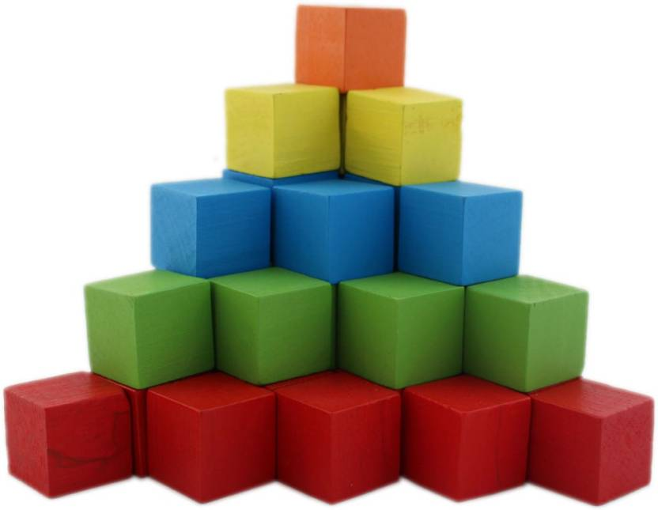
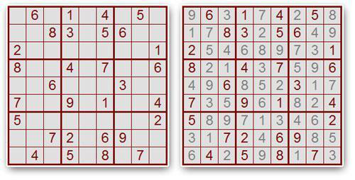
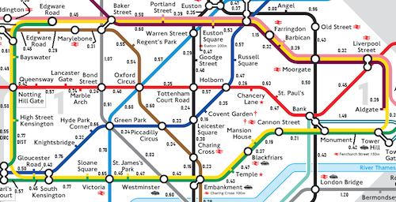
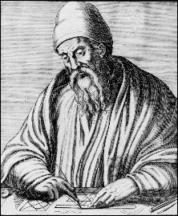

# Basic Concepts



This lesson introduces some initial basic concepts: computers, data, programs, algorithms, programming languages, bugs, problems, specifications... everything!

If this first lesson feels tedious or complicated, don’t worry. Keep going and come back later. Things will become clearer, and these definitions and examples will be useful to you.

## Computers, data, programs, languages, and algorithms

A **computer** is a machine that processes data by applying a series of elementary instructions. From some **input data** provided by a user, the computer performs a series of calculations and generates some **output data** that are delivered to the user. The calculations executed by the computer follow a **program** that encodes, using a **programming language**, an algorithm. An **algorithm** describes in detail and without ambiguity how to solve a specific **problem**, that is, how to start from some input data and arrive at some output data.

## Computational problems

A **computational problem** is a generic question that is intended to be answered automatically by a computer. The data that must be provided to a generic question in order to answer it are called **input data** (or **inputs**). The data corresponding to the answer are called **output data** (or **outputs**). A computational problem generally specifies which input data are admissible and what the relationship is between the input data and the output data.

### Example: Product of numbers

For example, "_Given two natural numbers $x$ and $y$, what is the product of $x$ and $y$?_" is a computational problem. This is a generic question, in the sense that it cannot be answered until specific data are provided, and the answer, also specific, depends on this data. Thus, for example, once the computer is told that $x$ is 12 and $y$ is 3, it can solve the computational problem for these specific data and answer that their product is 36. If it is told that $x$ is 2891 and $y$ is 4591, then the answer to the generic problem for these specific data will be 13272581.

For this computational problem, the input data are, therefore, two natural numbers $x$ and $y$, and the only output data is another natural number, say $p$. The relationship between the input data and the output data is that $p$ must be the product of $x$ and $y$, that is, $p = x \cdot y$.

### Example: Solving Sudokus

Solving Sudokus is another example of a computational problem. Remember that Sudoku is a game that consists of completing a 9 × 9 grid with numbers between 1 and 9 so that the final result has no repeated numbers in the same row, column, or 3 × 3 subgrid. This is a Sudoku and its solution:



The computational problem of Sudoku has as input an incomplete grid and as output a complete grid. The relationship between the input data and the output data is that the output grid must conform to the input grid and the rules of the game. The admissible input data are those that have exactly one solution.

### Other examples

Other examples of computational problems include:

-   _Given a natural number, is it a prime number?_

    For this problem, the input data is a single natural number, say $n$. The output data is `yes` when $n$ is a prime number, or `no` when $n$ is not.

    In the case the input is 17, the associated output is `yes`. In contrast, if the input is 33, the associated output is `no`.

-   _Given a valid date from day, month, and year, what day of the week does it correspond to?_

    For this problem, the input is a date, which can be represented by three numbers (day, month, and year). The output is a day of the week (Monday, ..., Sunday). It is emphasized that the date must be valid, otherwise the question makes no sense.

    Thus, if the input were 17 11 2006 (November 17, 2006), the corresponding output would be _Friday_. However, the input 30 2 2008 (February 30, 2008) is not admissible for this problem because February does not have 30 days. Determining whether a date is valid or not would be another computational problem.

-   _Given a non-empty set of natural numbers, which one is the maximum?_

    For this problem, the input is a set of natural numbers and the output is one of the natural numbers in this set, specifically the largest one. In this case, it is important to note that the input set cannot be empty because the maximum of an empty set is not well defined.

    If the input is the set {5,74,-2,11,71}, the associated output is the integer 74. The empty set (∅) is not an admissible input for this problem and therefore has no associated output.

-   _Given a text and a pattern, determine whether the pattern appears within the text (and where if it does)._

    This problem appears in many applications: For example, a user of a word processor may want to search for a word in their document, perhaps to replace it with another. Also, a biologist may want to know if a nucleotide sequence appears in a DNA strand. And also, an internet search engine like Google is interested in finding a particular word entered by a user in billions of web pages.

    Despite all these different applications, the inputs of this problem are always two pieces of textual information, and the output is `yes` or `no` (and if yes, where).

    Thus, if we have an input where the text is `esperança` and the pattern is `pera`, the associated output is `yes`, starting at position 3.

-   _Given the description of the lines and stops of a city's subway, a departure station, and a destination station, find the fastest route from the origin station to the destination station._

    This problem has as input a graph (where vertices correspond to stops and edges to segments between stops with their time annotation) and two vertices of this graph. The output data is a series of segments to travel, starting at the departure vertex and ending at the destination vertex, that follow the track segments and form the fastest path among all possible ones.

    -> 

**Exercise.** For the following problems, identify what the inputs are, what the outputs are, what conditions the inputs must meet to be admissible, and what the relationship is between inputs and outputs.

-   Calculate the sum of two real numbers.
-   Calculate the quotient of two real numbers.
-   Calculate the quotient and remainder of two integers.
-   Calculate the absolute value of a real number.
-   Calculate the square root of a real number.
-   Solve a linear equation.
-   Solve a quadratic equation.
-   Find the average of the grades of students in a class.
-   Calculate the distance between two points on the plane.
-   Calculate the distance between two points in space.
-   Determine if two lines are equal, parallel, or intersect.
-   Simplify a fraction.
-   Decide if two fractions represent the same rational number.

## Algorithms

An **algorithm** is an explicit set of instructions to carry out some calculation that, from some input data, produces some output data.

::: tip Abu Abdullah Muhammad ibn Musa al-Khwarizmi


The word _algorithm_ (or _algorism_) comes from the name Abu Abdullah Muhammad ibn Musa al-Khwarizmi, a 9th-century Persian mathematician and astronomer who adopted the decimal system and developed the basic methods of addition, multiplication, and division.

<div style='clear: both;'/>
:::

The instructions that can be used in an algorithm depend on the basic operations that the processor executing it can perform. In the case of digital processors of modern computers, a processor can perform logical and arithmetic operations, as well as chain instructions one after another, and execute others conditionally or repeatedly.

Algorithms can be expressed using many notations, including natural language, programming languages, pseudocode, flowcharts, circuits... In this course, we will first sketch algorithms in natural language, often helping ourselves with mathematical language. Then, we will concretize them using a programming language, specifically Python.

An algorithm is **correct** for solving a particular computational problem if, for all possible admissible input data, the output data produced by the execution of the algorithm satisfy the problem specification.

It is essential that algorithms are correct. Incorrect algorithms can cause a computer to never provide an answer (it hangs), execute some illegal instruction (for example, divide by zero), or produce incorrect results. Depending on the context, incorrect algorithms can cause catastrophic effects. For example, the Therac-25 was a radiation therapy machine controlled by a computer. Its poor programming caused six accidents between 1985 and 1987, in which patients received massive overdoses of radiation. Three of the six patients died. Another more recent error without such terrible consequences but affecting many more people is the first version of Microsoft Excel 2007, which incorrectly shows the result of multiplying 77.1 by 850: instead of giving the answer 65535, it writes 100000.

Below we present some examples of algorithms.

### School multiplication algorithm

Consider the following computational problem: given two numbers $x$ and $y$, obtain their product. To focus the discussion, we restrict ourselves to the case where both numbers are natural numbers (in computer science, natural numbers are considered to include zero: $\mathbb{N} = \{0, 1, 2, 3, ...\}$).

To solve this problem, we were taught an algorithm at school when we were very young... You surely remember it! Applying this algorithm to the numbers $x=2891$ and $y=4591$ results in the following development:

```text
             2 8 9 1
     ×       4 5 9 1
    -----------------
             2 8 9 1
         2 6 0 1 9
       1 4 4 5 5
     1 1 5 6 4
    -----------------
     1 3 2 7 2 5 8 1
```

Note that to apply this algorithm, the processor executing it must know the multiplication tables and know how to add.

:::info Exercise
Describe, in your own words but in full detail, the school multiplication algorithm.
:::

:::info Exercise
Complement the previous explanation to take into account possible negative integers.
:::

### Russian peasant multiplication algorithm

The previous algorithm for multiplying two numbers is probably the most popular (although there are countries where it is taught by shifting rows to the right instead of to the left). But there are other very different algorithms for multiplying two numbers. Below we consider the algorithm of **Russian peasant multiplication** (also called **Egyptian multiplication**, because it dates back to the way the ancient Egyptians multiplied around 2000 BC):

-   Use a table with two columns.
-   Write the two numbers to multiply ($x$ and $y$) in the first row.
-   Write the results of successively dividing $x$ by 2 (ignoring fractions) in the first column until you reach 1.
-   Write the results of successively multiplying $y$ by 2 in the second column as many times as you divided $x$ by 2.
-   Mark all the numbers in the second column that are next to an odd number in the first column.
-   Sum all the numbers in the second column that you have marked. This is the result of $x$ times $y$.

Let's apply this algorithm to the input data $x=2891$ and $y=4591$:

```text
        2891        4591
       --------------------
        1445        9182 ←
         722       18364
         361       36728 ←
         180       36728
          90      146912
          45      293824 ←
          22      587648
          11     1175296 ←
           5     2350592 ←
           2     2350592
           1     9402368 ←
       --------------------
                13272581
```

Fortunately, this algorithm gives the same answer as the one we learned at school!

Note that to apply this algorithm, the processor executing it must know how to calculate half of a number, add two numbers, and determine if a number is odd. Surely you would have preferred to be taught this algorithm at school: studying multiplication tables was hard...

:::info Exercise
Use the Russian peasant multiplication algorithm to multiply 47532 by 1735.
:::

:::info Exercise
Argue why the Russian peasant multiplication algorithm is correct.
:::

### Euclid's algorithm for GCD

The **greatest common divisor** (GCD) of two nonzero natural numbers is the largest natural number that divides both numbers without leaving a remainder. We denote by $\text{gcd}(a,b)$ the greatest common divisor of $a$ and $b$. For example, $\text{gcd}(78,24) = 6$ and $\text{gcd}(4,14) = 2$.

One application of the greatest common divisor is fraction reduction: For example, since $\text{gcd}(78, 24) = 6$, we have

$$
    \frac{78}{24} = \frac{13 \cdot 6}{4 \cdot 6} = \frac{13}{4}.
$$

One possible way to find the greatest common divisor of two numbers is to calculate all their divisors and take the largest common one. Another way to find the greatest common divisor of two numbers is to decompose each into its product of prime factors and choose those factors that appear in both decompositions. For example, to calculate $\text{gcd}(78,24)$, we find that $78 = 13 \cdot 3 \cdot 2$ and $24 = 3 \cdot 2 \cdot 2 \cdot 2$. The common factors are 3 and 2 (each only once), so $\text{gcd}(78,24) = 3 \cdot 2 = 6$. Although these algorithms are correct, in practice they are too slow and complicated.

:::tip Euclid



Euclid was a Greek mathematician who lived around the 3rd century BC and is known as the "father of geometry". He wrote the fundamental work "Elements", a systematic treatise on geometry, which profoundly influenced the development of mathematics and science for centuries.

<div style='clear: both;'/>
:::

A better alternative is to use **Euclid's algorithm**. This algorithm, discovered by the classical Greeks, was described by Euclid in his book _Elements_ around 300 BC. Many historians consider Euclid's algorithm to be the first full-fledged algorithm. Although Euclid formulated his algorithm geometrically, here we interpret it numerically. Essentially, Euclid's algorithm says:

:::info 💬
Subtract the smaller number from the larger one until they are equal; that number is the solution.
:::

Let's try to follow the operation of this algorithm to calculate the greatest common divisor of 78 and 24:

-   Initially, the two numbers are 78 and 24. Since the larger is 78 and the smaller is 24, subtract 24 from 78, leaving 54. The other number remains 24.
-   Now, since 54 and 24 are not equal, and since the larger is 54 and the smaller is 24, subtract 24 from 54, leaving 30. The numbers now are 30 and 24.
-   Continue, because 30 and 24 are still not equal. Subtract 24 from 30, leaving 6 and 24.
-   Since 6 and 24 are not equal, and the larger is now the second, subtract 6 from 24, leaving 6 and 18.
-   Again, since 6 and 18 are not equal, subtract 6 from 18, leaving 6 and 12.
-   Since 6 and 12 are not equal, subtract 6 from 12, leaving 6 and 6.
-   Now the two numbers are equal (6). The algorithm tells us that the obtained number is the greatest common divisor of the initial numbers. Therefore, $\text{gcd}(78,24) = 6$.

We can summarize the execution of the previous steps using a two-column table. In the first row, place the two numbers whose greatest common divisor we want to calculate. Then, look at which of the two is larger and, in the next row, subtract the smaller from the larger. Leave the smaller unchanged. When we reach a row with both values equal, Euclid's algorithm tells us that this number is the solution:

```text
     78  24
    --------
     54  24
     30  24
      6  24
      6  18
      6  12
      6  6
    --------
        6
```

Applying Euclid's algorithm is very simple: you only need to always consider two numbers (which change), be able to check if they are equal or not, be able to compare them to find which is larger and which is smaller, and be able to subtract one from the other.

The correctness of Euclid's algorithm is based on the following property:

**Property.** If $x$ and $y$ are strictly positive integers such that $x > y$, then $\text{gcd}(x,y) = \text{gcd}(x - y, y)$.

**Proof.** Any integer that divides $x$ and $y$ must also divide $x - y$. Therefore, $\text{gcd}(x,y) \leq \text{gcd}(x - y, y)$. On the other hand, any integer that divides $x - y$ and $y$ must also divide $x$ and $y$. Therefore, $\text{gcd}(x - y, y) \leq \text{gcd}(x, y)$.

:::info Exercise
Use Euclid's algorithm to calculate the greatest common divisor of 4290 and 910.
:::

:::info Exercise
What happens to the described Euclid's algorithm when trying to calculate the greatest common divisor of zero and another number? Fix it.
:::

:::info Exercise
What is the GCD of 123456789 and 1? Calculate it with Euclid's algorithm. Or... better not. We will see how to fix it later.
:::

:::info Exercise

The **least common multiple** of two natural numbers is the smallest natural number (different from zero) that is a multiple of both. Give an algorithm to calculate the least common multiple of two natural numbers using their prime factorization. Give a way to calculate the least common multiple of two natural numbers knowing their greatest common divisor. Explain how to use the least common multiple of different numbers to add fractions with different denominators.
:::

## Computer model

To be able to program computers, we need to know what a computer is. However, modern computers are very complicated machines, and giving an accurate description is too difficult. Therefore, we settle for describing an abstract and ideal model of a computer. Although it is a very simplified model, it contains the elements that interest us most when starting to program.

<MySnap src="./model.ts" height="360"/>

A **computer** is a machine that manipulates data by applying a series of instructions according to a program. The abstract computer model we consider is composed of the following elements:

-   **Memory:** Memory is the place where the data manipulated by the computer are stored. These data are usually numbers, letters, words, or combinations of these.

-   **Calculation unit:** The calculation unit is the place where the elementary operations that the computer can perform are carried out. These operations can be adding, multiplying, or comparing numbers, for example. The data operated on come from memory, and the results are also stored in memory.

-   **Control unit:** The control unit is responsible for chaining instructions one after another, following the logic of the program. Thanks to the control unit, certain instructions can be repeated, executed or not, etc.

-   **Input/output devices:** Input/output (I/O) devices ensure communication between the computer and the outside; they serve to input the input data and extract the output data. For simplicity, we consider that there is only one input device and one output device. The input device reads data and stores it in memory; the output device writes data stored in memory.

If we think of a typical computer today, the memory corresponds to its RAM (my computer has 16 gigabytes of memory), the calculation and control units correspond to its processor (my computer has an Intel Core at 3.1 gigahertz), and the input/output devices correspond to the devices connected to it (for example, the keyboard, mouse, and microphone are input devices; the monitor and printer are output devices; and hard drives and network connection are both input and output).

Obviously, all these elements are very complex, but operating systems allow us to consider them in a much simpler way. The **operating system** of a computer is the software that manages the computer's resources and offers services to programmers to use them while hiding their complexity. In particular, the operating system usually offers services for managing memory, processes (active programs), and peripherals (through file systems).

**Exercise.** Find out which operating system your personal computer has. Also find out which processor it has, how much memory it has, and what its input, output, and input-output devices are.

**Exercise.** Count and list how many devices with a digital processor you have at home (computers, mobiles, TVs, ...).

## Programming languages

A **programming language** is an artificial language to control a computer by precisely expressing an algorithm.

There are thousands of programming languages. Broadly, these can be classified according to their use (general purpose, systems programming, scripting), their level of abstraction (high, medium, or low level), and according to their programming paradigm (imperative, functional, or logic).

Programming languages are defined through **syntactic rules** (how things are written) and **semantic rules** (what things describe).

Since computers do not directly understand programming languages, a program written in a specific programming language must first be converted into the basic instructions that the computer really understands. This process is called **compilation**. Fortunately, this conversion can be done automatically by the computer itself through a program called a **compiler**, which also takes the opportunity to verify that the program contains no syntactic or semantic errors.

We focus on imperative programming languages. In an **imperative language**, a program consists of a series of instructions that describe changes in the data in memory. In this course, we program algorithms using the Python language. This programming language is huge; we will only see a small part of it, highlighting the constructions that most imperative languages share with it. In the next lesson, we will see how to start working in Python.

## Program development

The process of developing a program involves the following stages:

-   **Problem specification:** The first step is to specify what the problem to solve is. Specifying a problem consists of adequately describing the problem considered. For this, it is necessary to describe what its possible input data are, what the possible output data are, and what the relationship is between the output data and the input data. This involves understanding the entire context of the problem. At the specification stage, it is only about _what_ needs to be done, not _how_ to do it.

-   **Algorithm design:** Next, an algorithm must be designed to solve the problem. Designing an algorithm is a very creative task, linked to experience and knowledge of various algorithmic schemes.

-   **Program coding:** Then, a program must be written by coding the algorithm using a programming language. This program is prepared to be executed by the computer.

-   **Program testing:** Finally, once the program is ready, it must be tested. This consists of running it on some inputs to ensure that, at least on those inputs, the program works as expected.

Unfortunately, during these stages, errors are made or diagnosed that require going back to previous stages. Therefore, it is always advisable to document well the achievement of each stage.

**Programming** is the discipline that deals with writing, extending, testing, debugging, and maintaining programs. **Software engineering** is the branch of computer science concerned with all aspects of producing programs systematically and organized.

<Autors autors="jpetit"/>