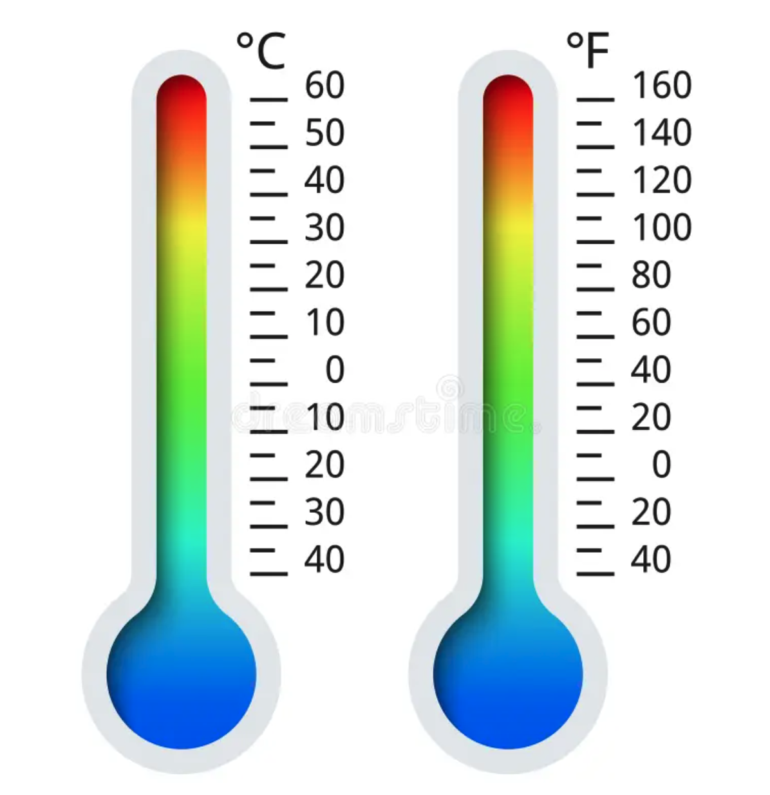

# Application: Conversion from Celsius to Fahrenheit




This lesson shows how to write a program that reads a temperature in degrees Celsius and calculates its conversion to degrees Fahrenheit.

<div style='clear: both;'/>


## Problem statement

Remember that temperatures can be expressed in degrees Celsius (°C) or degrees Fahrenheit (°F). The relationship between these two units of measurement is as follows:

```
°F = °C⋅1.8 + 32
```

We want a program that reads a temperature in degrees Celsius and calculates its conversion to degrees Fahrenheit.


:::info Hey!
Think about how to solve the problem before continuing to read!
:::


## Solution

The first step to solve any problem is to identify what its inputs are, what its outputs are, and what relationship they have between them. In this case:

- From the problem statement, it is clear that there is an input `c` which represents a temperature in degrees Celsius.

- Similarly, it is clear that the output is a temperature in degrees Fahrenheit, which can be stored in a real variable named `f`.

The relationship between the input `c` and the output `f` is `f = c⋅1.8 + 32`.

The solution must therefore perform three tasks, one after the other:

1. Read the value of `c`. This value must be a real number (with decimals).

2. Calculate the value of `f` from `c`. To do this, use the conversion formula.

3. Write the value of `f`.

In Python, this can be coded as follows:

```python
c = float(input())        # Reading the input
f = c * 1.8 + 32         # Calculating f from c
print(f)                 # Writing the output
```

The first line assigns to the variable `c` the value read from the input. The second line assigns to `f` the appropriate value from `c` by evaluating the expression `c * 1.8 + 32`. The third line prints the value of `f`.

You can try the program here:

<PyWeb
:code="`c = float(input())
f = c * 1.8 + 32
print(f)
`"
:height="250"
/>

If you want to make the program more explicit for the user, you can add a message before reading the temperature in degrees Celsius and another before writing the temperature in degrees Fahrenheit:

```python
c = float(input('Enter the temperature in degrees Celsius:'))
f = c * 1.8 + 32
print('The temperature in degrees Fahrenheit is:', f)
```

Note that in this application we had to convert the text read with `input` to a real number with `float` because the temperature can be a number with decimals. If we had used `int` instead of `float`, the program would have given an error if the user had entered a number with decimals.


<Authors authors="jpetit"/>