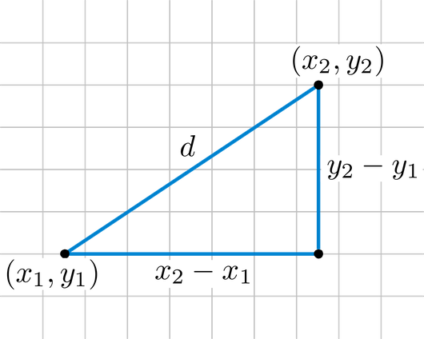

# Application: Calculation of the Euclidean distance between two points


This lesson shows how to write a program that calculates the Euclidean distance between two given points.

<div style='clear: both;'/>


## Problem statement

We want a program that, given two points, calculates their Euclidean distance. Remember that the Euclidean distance $d$ between two points $(x_1, y_1)$ and $(x_2, y_2)$ can be calculated with the formula:

$$
    d = \sqrt{(x_2 - x_1)^2 + (y_2 - y_1)^2}.
$$

Here is its geometric interpretation:



:::info Hey!
Think about how to solve the problem before continuing to read!
:::


## Solution

The first step to solving any problem is to identify what its inputs are, what its outputs are, and what relationship they have between them. In this case:

- From the problem statement, it is clear that there are two inputs: the two points. But how are these points represented? Well, with their coordinates. Therefore, the inputs are four real numbers `x1`, `y1`, `x2`, and `y2`.

- Likewise, it is clear that the output is a real number `d` that represents the Euclidean distance between the two points.

The relationship between the inputs `x1`, `y1`, `x2`, `y2` and the output `d` is the Euclidean distance formula.

The solution must therefore perform three tasks, one after the other:

1. Read the coordinates `x1`, `y1`, `x2`, `y2` of the two points. These coordinates must be real numbers (with decimals).

2. Calculate the value of `d` from `x1`, `y1`, `x2`, `y2`. To do this, use the Euclidean distance formula.

3. Print the value of `d`.


In Python, this can be coded as follows:

```python
x1 = float(input())
y1 = float(input())
x2 = float(input())
y2 = float(input())
d = ((x2 - x1)**2 + (y2 - y1)**2) ** 0.5
print(d)
```

This time, the first four lines assign to the variables `x1`, `y1`, `x2`, and `y2` the values read from the input. The fifth line assigns to `d` the relevant value from `x1`, `y1`, `x2`, and `y2` by evaluating the expression `((x2 - x1)**2 + (y2 - y1)**2) ** 0.5`. The sixth line prints the value of `d`.

Remember that, in Python, the operator `**` is the exponentiation operator. Therefore, `x**2` is the same as $x^2$ and `x**0.5` is the same as $\sqrt{x}$.

<Authors authors="jpetit"/>