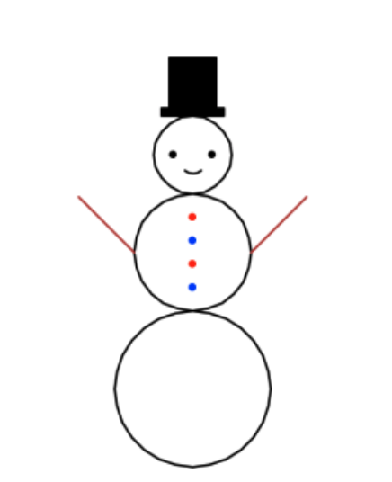
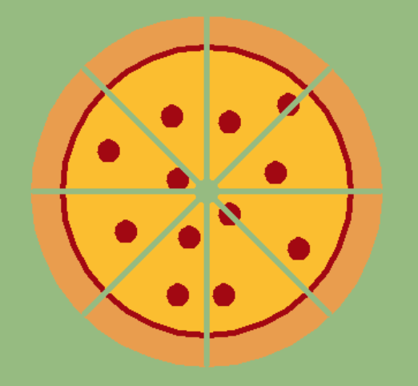
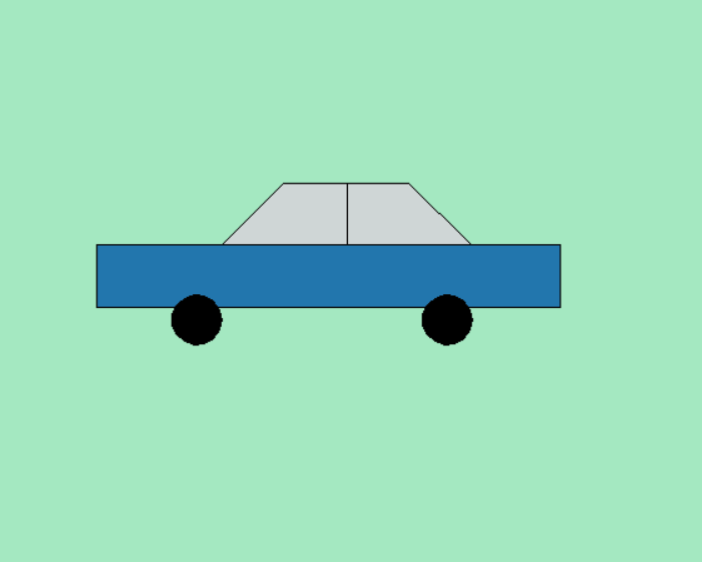

# Programs that Draw


This lesson introduces a new Python program that draws a rectangle, with the width and height desired by the user. To do this, Python's turtle is used. As an exercise, you are asked to create a program that draws a triangle.

## Program to Draw Rectangles

This program allows you to draw a rectangle:

```python
# Draw a rectangle

import turtle

width = int(input('Width? '))
height = int(input('Height? '))

turtle.forward(width)
turtle.left(90)
turtle.forward(height)
turtle.left(90)
turtle.forward(width)
turtle.left(90)
turtle.forward(height)
turtle.left(90)
```

This program is longer than the previous ones... Click the ▶ button to run it! For example, enter a width of 100 and a height of 50. If you don't see anything on the right, drag the handle upwards.

<PyWeb
:code="`# Draw a rectangle\n
import turtle\n
width = int(input('Width? '))
height = int(input('Height? '))\n
turtle.forward(width)
turtle.left(90)
turtle.forward(height)
turtle.left(90)
turtle.forward(width)
turtle.left(90)
turtle.forward(height)
turtle.left(90)
`
"
:height="600"
/>

## Python's Turtle

The drawing of the previous rectangle was done using **turtle graphics**. The turtle is a virtual little creature that walks around your screen with a pencil attached to its tail and obeys movement instructions given to it in order to draw while moving forward and backward or turning right and left.

At the start, the turtle is at the center of the drawing area facing right. If we tell it to move forward 100 units, the turtle moves 100 units to the right, leaving its trail with the pencil. If we then tell it to turn 90 degrees left and move forward 50 more units, the turtle will extend its trace, painting an angle.

In the drawing area, the triangle represents the turtle's position and direction. The old days of Logo where the turtle was a cute 8-bit graphic have long passed into the sad oblivion of the past...

To use the turtle, we must use a standard Python module called `turtle`. In Python, a module contains operations that someone has already written so that we can use them. Python offers many standard modules that enrich the language's possibilities: additionally, many more modules can be installed for graphics, network communication, music, mathematics, artificial intelligence...

To use the functionalities of a module, you first need to import it. Importing a module simply means you want to use that module. Therefore, the program starts with the instruction `import turtle`, which imports the turtle module. Then, you can use the module's operations by prefixing them with the module name and a dot. For example, `turtle.forward(width)` invokes the `forward` action of the `turtle` module that moves the turtle forward by `width` units. Similarly, `turtle.left(90)` invokes the operation to turn the turtle 90 degrees to the left.

By properly combining these operations, we manage to draw the desired rectangle. Review the program to understand it completely. Notice that the last turn is unnecessary but ensures the turtle ends up at the original point with the original orientation.

## Exercise

Now it's your turn! Using the previous program as a template, create a program that reads a length and draws an isosceles triangle of that size, with the base at the bottom, like a Delta (△).

<PyWeb
:code="`# Modify to draw a triangle\n
import turtle\n
width = int(input('Width? '))\n
turtle.forward(width)
turtle.left(90)
turtle.forward(width)
turtle.left(90)
turtle.forward(width)
turtle.left(90)
turtle.forward(width)
turtle.left(90)
`
"
:sol="`# Draw a triangle\n
import turtle\n
size = int(input('Size? '))\n
turtle.forward(size)
turtle.left(120)
turtle.forward(size)
turtle.left(120)
turtle.forward(size)
turtle.left(120)
`
"
:height="600"
/>

Don't be afraid to try and experiment. Nor to make mistakes. With these little programs you write here, you can't harm the computer.

## More Turtle Instructions

The turtle can move with these instructions:

-   `turtle.forward(d)`: moves the turtle forward `d` units.
-   `turtle.backward(d)`: moves the turtle backward `d` units.
-   `turtle.left(a)`: turns the turtle left by `a` degrees.
-   `turtle.right(a)`: turns the turtle right by `a` degrees.
-   `turtle.circle(r)`: moves the turtle in a circle with radius `r` units.
-   `turtle.home()`: moves the turtle to its initial position at the center of the drawing area.

The turtle also has operations to change its pen. These commands allow you to lift or lower the pen so the turtle moves without leaving a trace:

-   `turtle.penup()`: lifts the pen (does not draw when moving).
-   `turtle.pendown()`: lowers the pen (draws when moving).

You can also change the pen's thickness and color:

-   `turtle.pensize(s)`: sets the pen thickness to `s` units (initially 1, try 5 for a thick line).
-   `turtle.color(c)`: sets the pen color to `c`.

Colors can be given in many ways; the easiest is to provide a text value like `'black'`, `'red'`, `'blue'`, ...

The turtle offers many more operations! You can access the full documentation of the `turtle` library at https://docs.python.org/3/library/turtle.html.

## More Exercises

Try making Python programs that draw some scenes like these:




<div style="clear: left;"/>

Be creative!

<PyWeb :height="600"/>

The next lesson will teach you some fundamental Python concepts, such as the use of variables and assignments in more detail.

<Autors autors="jpetit"/>