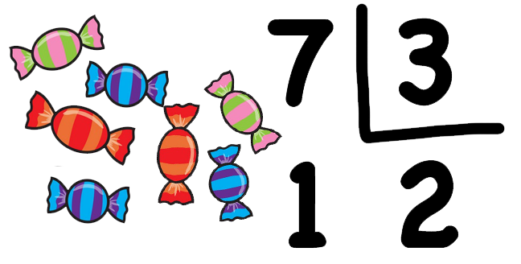

# Application: Time Decomposition


This lesson shows how to solve the problem of decomposing a given number of seconds into hours, minutes, and seconds. This allows us to deepen the use of instructions already presented and see how division with integer values works.


## Problem Statement

Consider the following problem: Given a (positive) amount of seconds `n`, we want to know how many hours, minutes, and seconds it represents. For example, if `n` is 3661, we should say that in 3661 seconds there is one hour, one minute, and one second. Also, if `n`
is 76234, we should say that in 76234 seconds there are 21 hours, 10 minutes, and 34 seconds (don't be lazy: check it!).


## Solution

As always, the first step to solve any problem is to identify what its inputs are, what its outputs are, and what relationship they have between them. In this case:

- From the problem statement, it is clear that there is an input `n` which represents a certain number of seconds.

- Likewise, it is clear that the outputs are three natural numbers `h`, `m`, and `s` which represent, respectively, the number of hours, minutes, and seconds contained in `n`. We can store them in three integer variables called `h`, `m`, and `s`.

- The relationship between the input `n` and the outputs `h`, `m`, and `s` is `3600h + 60m + s = n`, with `0 ≤ m < 60` and `0 ≤ s < 60`.


The solution must read the value of `n`, calculate the values of `h`, `m`, and `s` from `n` (we haven't thought about how yet), and print the values of `h`, `m`, and `s`. This can start like this:

```python
# Time decomposition.

n = int(input())        # Reading the input
...                     # Calculation of h, m, s from n. 🚧 To be done !!!
print(h, m, s)          # Writing the outputs
```

Obviously, we still need to do the calculation part, but the rest is already in place: The instruction `n = int(input())` indicates that an integer must be read and assigned to the variable `n`, and the `print` instruction will write the corresponding values of `h`, `m`, and `s` separated by a space.




Before continuing, we need to introduce (or _review_, since you already know it) the concept of **integer division**: Go back a few years, when you learned to divide:

— _If Carla has seven candies and she has to divide them among three friends, how many candies will she give to each friend?_

— _She will give two candies to each friend, and one will be left over!_

That is integer division! Surely Carla would never have given 2.333333 candies to her friends as a child, right? How sweet... 🍭

Precisely, the result of dividing one integer by another integer in Python with the operator `//` is integer division. Therefore, the result of `7 // 3` is `2`. Also, the operator `%` gives the remainder of the integer division! For example, the result of `7 % 3` is `1`.

Back to time decomposition: How do we calculate `h`, `m`, and `s` from `n`?

Considering that one hour is 3600 seconds, it is clear that the number of hours `h` in `n` is the result of `n // 3600`. Therefore, the calculation of `h` from `n` can be done with this assignment:

```python
h = n // 3600
```

Once we know how many hours are in `n`, how many seconds remain? Well, `n % 3600` (or `n - 3600 * h`, which is the same but longer to write). And, in this amount, how many minutes are there? The result of dividing it by 60! Therefore,

```python
m = (n % 3600) // 60
```

And how many seconds remain? The remainder of this integer division! Therefore,

```python
s = (n % 3600) % 60
```

And with this, we have the complete calculations for `h`, `m`, and `s`:

```python
h = n // 3600
m = (n % 3600) // 60
s = (n % 3600) % 60
```

At this point, notice that since 3600 is a multiple of 60, then `(n % 3600) % 60` is actually equal to `n % 60`. The complete solution is therefore this:

```python
# Time decomposition.

n = int(input())       # Reading the input
h = n // 3600          # Calculating the number of hours
m = (n % 3600) // 60   # Calculating the number of minutes
s = n % 60             # Calculating the number of seconds
print(h, m, s)         # Writing the outputs
```

And here you can comfortably try it inside your browser:


<PyWeb
:code="`# Time decomposition.\n
n = int(input())       # Reading the input
h = n // 3600          # Calculating the number of hours
m = (n % 3600) // 60   # Calculating the number of minutes
s = n % 60             # Calculating the number of seconds
print(h, m, s)         # Writing the outputs
`"
/>


## Correctness

At this point, it is appropriate to ask how we can ensure that this solution is really correct. It is correct for these reasons:

1. As required, `s` is between 0 and 59. This is a consequence of the fact that `s` is the remainder of an integer division by 60.

2. As required, `m` is between 0 and 59. This is a consequence of the fact that, since `n % 3600` is between 0 and 3599, then `(n % 3600) // 60` cannot be greater than 59.

3. As required, `n == 3600 * h + 60 * m + s`. Indeed, the equality `n = 3600 * (n // 3600) + 60 * ((n % 3600) // 60) + n % 60` is true, as we encourage you to verify.


## Alternative Solution

Often, the same problem can be solved in other (good) ways. For example, the method explained above can be coded even more compactly, without the need for any variable other than `n`:

```python
# Time decomposition, reduced version.

n = int(input())
print(n // 3600, (n % 3600) // 60, n % 60)
```

The resulting program is shorter but probably less explicit.


<Authors authors="jpetit roura"/>