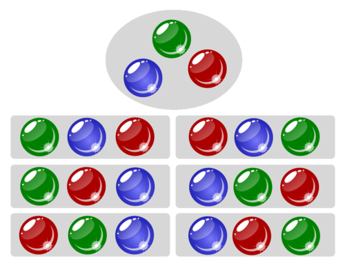

# Application: Factorial


This lesson shows algorithms to calculate factorial numbers using iterative constructs.


## Mathematical concept of factorial

Given $n$ objects, in how many ways can they be arranged one after another?

For example, if we have three balls, one green, one blue, and one red,
there are six ways to line them up:



In general, there are $n!$ ways to arrange $n$ objects
one after another. Here, $n!$ denotes the factorial of $n$, defined as

$$n! = n (n-1) (n-2) \cdots 1.$$

The reason is this: Among the $n$ objects, there are $n$ possibilities to
choose one as the first. Once this first object is chosen, there are
$n-1$ left, and we have $n-1$ possibilities to choose the second, ... And so
on until the last, where there is only one possibility.

By definition, $0! = 1$. This value is appropriate since there is exactly
one sequence with zero objects: the empty sequence.

The following table shows the first values of factorials:

|$n$   |$n!$ |
|------|----:|
| 0    | 1   |
| 1    | 1   |
| 2    | 2   |
| 3    | 6   |
| 4    | 24  |
| 5    | 120 |


## Program to calculate the factorial of a number

Consider that we want a program to calculate the factorial `f` of a natural number `n`. We could start like this:

```python
from yogi import read

n = read()
... # calculations to obtain f = n!
print(f)
```

To try to get `f` to be the factorial of `n`, we can use the definition of factorial: `f = 1 * 2 * 3 * ··· * n`. This tells us that `f` must be the product of the numbers between 1 and `n`. And we have already seen how to write a loop to generate all these numbers! We could use it as a template to complete the program:

```python
from yogi import read

n = read()
i = 1
while i <= n:
    ...
    i = i + 1
print(f)
```

But we haven't talked about `f` yet... Let's see, to start, we know that when `n` is 0, `f` must be 1. And, in the previous loop, when `n` is 0, the loop body will not be entered. Therefore, the variable `f` must be set to 1 outside the loop body. Like this:

```python
from yogi import read

n = read()
f = 1
i = 1
while i <= n:
    ...
    i = i + 1
print(f)
```

To continue, notice that we want, at the end of the loop, `f` to be `f = 1 * 2 * 3 * ··· * n`. Since the loop will end with `i = n + 1`, we could try to maintain at each iteration that `f = 1 * 2 * ··· * i`. This can be achieved by multiplying `f` by `i` at each iteration. Therefore, at each iteration, we must assign `f = f * i`. The program then looks like this:

```python
from yogi import read

n = read()
f = 1
i = 1
while i <= n:
    f = f * i
    i = i + 1
print(f)
```

A DRAWING OR TRACE IS NEEDED.

You can try the program and check that it gives the correct values. Notice that factorial numbers grow very fast. For example, 200! is
788657867364790503552363213932185062295135977687173263294742533244359449963403342920304284011984623904177212138919638830257642790242637105061926624952829931113462857270763317237396988943922445621451664240254033291864131227428294853277524242407573903240321257405579568660226031904170324062351700858796178922222789623703897374720000000000000000000000000000000000000000000000000. Fortunately, Python has no problems with very large numbers (it can handle them as long as there is enough memory). With many other programming languages, this is not the case and operations can cause overflow errors.


## A minor improvement

If you have thought about the previous program, you may have noticed that it can be improved: The first product is unnecessary. Since `f = 1 * 2 * 3 * ··· * n` is `f = 2 * 3 * ··· * n`, the loop does not need to start at 1, it can start at 2:

```python
from yogi import read

n = read()
f = 1
i = 2
while i <= n:
    f = f * i
    i = i + 1
print(f)
```

This way the program performs one less iteration (because it saves a multiplication by one). It is not a big improvement by itself (reducing one iteration is negligible when there are many), but noticing these facts in programs is important.

<Authors authors="jpetit"/>