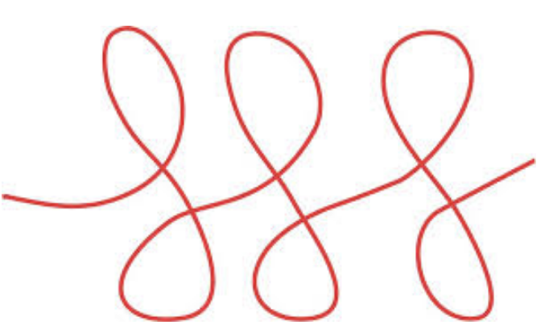

# Iterations with `for`



This lesson introduces the iterative instruction `for in range`,
which we can consider a kind of special,
quite useful case of the iterative instruction `while`.

## Writing many numbers

Let's consider again a program that reads a number `n`,
and writes all the numbers between 1 and `n`, one per line.
Recall that this is one possible solution:

```python
n = read(int)
i = 1
while i <= n:
    print(i)
    i = i + 1
```

If we look at this code from the third line,
we find a very common pattern when building loops:
make a variable (called _control variable_) start at a certain value,
and advance to a certain value with a certain increment each iteration.
In this case, the control variable is `i`, starting from `1`,
ending at `n` incrementing by `1` each time.

The iterative instruction `for in range` allows us to write this pattern more concisely.
This is its most complete version:

```python
for <variable> in range(<start>, <end>, <step>):
    <instructions>
```

which is equivalent to:

```python
<variable> = <start>
while <variable> < <end>:
    <instructions>
    <variable> = <variable> + <step>
```

(If the `<step>` is negative, the loop stops when `<variable>` is greater than or equal to `<end>`).

Therefore, the loop from the previous program could be written like this:

```python
for i in range(1, n + 1, 1):
    print(i)
```

Note that the `<end>` is _not_ part of the loop.

In fact, the `<step>` of `range` is optional, defaulting to 1.
Therefore, the loop from the previous program could be simplified a bit like this:

```python
for i in range(1, n + 1):
    print(i)
```

Also, the `<start>` of `range` is optional, defaulting to 0:
Therefore, the loop from the previous program could also be written like this:

```python
for i in range(n):
    print(i + 1)
```

In this case, `i` goes from 0 to `n` - 1, so the `print()` adds one.

## Examples

To make it very clear, the following table shows the successive values the loop variable would take for some different ranges:

| range             | values            |
| ----------------- | ----------------- |
| `range(8)`        | `0 1 2 3 4 5 6 7` |
| `range(0)`        | ``                |
| `range(1)`        | `0`               |
| `range(-5)`       | ``                |
| `range(1, 5)`     | `1 2 3 4`         |
| `range(0, 8, 2)`  | `0 2 4 6`         |
| `range(0, 7, 2)`  | `0 2 4 6`         |
| `range(6, 0, -1)` | `6 5 4 3 2 1`     |

The program that calculates the factorial of a natural number can be written like this with a `for` loop:

```python
from yogi import read

n = read(int)
f = 1
for i in range(2, n + 1):
    f = f * i
print(f)
```

The program that draws a regular n-gon would be like this:

```python
import turtle
import yogi

size = yogi.read(int)
sides = yogi.read(int)
angle = 360 / sides

for i in range(sides):
    turtle.forward(size)
    turtle.right(angle)

turtle.done()
```

Obviously, `for` loops can also be nested. This program draws a square rotated several times:

```python
import turtle
import yogi

size = yogi.read(int)
rotations = yogi.read(int)
angle = 360 / rotations

for i in range(rotations):
    for j in range(4):
        turtle.forward(size)
        turtle.right(90)
    turtle.right(angle)

turtle.done()
```

As you have seen,
although it may initially seem harder to understand,
these codes are more compact and quicker to write
and easy to read.
The reason is that all the control elements of the loop are found in
one single place.
Therefore, we recommend you get used to `for in range` loops
and use them when your algorithms follow the very common pattern mentioned above.
Use `while` loops only
for iterations with more original schemes.
On the other hand, Python's `for` loop can do even more things, which we will see later.

<Authors authors="jpetit"/>