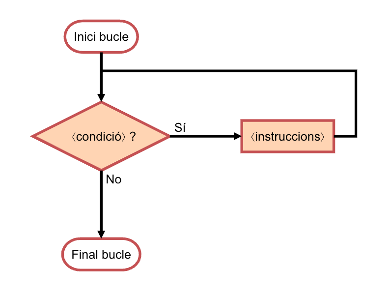

# Iterations


This lesson introduces the iterative instruction (`while` in Python). In computer science, repeating instructions is called _iterating_ or _looping_. Iteration allows simplifying and enhancing algorithms by stating that certain steps will be repeated until told otherwise. Learning to design loops is extremely important for writing programs. Let's start with some simple examples; in applications, we will progressively see more complex uses.

## Writing the numbers from 1 to `n`

Consider a program that reads a number `n` and writes all the numbers between 1 and `n`, one per line. For example, if we read a 4, the program should write

```text
1
2
3
4
```

With the tools we have seen so far, it is not possible to make this program. For example, how many lines of code would it have? 100? Then, if `n` were 1000, how could we make the program write 1000 lines? Clearly, we need a new type of instruction.

In particular, we need to be able to tell the computer to keep performing operations while a certain condition is met, that is, we need an **iterative instruction**, which in its most basic form is written like this in Python:

```python
while <condition>:
    <instructions>
...
```

To execute a `while`, the computer first checks the `⟨condition⟩`.
If it is not met, it proceeds to execute whatever comes after the `while`.
If it is met, the indented `⟨instructions⟩` inside the body of the `while` are executed.
Then, it checks the condition again.
If it is not met, it proceeds to execute whatever comes after the `while`.
If it is met, the indented `⟨instructions⟩` inside its body are executed.
And so repeatedly, _while_ (`while` in English) the `⟨condition⟩` holds true.

The following flowchart shows how the `while` loop works:



This program solves the proposed problem using a `while`:

```python
n = read(int)
i = 1
while i <= n:
    print(i)
    i = i + 1
```

How does it work?
First, we read `n` (suppose it is 3).
The third line
declares a variable `i` with initial value 1.
Then, the condition of the `while` is checked.
Since it is true, because `1 <= 3`,
the body of the `while` is executed,
which consists of printing the current `i` (which is 1) on a line,
and then incrementing `i` by 1 to 2.
Now the condition is checked again,
and since it is true, because `2 <= 3`, it prints 2 and `i` becomes 3.
Now the condition is checked again,
which still holds true, because `3 <= 3`, it prints 3 and `i` becomes 4.
Now the condition no longer holds,
because it is not true that `4 <= 3`,
so the `while` ends.
And since there is no more code afterwards, the program also ends,
after having printed the numbers from 1 to 3.

Since the previous program iterates while `i` is not `n`, one might be tempted to write the `while` condition like this:

```python
n = read(int)
i = 1
while i != n:     # 💥
    print(i)
    i = i + 1
```

Unfortunately, this is not very safe. Indeed, for positive or zero values of `n`, the program works perfectly, but what happens for negative values of `n`? The program will start printing 1, 2, 3, 4, ... and never stop, printing more and more numbers. Of course: since `i` is always positive and increases by one each iteration, it will never be equal to `n` which is negative. When a loop can never end, we say it **hangs**. Whenever we write loops, we must consider that they cannot hang because this is very undesirable.

When a program hangs, you can stop it by pressing the <kbd>control</kbd> and <kbd>c</kbd> keys at the same time. Try it: hang the previous program and interrupt its execution with <kbd>control</kbd><kbd>c</kbd>. One of the beautiful things about programming is that it's very easy to try things out!

## Writing the odd numbers from 1 to `n`

Now consider that we only want to write the odd numbers from 1 to `n`. For example, if we read a 7, the program should write

```text
1
3
5
7
```

and if we read a 10, the program should write

```text
1
3
5
7
9
```

The program can be made as before, but adding two units each iteration instead of one:

```python
n = read(int)
i = 1
while i <= n:
    print(i)
    i = i + 2
```

Notice that the program works well whether `n` is even or odd. What would happen if the condition were `i == n` instead of `i <= n`? For which values of `n` would it hang?

## Writing the numbers from `n` down to 1

Now consider that we want to write the numbers from `n` down to 1 in descending order. For example, if we read a 4, the program should write

```text
4
3
2
1
```

In this case, the initial value of the variable `i` should be `n`, the loop should iterate while it is strictly positive, and it should decrement each iteration:

```python
n = read(int)
i = n
while i > 0:    # could also be i >= 1
    print(i)
    i = i - 1
```

Not too difficult, right?

In fact, the program could be made even simpler by directly dispensing with the variable `i` and using `n` instead:

```python
n = read(int)
while n > 0:
    print(n)
    n = n - 1
```

However, in this way, the original value of `n` is lost, which can be detrimental in many cases.

## Reasoning about loops

Let's reconsider the program that writes the numbers from 1 to `n` for a given `n` and add an instruction at the end:

```python
n = read(int)
i = 1
while i <= n:
    print(i)
    i = i + 1
print('goodbye')
```

Try to answer these questions (assuming `n >= 0`):

1. How many times is the instruction `i = 1` executed?

2. How many times is the instruction `print('goodbye')` executed?

3. How many numbers are printed?

4. How many iterations does the loop perform?

5. What is the value of `i` at the end of the loop?

6. How many times is the loop condition evaluated?

Let's see:

1. Clearly, the instruction `i = 1` is executed only once, before the loop starts.

2. Likewise, the instruction `print('goodbye')` is executed only once, when the loop ends.

3. The number of numbers printed is `n`, since the program prints all the numbers from 1 to `n`. (If `n` were negative, it would print no numbers.)

4. The loop must perform `n` iterations, since it prints one number per iteration and in total `n` numbers are printed.

5. The value of `i` at the end of the loop must be `n + 1`: when the loop prints the last number (`n`), it still adds one to `i` which becomes `n + 1`. It is precisely when `i` equals `n + 1` that the loop condition becomes false and, therefore, the loop ends. You can verify this by adding a `print(i)` at the end of the program.

6. The number of times the loop condition is evaluated is also `n + 1` (not `n`). Indeed, the check whether `i <= n` will be true during the first `n` iterations, but after the last iteration, when `i` is `n + 1`, it will evaluate to false. That is why the loop ends. Therefore, the condition is always evaluated one more time than the number of iterations performed in a loop.

This type of questions and reasoning about loops is useful to understand how loops work in general and will also be useful to reason about your loops and understand why they work or not. Also, this type of counting is necessary to establish the efficiency of algorithms.

<Authors authors="jpetit roura"/>