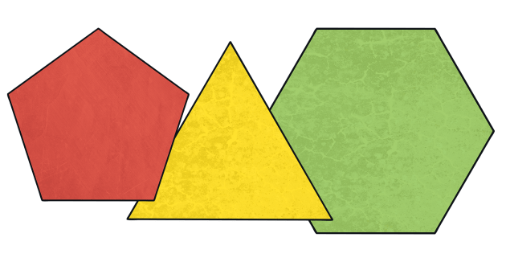
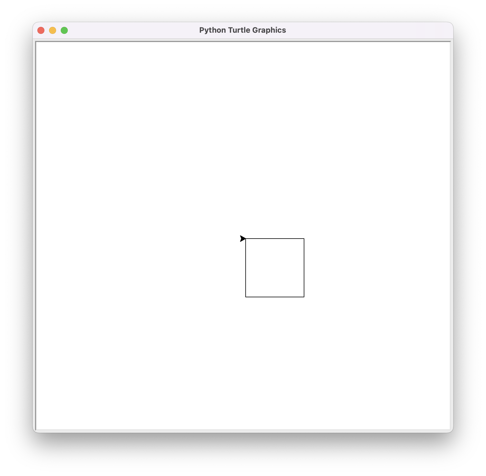
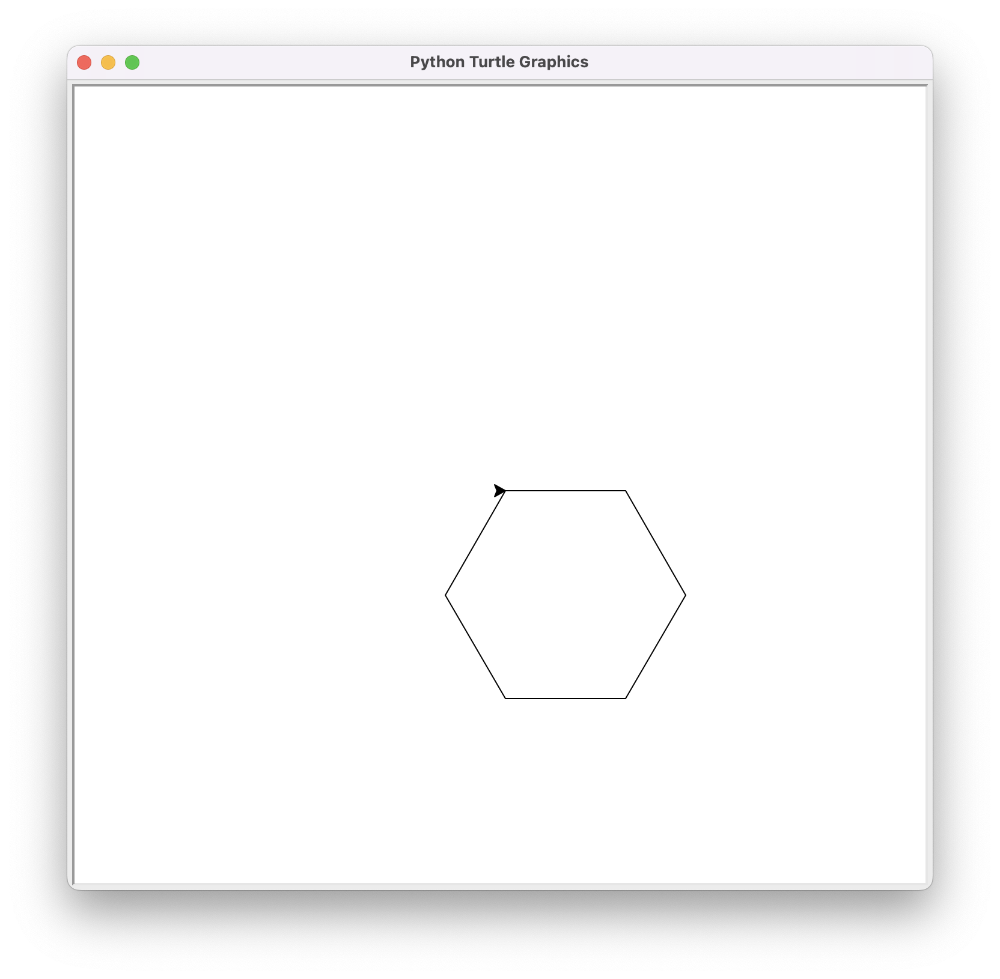
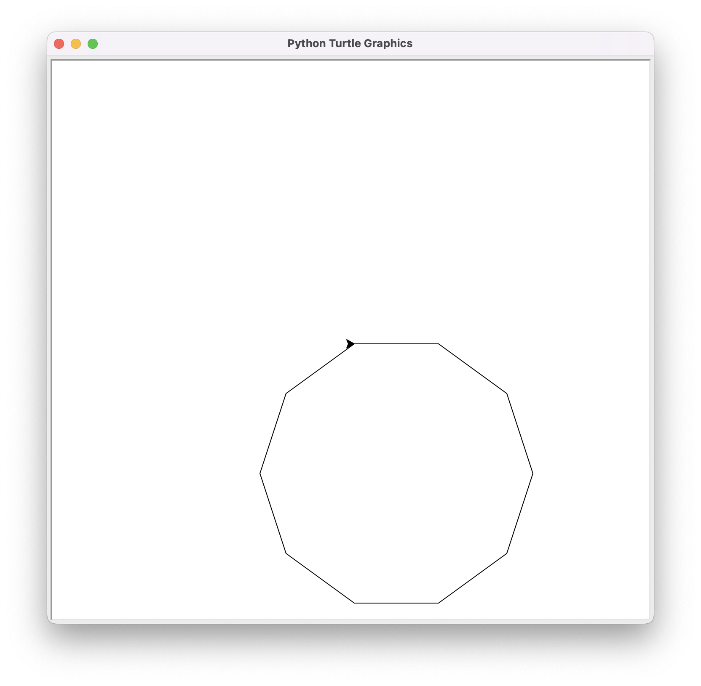
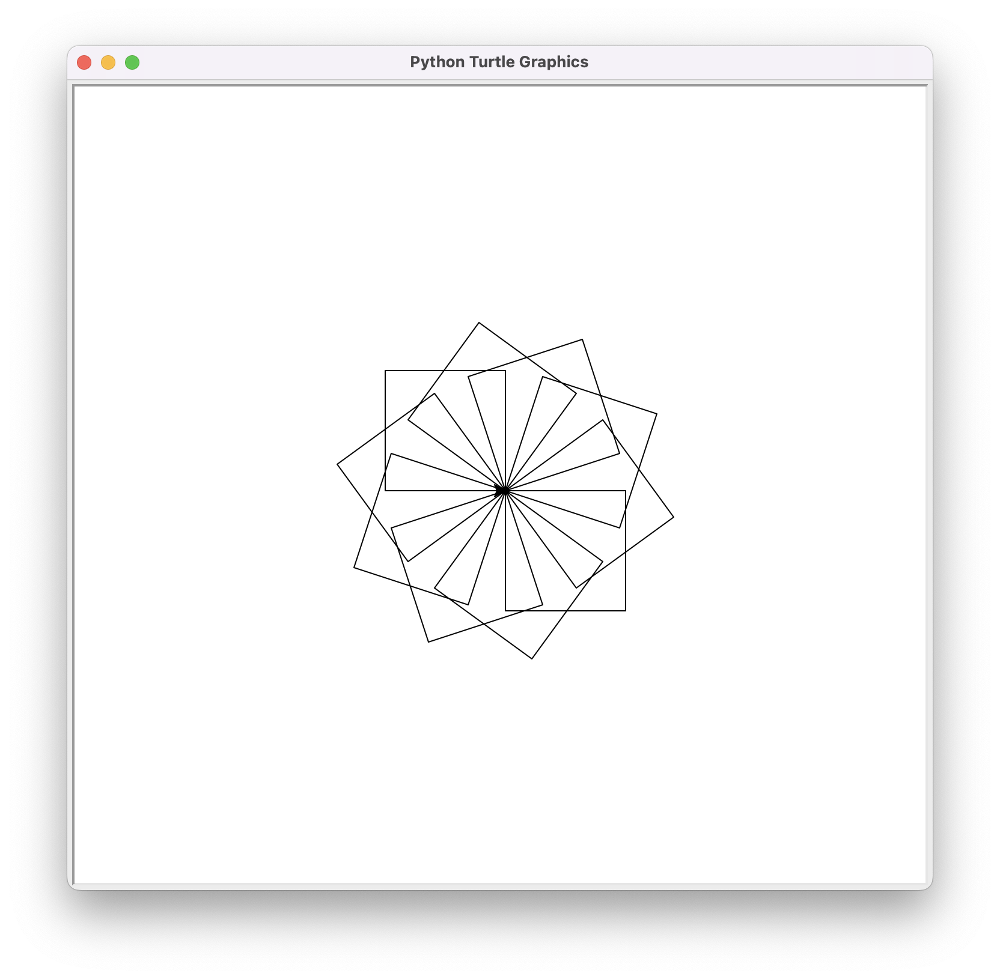

# Application: Drawing Regular Polygons



In this lesson, we present how to draw regular polygons with Python's turtle using loops. First, the simple case of the square is shown, then it is generalized to regular polygons. Finally, it shows how to use a loop inside a loop to draw many rotated squares.


## Drawing a Square

We had already seen that this program draws a square:

```python
import turtle

size = 100 

turtle.forward(size)
turtle.right(90)
turtle.forward(size)
turtle.right(90)
turtle.forward(size)
turtle.right(90)
turtle.forward(size)
turtle.right(90)

turtle.done()
```

Now that we know loops, we can write it more briefly by repeating the turtle's forward and turn four times with a `while` loop:

```python
import turtle

size = 100 

i = 0
while i < 4:
    turtle.forward(size)
    turtle.right(90)
    i = i + 1

turtle.done()
```


The loop runs 4 iterations, one for each `i` in 0, 1, 2, and 3. It could also have been done with `i` starting at 1 and incrementing until `i <= 4`, but for reasons that will be seen, in Python it is more common to start counting from zero.

Here is the result:




## Drawing a Regular Polygon

Remember that a **polygon** is a flat figure formed by a finite number of sequential linear segments. Each of these segments is a side. A polygon with all angles and sides equal is called a **regular polygon**.

If we now want to draw a regular polygon with a certain number of sides `sides`, we just need to change the 4 from the previous square to the value of `sides` and rotate the turtle by `360 / sides` degrees each time. For example, the following program draws a hexagon:

```python
import turtle

size = 100 
sides = 6

i = 0
while i < sides:
    turtle.forward(size)
    turtle.right(360 / sides)
    i = i + 1

turtle.done()
```

This is the result:



Make just one change to the previous program to draw a regular decagon like this:



Obviously, we could make a program where the size and the number of sides of the regular polygon are given by the user. Also, to avoid recalculating the turtle's rotation angle at each iteration, we could create a variable to store it:


```python
import turtle
import yogi

size = yogi.read(int)
sides = yogi.read(int)
angle = 360 / sides

i = 0
while i < sides:
    turtle.forward(size)
    turtle.right(angle)
    i = i + 1

turtle.done()
```

> 📝 Modify the previous program so that the polygon is centered in the window.


## Drawing Many Rotated Squares

We already know that this loop draws a square:

```python
# start drawing square
i = 0
while i < 4:
    turtle.forward(size)
    turtle.right(90)
    i = i + 1
# end drawing square
```

Its start and end have been annotated with comments to make it very clear what it does and when this part of the program begins and ends.

Then, if we repeat this part `rotations` times, rotating the turtle `360 / rotations` degrees each time, we should draw `rotations` squares. This would be the new code:

```python
j = 0
while j < rotations:
    # here put the code to draw a square
    turtle.right(360 / rotations)
    j = j + 1
```

And now we add the code that actually draws the square:


```python
j = 0
while j < rotations:

    # start drawing square
    i = 0
    while i < 4:
        turtle.forward(size)
        turtle.right(90)
        i = i + 1
    # end drawing square

    turtle.right(360 / rotations)
    j = j + 1
```

Notice then that we can nest iterative instructions, similarly to nesting conditional instructions. In this case, the outer loop is controlled by the variable `j` and the inner loop by the variable `i`.

The result, with a value of `rotations` of 10, is this:



The complete program could be like this:


```python
import turtle
import yogi

size = yogi.read(int)
rotations = yogi.read(int)
angle = 360 / rotations

j = 0
while j < rotations:
    i = 0
    while i < 4:
        turtle.forward(size)
        turtle.right(90)
        i = i + 1
    turtle.right(angle)
    j = j + 1

turtle.done()
```

<Authors authors="jpetit"/> 
