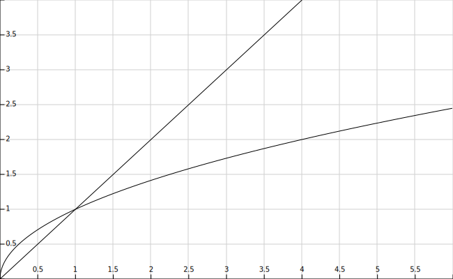

# Application: Divisors of a Number and Primality


This lesson shows several solutions related to finding the divisors of a natural number. First, an easy solution is presented to find all the divisors of a number. Since it turns out to be too slow, a second, more efficient version is shown that takes advantage of a simple mathematical property. Finally, the ideas used are leveraged to create a program that determines whether a number is prime or not.


## Writing all divisors of `n`

Consider a program that reads a natural number `n` and writes all its divisors. For example, for `n` = 30, it should write 1, 2, 3, 5, 6, 10, 15, 30, and for `n` = 17, it should write 1 and 17.

Since a natural number `n` can only have divisors between 1 and `n` itself, one possible solution to solve this problem is to iterate through all natural numbers `d` between 1 and `n` and, for each, check if `d` divides `n`. If so, print `d`.

To code this idea in Python, remember that this problem prints *all* numbers between 1 and `n`:

```python
from yogi import read

n = read(int)
d = 1
while d <= n:
    print(d)
    d = d + 1
```

Since we only want to print the `d` that divide `n`, we can make the `print(d)` conditional on this fact:

```python
from yogi import read

n = read(int)
d = 1
while d <= n:
    if n % d == 0:
        print(d)
    d = d + 1
```

Note that the condition `n % d == 0` is equivalent to "`d` divides `n`" because `%` is the operator that calculates the remainder of integer division, and `d` divides `n` when the remainder of the integer division of `n` by `d` is zero. Therefore, the program now only prints the divisors of `n`. Great!

If you try the previous program (you should always do this!), you will see that it works correctly.

But try giving it 1000000007 as input... The program immediately prints `1` but then seems to do nothing! Be patient. The problem is that 1000000007 is a large number and it is a prime number: since its divisors are only 1 and 1000000007, it tries to divide 1000000007 by all numbers between 1 and 1000000006 without success one after another. On my computer, this takes about two and a half minutes. Computers are very fast, but never fast enough. Could we find a faster way to find all the divisors of a given number?


## A more efficient algorithm

A first improvement we can add to the previous algorithm is to realize that if a number $n$ has no divisors between $2$ and $n-1$, it also won't have any between $2$ and $n/2$. Therefore, we can make the loop twice as fast by testing at most $1 + n/2$ divisors: 2 and all odd numbers up to $n$. This should take half the time.

But we can improve it even more: Notice that every time we find that $d$ is a divisor of $n$, we also find that $n/d$ is a divisor of $n$. For example, if we know that 5 divides 30, then we also know that $30/5 = 6$ divides 30. So, we find two divisors for the price of one! 🆓! Also, note that if $d$ is a divisor of $n$ with $d \le \sqrt{n}$, then the divisor $n/d$ is greater than or equal to $\sqrt{n}$. Therefore, we don't need to search for all divisors of $n$ between 1 and $n$, only between 1 and $\sqrt{n}$ and add their complementary divisor (which will be between $\sqrt{n}$ and $n$).

We could start coding this idea in Python like this:

```python
from yogi import read

n = read(int)
d = 1
while d <= √n:                  ❌
    if n % d == 0:
        print(d)
        print(n // d)
    d = d + 1
```

In the previous program, when it is determined that `d` is a divisor of `n`, not only is `d` printed as before, but now the integer division of `n` by `d` is also printed (two for one). Also, the loop should now stop at the square root of `n` instead of `n`, which we wrote as `d <= √n`. Unfortunately, Python does not have the square root operation `√`.

But fixing this is quite simple: since `d` is always positive, the condition `d ≤ √n` is equivalent to `d² ≤ n` (we square both sides of the inequality). And this can be legally written in Python as:

```python
from yogi import read

n = read(int)
d = 1
while d * d <= n:                  ✅
    if n % d == 0:
        print(d)
        print(n // d)
    d = d + 1
```

The program is starting to work! If we give it 30 as input, it prints
1,
30,
2,
15,
3,
10,
5,
and 6.
The divisors are not in order but they are all there, as expected.

Unfortunately, there are still too many. If we give it 25 as input, it prints
1,
25,
5,
and
5.
The 5 is printed twice 🙁. The reason is that 25 is a **perfect square**, that is, the square of a natural number. Its root is therefore a divisor (which the program correctly detects) and its complementary divisor is itself. There are many ways to fix this; here is one:

```python
from yogi import *

n = read(int)
d = 1
while d * d < n:
    if n % d == 0:
        print(d)
        print(n // d)
    d = d + 1
if d * d == n:
    print(d)
```

The loop now ends without reaching the root, and after the loop, the root is printed (only once) if the number was a perfect square.

Hooray! It works. But what have we gained from this work? Try the new program with 1000000007. It gives me the result instantly. The reason is that the time of the old version grew proportionally to `n`, while the time of the new version grows proportionally to `√n`. Both functions tend to infinity, but `n` much faster than `√n`, as shown in the following figure:



With small values of `n`, the difference is already visible; with large values, it is enormous! What do you prefer: to make about 1000000007 steps or to make √1000000007 ≈ 31500?

Here we have seen how leveraging our knowledge in the domain of mathematics allows us to speed up a program. Don't forget the trick of two divisors for the price of one; you will need it on another occasion.


## Primality

Remember that a natural number is **a prime number** when it has exactly two divisors: 1 and itself. The prime numbers less than 100 are 2, 3, 5, 7, 11, 13, 17, 19, 23, 29, 31, 37, 41, 43, 47, 53, 59, 61, 67, 71, 73, 79, 83, 89, and 97. Zero and one are not prime: zero cannot be divided by itself, and one, although it can be divided by 1 and itself, these two divisors are the same, so they are not exactly two.

How could we write a program to determine whether a given natural number is prime or not?

Notice that we just made a program that, given a number `n`, prints all its divisors. If it only prints 1 and `n` (that is, if it only finds two divisors), it means it is prime. Therefore, we could adapt the previous program to count in a variable `c` the number of divisors between 2 and `√n` (instead of printing them) and, at the end, check if this counter is zero or not to know if `n` is prime or not.

We can start like this:

```python
from yogi import *

n = read(int)
c = 0
d = 2
while d * d <= n:
    if n % d == 0:
        c = c + 1
    d = d + 1
if c == 0:
    print(n, 'is prime')
else:
    print(n, 'is not prime')
```

Almost... The previous program has two defects:

1. The first is a correctness problem: The program incorrectly says that 0 and 1 are prime. Did you notice? For the rest of the natural numbers, the program works correctly. But 0 and 1 are special cases and must be treated specially.

2. The second problem is efficiency: When the program determines that the number is composite, the variable `c` goes from 0 to 1, which is fine. But with that, it is already known that the number is not prime! However, the program continues looking for more divisors, which is unnecessary and slows down the solution.

One possible way to fix these defects is with this new version:

```python
from yogi import *

n = read(int)
if n <= 1:
    print(n, 'is not prime')
else:
    c = 0
    d = 2
    while d * d <= n and c == 0:
        if n % d == 0:
            c = 1
        d = d + 1
    if c == 0:
        print(n, 'is prime')
    else:
        print(n, 'is not prime')
```

Now, the cases of 0 and 1 are explicitly handled. Also, the loop stops iterating as soon as it finds that `c` is no longer zero by making the condition `and c == 0`.

Therefore, the variable `c` now no longer describes the number of divisors found, but it is 0 when none has been found yet and 1 when some have been found. Later we will see that booleans can help describe these possibilities in a cleaner way.

<Authors authors="jpetit"/>