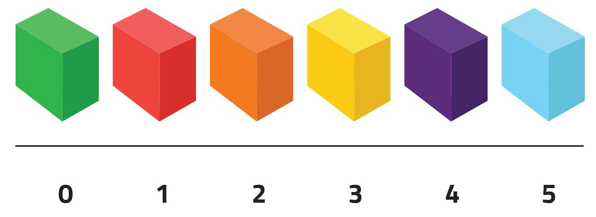
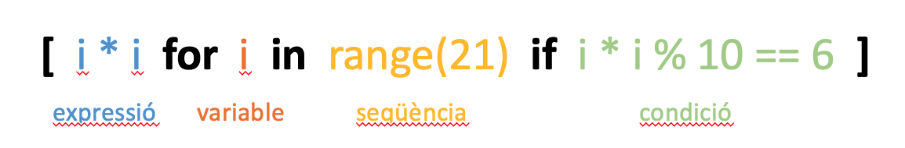
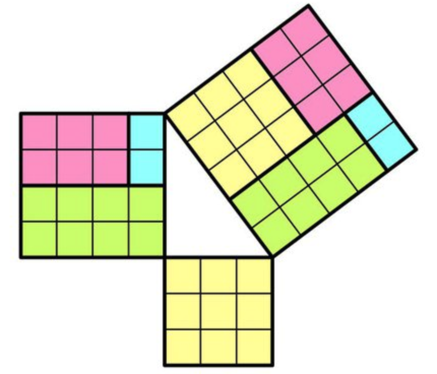

# List Comprehensions



In this lesson, list comprehensions are introduced, a very expressive way to describe the contents of lists with syntax similar to what we are used to for describing sets in mathematics. Thanks to list comprehensions, algorithms will have fewer levels of indentation and will be more readable.


## Comprehension Notation

Until now, we have described lists using **extension notation**, that is, by giving a list with all the members of the set:

```python
>>> l1 = []
>>> l2 = [10, 30, -12]
>>> l3 = ['cat', 'dog', 'turtle']
```

Extension notation is useful for lists with a few elements, but when there are many elements or their number is unknown, it can no longer be used and code fragments with loops and `append`s must be written to create them. For example, this fragment creates the list `squares` with all the numbers `i²` for `i` from 0 to `n - 1`:

```python
squares = []
for i in range(n):
    squares.append(i * i)
```

**Comprehension notation** allows creating lists through an expression depending on a variable, for a domain of values of that variable. For example, the list `squares` could be written like this with comprehension notation:

```python
squares = [i * i for i in range(n)]
```

Surely you find this definition much simpler than the three lines above and, moreover, you probably recognize this notation as a copy of what is used in mathematics to describe sets:

$$
Q = \{i^2 \ |\  i\in\{1,...n\}\}
$$

Additionally, comprehension notation also allows adding a condition for the elements included in the list. For example, the list of all squares between 0 and 20 that end in a 6 could be described like this:

```python
>>> [i * i for i in range(21) if i * i % 10 == 6]
[16, 36, 196, 256]
```

Therefore, list comprehension notation has four parts:

- an expression that determines the values of the list,
- a variable,
- a sequence,
- and a condition (optional).

This is the scheme:



Underneath, Python converts a list comprehension into a loop, a conditional, and an `append`: The list comprehension

```python
lst = [i * i for i in range(21) if i * i % 10 == 6]
```

is thus equivalent to

```python
lst = []
for i in range(21):
    if i * i % 10 == 6:
        lst.append(i * i)
```

but probably memory management with comprehensions is more efficient.


Comprehensions can have more than one `for`, which are executed nested. For example, we could calculate all possible sums of the values of two six-sided dice in ascending order like this:

```python
>>> sorted([die1 + die2 for die1 in range(1, 7) for die2 in range(1, 7)])
[2, 3, 3, 4, 4, 4, 5, 5, 5, 5, 6, 6, 6, 6, 6, 7, 7, 7, 7, 7, 7, 8, 8, 8, 8, 8, 9, 9, 9, 9, 10, 10, 10, 11, 11, 12]
```

Occasionally, we will also want to create lists of tuples:

```python
>>> [(a, b) for a in range(3) for b in 'cat']
[(0, 'c'), (0, 'a'), (0, 't'), (1, 'c'), (1, 'a'), (1, 't'), (2, 'c'), (2, 'a'), (2, 't')]
```

Often list comprehensions work very well with built-in functions like `max`, `min`, and `sum`. For example,
the function we made for the dot product can be written more concisely like this:

```python
def dot_product(x, y):
    """Returns the dot product of two vectors of the same size."""

    return sum([x[i] * y[i] for i in range(len(x))])
```



One last example: In mathematics, a **Pythagorean triple** is formed by three natural numbers $a$, $b$, and $c$ such that $a^2+b^2=c^2$. Therefore, Pythagorean triples correspond to right triangles with all three sides of natural lengths.

A list comprehension for Pythagorean triples could be written like this:

```python
>>> n = 25  # maximum length
>>> [   (a, b, c)
...     for a in range(1, n + 1)
...     for b in range(a, n + 1)
...     for c in range(b, n + 1)
...     if a**2 + b**2 == c**2
... ]
[(3, 4, 5), (5, 12, 13), (6, 8, 10), (7, 24, 25), (8, 15, 17), (9, 12, 15), (12, 16, 20), (15, 20, 25)]
```

There are more efficient methods to generate Pythagorean triples, but this example highlights the capabilities of list comprehensions.

<Autors autors="jpetit"/> 
