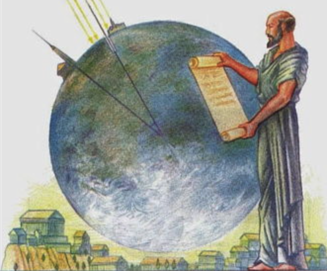

# Sieve of Eratosthenes


In this lesson, we revisit the problem of primality. This time, however, instead of determining whether a single number is prime or not, we present an algorithm that allows us to determine all prime numbers up to a given value. This algorithm, known as the **Sieve of Eratosthenes**, is much more efficient than checking each number individually to see if it is prime.

## Problem description and analysis of a first solution

[Previously](/functions/examples-functions.html) we developed a function that, given a natural number `n`, indicates whether `n` is prime or not. The idea was to try to find any number between 2 and `√n` that divides `n`. If any is found, the number is composite; otherwise, it is prime. The code was this:

```python
def is_prime(n):
    """Indicates whether the natural number n is prime or not."""

    if n <= 1:
        return False
    d = 2
    while d * d <= n:
        if n % d == 0:
            return False
        d = d + 1
    return True
```

This time we want to solve a different but related problem: Given a natural number `m`, we want to determine all prime numbers up to `m`. For example, if `m` is 26, we should return 2, 3, 5, 7, 11, 13, 17, 19, and 23.

This problem could be solved with a function like this:

```python
def primes(m):
    """Given a natural number m, returns the list of all prime numbers from 0 to m."""
```

Note that to be able to return a variable number of values, this function returns a list of integers.

Since we already have a function that tells us if a number is prime or not, we can implement `primes` by generating all numbers from 0 to `m` and adding to a list those that are prime:

```python
def primes(m):
    """Given a natural number m, returns the list of all prime numbers from 0 to m."""

    ps = []
    for n in range(m + 1):
        if is_prime(n):
            ps.append(n)
    return ps
```

Or, more elegantly, we can describe the list of elements to return with a list comprehension:

```python
def primes(m):
    """Given a natural number m, returns the list of all prime numbers from 0 to m."""

    return [n for n in range(m + 1) if is_prime(n)]
```

The solution is perfectly correct, simple, and reuses code we already have. Unfortunately, it is quite slow: On my computer, finding the 78,498 prime numbers up to 1,000,000 takes 7.428 seconds. To measure these times, I created a program that simply does a `print(len(primes(1000000)))` and ran it with the `time` command:

```bash
> time python3 primes.py 
78498
real    0m7.428s
user    0m7.359s
sys     0m0.022s
```

One could try to reduce the time by only considering odd numbers:

```python
def primes(m):
    """Given a natural number m, returns the list of all prime numbers from 0 to m."""

    if m <= 1:      # special case
        return []
    else:
        return [2] + [n for n in range(3, m + 1, 2) if is_prime(n)]
```

But the time doesn't change much: Now it takes 7.388 seconds. Of course: for even numbers, the `is_prime` function finishes quickly. That's why the improvement is not substantial. Maybe we should also skip multiples of 3, 5... that is, multiples of any prime. This leads us to the following solution.

## The Sieve of Eratosthenes


To speed up the search for prime numbers, we present the algorithm called the **Sieve of Eratosthenes**. This is an ancient algorithm, the first reference of which was found in a 2nd-century document attributing it to the Greek mathematician and astronomer Eratosthenes of Cyrene, born in the 3rd century BC. Eratosthenes was a genius: One of his main contributions was estimating the Earth's diameter by measuring the angle of two shadows, with only about 2% error.

The idea of Eratosthenes' algorithm to find all prime numbers up to a certain integer `m` is as follows:

- First, write down all numbers from 0 to `m`. Cross out 0 and 1 because they are not prime. The first uncrossed number (2) is a prime number.

- Since 2 is determined to be prime, cross out all remaining multiples of 2 because they cannot be prime.

- Among the numbers not yet crossed out, the first one is prime. Therefore, cross out all its multiples. Repeat this step until reaching `m`.

Let's see this with an example, choosing `m = 26`.

First, write all numbers from 0 to 26 and cross out 0 and 1:

<del>0</del> <del>1</del> 2 3 4 5 6 7 8 9 10 11 12 13 14 15 16 17 18 19 20 21 22 23 24 25 26

The first uncrossed number is prime: 2. So, cross out all multiples of 2:

<del>0</del> <del>1</del> **2** 3 <del>4</del> 5 <del>6</del> 7 <del>8</del> 9 <del>10</del> 11 <del>12</del> 13 <del>14</del> 15 <del>16</del> 17 <del>18</del> 19 <del>20</del> 21 <del>22</del> 23 <del>24</del> 25 <del>26</del>

The next uncrossed number (3) must also be prime. So, cross out all multiples of 3 (some were already crossed out):

<del>0</del> <del>1</del> **2** **3** <del>4</del> 5 <del>6</del> 7 <del>8</del> <del>9</del> <del>10</del> 11 <del>12</del> 13 <del>14</del> <del>15</del> <del>16</del> 17 <del>18</del> 19 <del>20</del> <del>21</del> <del>22</del> 23 <del>24</del> 25 <del>26</del>

The next uncrossed number (5) must also be prime. So, cross out all multiples of 5:

<del>0</del> <del>1</del> **2** **3** <del>4</del> **5** <del>6</del> 7 <del>8</del> <del>9</del> <del>10</del> 11 <del>12</del> 13 <del>14</del> <del>15</del> <del>16</del> 17 <del>18</del> 19 <del>20</del> <del>21</del> <del>22</del> 23 <del>24</del> <del>25</del> <del>26</del>

And now there are no more changes. Therefore, all uncrossed numbers (2, 3, 5, 7, 11, 13, 17, 19, 23) are the prime numbers up to 26.

The end of the algorithm can be detected when the last prime considered is greater than `√m`. We already know that beyond this point we will not find any new divisors for numbers up to `m` (we have used this property many times).

!!! An animation would be perfect here.

## Implementation

To implement the Sieve of Eratosthenes algorithm, we will split the work into two parts. The first part defines the function `eratosthenes`, with the following specification:

```python
def eratosthenes(m):
    """
    Returns a list of m+1 booleans such that the value at position i indicates whether i is prime or not.
    Precondition: m >= 2.
    """
```

The precondition is simply to avoid degenerate cases. The returned value indicates, for each number between 0 and `m` inclusive, whether it is crossed out (False) or not (True). For example, `eratosthenes(26)` should return `[False, False, True, True, False, True, False, True, False, False, False, True, False, True, False, False, False, True, False, True, False, False, False, True, False, False, False]`.

From the function `eratosthenes` it is easy to implement the function `primes`:

```python
def primes(m):
    """Given a natural number m, returns the list of all prime numbers from 0 to m."""

    if m <= 1:
        return []
    else:
        sieve = eratosthenes(m)
        return [n for n in range(m + 1) if sieve[n]]
```

The implementation of the function `eratosthenes` is more complex, but can be done as follows:

```python
def eratosthenes(m):
    """Returns a list of m+1 booleans such that the value at position i indicates whether i is prime or not. Precondition: m >= 2."""

    sieve = [False, False] + [True] * (m - 1)
    i = 2
    while i * i <= m:
        if sieve[i]:
            for j in range(2 * i, m + 1, i):
                sieve[j] = False
        i += 1
    return sieve
```

The list `sieve` is a list of `m + 1` booleans indicating the numbers that can still be prime. At the beginning, all numbers can be prime except 0 and 1. Then all numbers `i` between 2 and `√m` are explored. If the number `i` is "crossed out" (when `sieve[i]` is False), nothing needs to be done. If it is not crossed out (when `sieve[i]` is True), then `i` is prime and all its multiples must be crossed out, which is done by the loop over `j`.

Perfect, we have it! If we run `primes(26)` we get `[2, 3, 5, 7, 11, 13, 17, 19, 23]`, as expected. And now, the time to find primes up to 1,000,000 is only 0.364 seconds!

The reason the Sieve of Eratosthenes is much faster is that it works by elimination instead of searching for potential divisors. A surprising fact is that the Sieve does not perform a single division to establish which numbers have divisors or not!

In many applications where prime numbers need to be determined, an initial precalculation with the Sieve of Eratosthenes is done to find all sufficiently large primes. Depending on what is needed, it may be more convenient to store the list of primes or the list of booleans (or both).

**Exercise:** What would happen if the main loop condition in `eratosthenes` was `while i <= m`? Would the algorithm still work? What would happen to its efficiency? Think about it and try it out!

<Authors authors="jpetit"/>