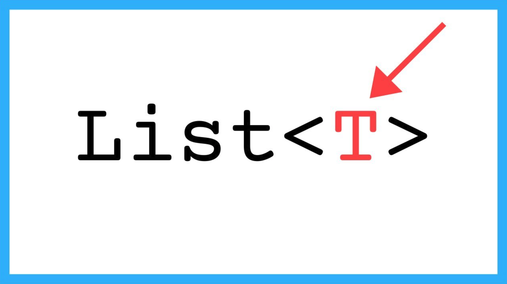

# Generic Types



This lesson shows how to make functions and actions have more flexible types in order to avoid duplicating code. To do this, the use of `Any` and `TypeVar` from the `typing` module is introduced, applied to a couple of simple examples.


## Limitations

Imagine we are asked to write a function that, given a non-empty list of integers, returns the position of its largest element (one of them if it appears more than once). The following function does exactly that:

```python
def max_position_int_list(L):
    """
    Returns a position p such that L[p] >= x for all x in L.
    Precondition: L is not empty.
    """

    p = 0
    for i in range(1, len(L)):
        if L[i] > L[p]:
            p = i
    return p
```

No mystery here. Now imagine we are asked to write a function that, given a non-empty list of strings, returns the position of its largest element. How easy! Just copy the previous function and change its header to reflect that now it deals with lists of strings:

```python
def max_position_str_list(L):
    ... # same code as in max_position_int_list
```

Except for the header, everything is the same! And if now we want to do it with a list of floats, we would just have to duplicate it again:

```python
def max_position_float_list(L):
    ... # same code as in max_position_int_list
```

Clearly, having all this duplicated code makes no sense at all. Cut and paste is the friend of a bad programmer, never of a good programmer. All these versions of the same function for different types is or will be a problem. Even more so considering that, at runtime, Python completely ignores types! We need a way to have headers that talk about any types.


## The `Any` type

Python's type system offers us ways to make type annotations more flexible and generic. The first way is with `Any`:

The special type `Any` (which must be imported from the `typing` module) represents any type, so any type is compatible with `Any` and `Any` is compatible with any type.

Its use is very simple. We can compact all the previous functions with this definition:

```python
from typing import Any

def max_position(L):
    """
    Returns a position p such that L[p] >= x for all x in L.
    Precondition: L is not empty.
    """

    p = 0
    for i in range(1, len(L)):
        if L[i] > L[p]:
            p = i
    return p
```

In the header, we now have `L: list[Any]`, that is, `L` is a list of any type of elements. Therefore, there will be no type errors if we pass a list of integers, a list of floats, or a list of strings. For this reason, we now say that `max_position` is a **generic function**.


# Type Variables

Although `Any` is useful in some situations, in others, `Any` is not strong enough. For example, consider a generic function that given a list of elements, returns it sorted (the sorting algorithm itself is not relevant now).

If its header were

```python
def sort(L):
    ...
```

it would be clear that `L` can be a list of any type, but it is not clear that the type of the returned list is the same as the input list. As written, the type system and programmers might understand that `sort` can receive a list of integers and return a list of floats, when what is meant is that if the input list is of integers, the output list is also of integers, and if the input list is of floats, the output list is also of floats, etc.

Similarly, maybe inside the code of `sort`, somewhere it is necessary to annotate the type of a local variable with the same type as the elements of the list. `Any` would not be useful, because `Any` always refers to any type.

For this reason, Python's type system offers **type variables**. The way to use type variables is as follows:

```python
from typing import TypeVar

T = TypeVar('T')

def sort(L):
    ...
    x = None  # type: T
    ...
```

Now it is clear that when `sort` receives a list of `T`s, it returns a list of `T`s. And, moreover, inside the code of `sort` it is now possible to annotate that the type of a variable `x` is also of the same type as the elements of the list. Thanks to type variables, we can refer more than once to the same type that we do not yet know when programming.

If necessary, type variables can also be restricted to a subset of types. For example, if `sort_numbers` should only work for lists of floats and integers, but not for other types, it could be written as:

```python
T = TypeVar('T', int, float)

def sort_numbers(L):
    ...
```

I am not sure what the first parameter of `TypeVar` is for. Everyone puts a string that is the same as the variable to which it is assigned. I suppose it is the name used when there are errors.

Obviously, functions can use more than one type variable. For example, this function swaps the fields of a tuple:

```python
T1 = TypeVar('T1')
T2 = TypeVar('T2')

def swap(t):
    return t[1], t[0]
```


<Authors authors="jpetit"/>
