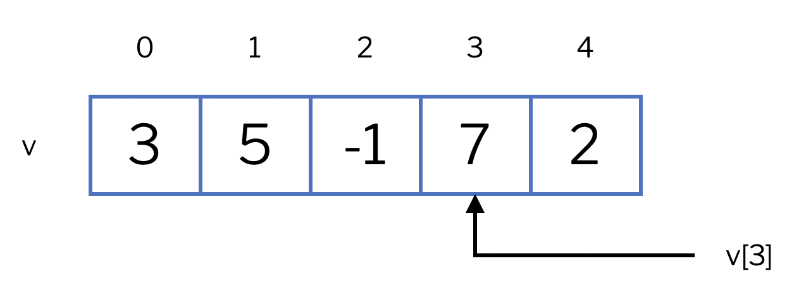
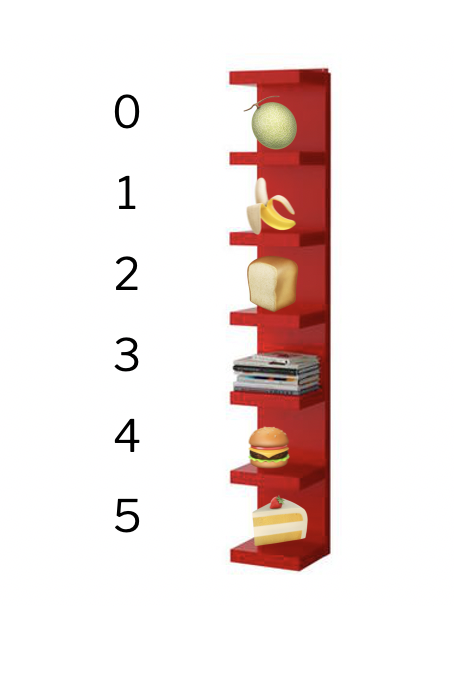

# Lists


This lesson introduces one of the most common and useful data structures in the world of programming: lists. Lists allow storing a collection of many data items of the same type in a single variable and accessing any of them directly through their position.


## Introduction

A **list** is a data structure that contains a collection of elements, all of the same type (integers, floats, texts, etc.). The elements in a list are arranged in different positions, and to refer to one of them, an **index** is used, which is an integer indicating the position of the element in the list, starting from 0.

Thus, in a list of `n` elements, the first element will have index 0, the second element will have index 1, ... and the last element will have index `n - 1`. In the following figure, you can see a list `v = [3, 5, -1, 7, 2]`, along with the index identifying each element. Since the list `v` has five positions, the last element has index 4. The element at position `i` in the list is denoted by `v[i]`. For example, `v[3]` is `7`.

<center>

</center>

We can imagine a list as a shelf with many shelves. All its shelves are identical, labeled by a number (starting from zero), and can store different data. One can refer to the shelf as a whole or refer to the content of one of its shelves through its shelf number. In the following figure, the last shelf is the sixth, at position 5, and contains a cake.

<center>

</center>

The simplest way to write lists is by enumerating their elements inside square brackets and separating them by commas. Here are some examples:

```python
>>> l1 = [1, 2, 3]
>>> l1
[1, 2, 3]
>>> l2 = [-3.4, 5.8, 2.0, 12.11]
>>> l2
[-3.4, 5.8, 2.0, 12.11]
>>> l3 = [False, False, True]
>>> l3
[False, False, True]
```

Lists and tuples have similarities, but they are quite different. We will specify the differences further below.

There are many operations that can be applied to lists; below we see the most common ones.


## Built-in functions

Python offers some built-in functions for lists. For example, the function `len`, applied to a list, returns its number of elements (also called length or size):

```python
>>> len([6, 3, 4, 6, 1])
5
>>> len([])     # [] is the empty list (no elements)
0
>>> len([66])   # [66] is the list containing only the element 66
1
```

The functions `min` and `max` applied to a single non-empty list return its minimum and maximum respectively:

```python
>>> min([6, 3, 4, 6, 1])
1
>>> max([3.14, 2.78, 0.0])
3.14
```

The function `sum` returns the sum of the elements in a list:

```python
>>> sum([3.14, 2.78, 0.0])
5.92
```

The function `sorted` returns the list with the elements sorted from smallest to largest:

```python
>>> sorted([3.14, 2.78, 0.0])
[0.0, 2.78, 3.14]
```

The function `reversed` returns the list in reverse order. But for technical reasons that we don't need to explain now, you still need to convert it to a `list` to get it as a list:

```python
>>> reversed([3.14, 2.78, 0.0])
<list_reverseiterator object at 0x10d95e830>
>>> list(reversed([3.14, 2.78, 0.0]))
[0.0, 2.78, 3.14]
```


## Operators

Concatenation of two lists is obtained with the `+` operator:

```python
>>> [1, 2, 3] + [4, 5, 6]
[1, 2, 3, 4, 5, 6]
>>> [1, 2, 3] + [4, 5, 6] + []
[1, 2, 3, 4, 5, 6]
```

The product of a list by an integer (and an integer by a list) returns that list repeated as many times as the indicated number:

```python
>>> 4 * [1, 2, 3]
[1, 2, 3, 1, 2, 3, 1, 2, 3, 1, 2, 3]
>>> [1, 2, 3] * 4
[1, 2, 3, 1, 2, 3, 1, 2, 3, 1, 2, 3]
```

These operations resemble those of strings because strings and lists of characters are quite similar. But there are also differences which we will discuss further below.

Relational operators with lists also work:

```python
>>> [1, 1] == [1, 1]
True
>>> [1, 1] == [1, 1, 2]
False
>>> [1, 1] != [1, 1, 2]
True
>>> [10, 20, 30] < [10, 40, 4]
True
```

Additionally, lists have an `in` operator that indicates whether an element is inside a list or not. And the `not in` operator returns the opposite:

```python
>>> "goose" in ["rabbit", "lamb", "goose", "duck"]
True
>>> "dog" not in ["rabbit", "lamb", "goose", "duck"]
True
```


## Element access operations

Remember that the positions of a list are identified by an integer starting at 0. Thus, in a list of four elements, the first has index 0, the second 1, the third 2, and the last 3. If we want to access an element of a list, we must specify its index inside square brackets, as shown here:

```python
v = [11.5, -13.2, 4.6, 7.8]
print(v[2])         # prints 4.6
if v[0] > 5:
    v[3] = 9.0
# the list becomes [11.5, -13.2, 4.6, 9.0]
```

Similarly, we can modify the content of a certain position in a list. You can see it in the following example, where the comments indicate the content of the list at each moment:

```python
lst = [1, 1, 1, 1]              # lst = [1, 1, 1, 1]
lst[1] = 4                     # lst = [1, 4, 1, 1]
lst[3] = lst[1]                # lst = [1, 4, 1, 4]
lst[0] = 2 * lst[2] + 1        # lst = [3, 4, 1, 4]
lst[0] -= 1                   # lst = [2, 4, 1, 4]
```

Remember that if a list has `n` positions, the valid indices are between 0 and `n - 1`. Indexing a list with a value greater than or equal to `n` is a programming error and Python will stop the program execution. Therefore, whenever you index a list, you should mentally (🤔) ensure that the index you use does not access outside the list. On the other hand, Python has the peculiarity that indices can be negative: index `-1` represents the last element of the list, `-2` the second to last, etc.

The following snippet shows three illegal accesses to list positions:

```python
names = ["Mireia", "Marta", "Elvira", "Jana"]
names[10] = "Jordi"              # 💥 position 10 does not exist
if names[4] == "Carme": ...      # 💥 position 4 does not exist
names[-5] = "Raquel"             # 💥 position -5 does not exist
```

Python lists exhibit a property called **direct access**: Given a list `L` and an index `i`, access to `L[i]` is done in a time independent of the length of the list `L` and the value of `i`.


## Sublists

With *slices* new lists are created. The start, end, and step positions work the same as in `range`:

```python
>>> xs = [30, 50, 10, 50, 60, 20, 50, 70]
>>> xs[2:6]
[10, 50, 60, 20]
>>> xs[:6]
[30, 50, 10, 50, 60, 20]
>>> xs[:2]
[30, 50]
>>> xs[:]
[30, 50, 10, 50, 60, 20, 50, 70]
>>> xs[1:8:2]
[50, 50, 20, 70]
```

They can also be used to modify (and extend) segments of existing lists:

```python
>>> L = [1, 2, 3, 4, 5, 6, 7, 8, 9]
>>> L[2:5] = [33, 44, 55]
>>> L
[1, 2, 33, 44, 55, 6, 7, 8, 9]
```

```python
>>> L = [1, 2, 3, 4, 5, 6, 7, 8, 9]
>>> L[8:] = [33, 66, 99]
>>> L
[1, 2, 3, 4, 5, 6, 7, 8, 33, 66, 99]
```


## Adding and removing elements

Lists also have instructions to remove elements from the list and to add new ones:

```python
>>> xs = [10, 20, 30]
>>> xs.append(40)
>>> xs
[10, 20, 30, 40]
>>> xs.append(50)
>>> xs
[10, 20, 30, 40, 50]
>>> ys = [60, 70, 80]
>>> xs.extend(ys)
>>> xs
[10, 20, 30, 40, 50, 60, 70, 80]
>>> del(xs[3])  # slow!
>>> xs
[10, 20, 30, 50, 60, 70, 80]
>>> xs.pop()    # fast
80
>>> xs
[10, 20, 30, 50, 60, 70]
>>> xs.clear()
>>> xs
[]
```

Adding and removing elements at the end is efficient, doing so in the middle of the list is not.

Note that some operations are performed on a list with a notation consisting of a dot and a name. It looks like a function call but it is a **method**. This concept will be clarified much later.


## Iterating over all elements of a list

Often, you want to iterate over all elements of the list, from the first to the last, performing some task with each of these elements. For example, to print each temperature from a list containing a list of temperatures, you could do:

```python
temperatures = [1.0, 12.5, 14.0, 10.1, -3.5]
for temperature in temperatures:
    print(temperature)
```

Here, the `for` loop indicates that the variable `temperature` will successively take the value of each element of the list `temperatures`, starting from position 0 onward. Inside the loop body, each value is printed.

Sounds familiar? Of course: `range` is nothing other than a built-in function that returns a list (technically, not exactly, but it doesn't matter).

This example shows that it is common, although not mandatory, for lists to have plural names, and the elements they contain, the corresponding singular name.

Here you can see how to calculate the product of the elements of a list using this iteration:

```python
numbers = [3, 5, -2, 4]
prod = 1
for number in numbers:
    prod = prod * number
print(prod)                      # prints -120
```

Warning: Remember that the variable used to iterate over the elements of the list is a copy of its elements. Therefore, in the following program, the list does not change even though each number is doubled:

```python
numbers = [3, 5, -2, 4]
for number in numbers:          #  👀 copy
    number = number * 2
# numbers = [3, 5, -2, 4] 😢
```

To be able to change the elements of the list, you must iterate over the indices of the list instead of over the elements of the list: Thus, to double all elements of the list `numbers` we can do:

```python
numbers = [3, 5, -2, 4]
for i in range(len(numbers)):
    numbers[i] = numbers[i] * 2
# numbers = [6, 10, -4, 8] 😃
```


## The list type

In Python, lists are of type `list`, we can check it like this:

```python
>>> type([3, 5, 1, 1, 2])
<class 'list'>
```

To have the safety provided by type checking, from now on we will assume that all positions of a list must be of the same type: such lists are called **homogeneous** data structures. This is not a Python requirement, but it is a good habit for beginners.

In Python's type system, `list[T]` describes a new type that is a list where each element is of type `T`. For example, `list[int]` is the type of a list of integers and `list[str]` is a list of texts.

In most cases, it is not necessary to annotate list variables with their type, because the system already determines it automatically through their values. Only when creating empty lists is it necessary to indicate the type of the list elements because, obviously, the system cannot know:

```python
l1 = [40, 20, 34, 12, 40]    # no need to annotate type: it is inferred automatically
l2 = []                      # need to indicate the type that this empty list will have
                             # because it cannot be inferred
```

Lists can also be used as parameters of subprograms. Then, their type must be annotated, just like with other parameters. For example, this function would calculate the maximum temperature of a list of floats storing temperatures:

```python
def max_temperature(temperatures):
    ...
```


## Relationship between lists and strings

For practical purposes, the `str` type is quite similar to a list of characters: almost all operations are the same:

```python
>>> s = 'Blaumut'
>>> len(s)
7
>>> s + s
'BlaumutBlaumut'
>>> s * 2
'BlaumutBlaumut'
>>> s[0]
'B'
>>> s[4:]
'mut'
>>> s[:4]
'Blau'
>>> s[::-1]
'tumualB'
>>> 'a' in s
True
```

However, there is an important difference: Python strings cannot have their characters modified: they are said to be immutable:

```python
>>> s = 'Blaumut'
>>> s[0] = 'C'
TypeError: 'str' object does not support item assignment
```

Additionally, strings offer many specific operations:

```python
>>> s = 'Blaumut'
>>> s.upper()       # returns s in uppercase
'BLAUMUT'
>>> s.lower()       # returns s in lowercase
'blaumut'
>>> s.isnumeric()   # indicates if s is numeric
False
```

Also, `split` is a particularly useful operation for strings: Applied to a string, it returns a list with each of its words, using spaces as separators:

```python
>>> 'it's when I sleep that I see clearly'.split()
['it's', 'when', 'I', 'sleep', 'that', 'I', 'see', 'clearly']
>>> '      it's   when    I sleep that I see   clearly      '.split()
['it's', 'when', 'I', 'sleep', 'that', 'I', 'see', 'clearly']
```

Additionally, you can also pass as a parameter the string that will serve as a separator:

```python
>>> '01/10/2017'.split('/')
['01', '10', '2017']
```


## Relationship between lists and tuples

Tuples also resemble lists, but there are fundamental differences:

- Tuple fields are immutable, but list elements are mutable.

- Tuple fields can (and usually do) have different types. All elements of a list `list[T]` are of the same type `T`.

That said, list elements can also be unpacked like tuple elements:

```python
>>> [a, b] = [1, 2]
>>> a
1
>>> b
2
```

## Summary of basic operations

|operation|meaning|
|---|----|
|`[]`|creates an empty list.|
|`[x1,x2,...]`|creates a list with elements `x1`, `x2`,...|
|`L1 + L2`|returns the concatenation of list `L1` and list `L2`.|
|`L * n`|returns the list `L` repeated `n` times.|
|`len(L)`|returns the number of elements in list `L`. |
|`sum(L)`|returns the sum of all values in list `L`.|
|`max(L)`|returns the maximum of all values in list `L`.|
|`min(L)`|returns the minimum of all values in list `L`.|
|`L[i]`| accesses the value at position `i` of list `L`.|
|`L[i:j:p]`| returns the sublist of `L` between positions `i` and `j` with step `p`.|
|`x in L` or `x not in L`| indicates whether `x` is or is not an element of list `L`.|
|`reversed(L)`|returns the list `L` in reverse order.|
|`sorted(L)`|returns the sorted list `L`.|
|`L.clear()`|deletes all elements of list `L`.|
|`L.append(x)`|adds element `x` to the end of list `L`.|
|`L1.extend(L2)`|adds list `L2` to the end of list `L1`.|
|`L.pop()`|removes and returns the last element of list `L1`.|

<Autors autors="jpetit"/>