# Matplotlib

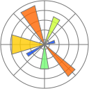

Matplotlib is a Python library for creating graphs and data visualizations. It is a fundamental tool for data analysis and presenting results. This document shows practical examples of using Matplotlib to create different types of charts. You can take it as a set of recipes for your own visualizations. You can explore more in the [official Matplotlib documentation](https://matplotlib.org/stable/contents.html).

## Installation

To install Matplotlib, use pip:

```bash
python3 -m pip install matplotlib
```

To have headers for type checking, you can also install the `matplotlib-stubs` package (still somewhat imperfect):

```bash
python3 -m pip install matplotlib matplotlib-stubs
```

## First plot

The most used module of Matplotlib is `pyplot`. This example shows how to create a basic line plot with axis labels and a title:

```python
import matplotlib.pyplot as plt

x = [1, 2, 3, 4, 5]
y = [2, 4, 8, 16, 32]

plt.plot(x, y)
plt.title('My first plot')
plt.xlabel('X Axis')
plt.ylabel('Y Axis')
plt.show()
```

When you run this code, a window with the corresponding plot will appear:

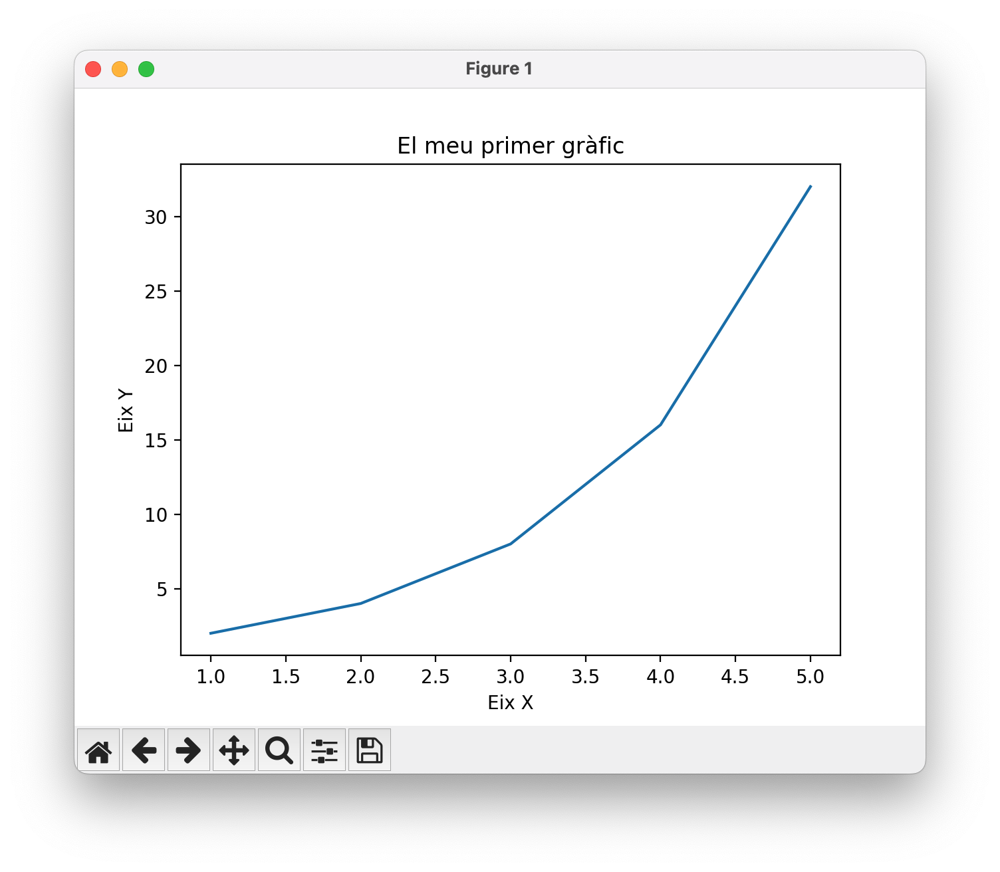

The tools in the bottom bar allow you to save the plot in various formats (PNG, SVG, PDF, etc.), zoom in, and move around the image.

The program works simply:

-   Imports the `pyplot` module from Matplotlib using the alias `plt`, following the usual convention.

-   Defines the data to plot in two lists: `x` and `y`.

-   Uses the function `plt.plot(x, y)` to create the line plot.

-   Adds a title and axis labels with the functions `plt.title()`, `plt.xlabel()`, and `plt.ylabel()`.

-   Finally, displays the plot with `plt.show()`.

## Saving plots

If you want to save the plot without displaying it, you can use `plt.savefig("filename.format")` instead of (or in addition to) `plt.show()`. Below is the saved result in SVG format with `plt.savefig("p1.svg")`:

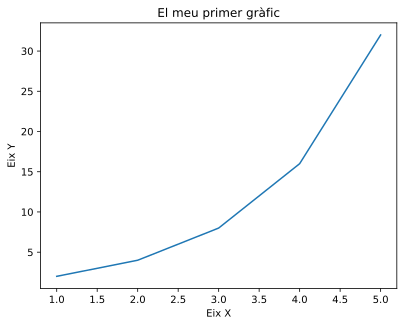

SVG images are scalable and ideal for inclusion in high-quality publications (like this one! 😂). Other common formats are PNG (bitmap image) and PDF (vector document).

Additionally, the `dpi` parameter controls the resolution (dots per inch), and `bbox_inches='tight'` removes unnecessary white space around the plot.

If you want to save the plot with a dark background, you can use the command `plt.style.use("dark_background")` before creating the plot. Here is the same plot saved with a dark background:

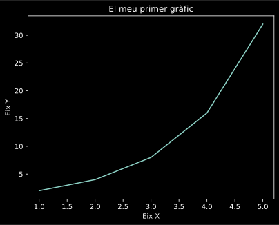

If you want to save the plot without a background color (transparent), you can use the parameter `transparent=True` in `plt.savefig()`. This is useful for overlaying the plot on other images or backgrounds.

## Line plots

Line plots are ideal for showing the evolution of continuous data. With `numpy` we can generate smoother data and create multiple series in the same plot. The function `legend()` shows the legend with labels for each line, and `grid()` adds a grid to facilitate reading:

```python
import matplotlib.pyplot as plt
import numpy as np

x = np.linspace(0, 10, 100) # 100 points between 0 and 10
y = np.sin(x)

plt.plot(x, y, label='sin(x)')
plt.plot(x, np.cos(x), label='cos(x)')
plt.legend()
plt.grid()
plt.show()
```

Here is the result:

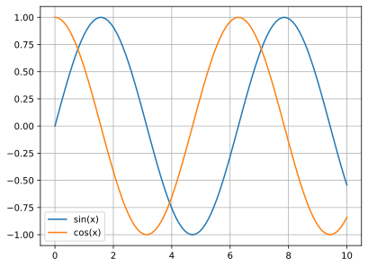

## Scatter plots

Scatter plots show the relationship between two variables. We can customize each point with different colors and sizes. The parameter `c` controls the color of each point, `s` the size, and `alpha` the transparency. The color bar (`colorbar`) shows the color scale used:

```python
x = np.random.rand(50)
y = np.random.rand(50)
colors = np.random.rand(50)
sizes = 1000 * np.random.rand(50)

plt.scatter(x, y, c=colors, s=sizes, alpha=0.5)
plt.colorbar()
plt.show()
```

The resulting plot is the following:

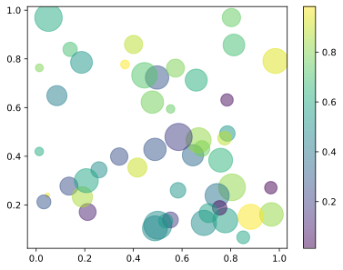

Note that, for brevity, we will no longer write the imports of `matplotlib.pyplot` and `numpy`, but they must be done before running the code.

## Histograms

Histograms show the frequency distribution of a dataset. The `bins` parameter determines the number of bars (intervals) into which the data is divided. The `edgecolor` option adds an outline to each bar to improve visualization:

```python
data = np.random.randn(1000)

plt.hist(data, bins=30, edgecolor='black')
plt.xlabel('Value')
plt.ylabel('Frequency')
plt.title('Histogram')
plt.show()
```

The result is this histogram:

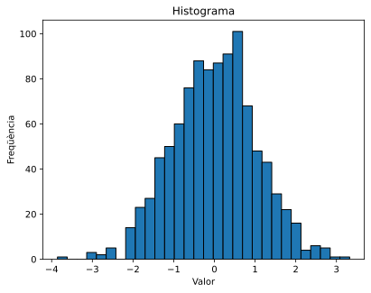

## Bar charts

Bar charts are perfect for comparing values between categories. Each bar represents a category and its height indicates the corresponding value:

```python
categories = ['A', 'B', 'C', 'D']
values = [23, 45, 56, 78]

plt.bar(categories, values, color='skyblue')
plt.xlabel('Category')
plt.ylabel('Value')
plt.show()
```

The resulting bar chart is this:

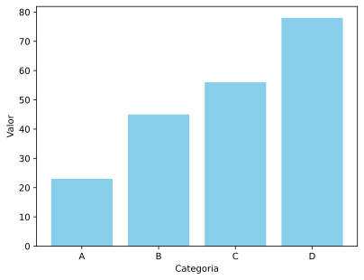

## Pie charts

Pie charts show proportions of a whole. The `explode` parameter allows separating one sector from the rest to highlight it. The `autopct` option shows the percentages, and `startangle` allows rotating the chart:

```python
labels = ['Python', 'Java', 'JavaScript', 'C++']
sizes = [35, 25, 20, 20]
colors = ['gold', 'lightblue', 'lightgreen', 'coral']
explode = (0.1, 0, 0, 0)

plt.pie(sizes, explode=explode, labels=labels, colors=colors,
        autopct='%1.1f%%', shadow=True, startangle=90)
plt.axis('equal')
plt.show()
```

The resulting pie chart is this:

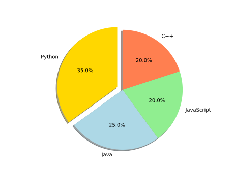

## Box plots

Box plots show the statistical distribution of data, including the median, quartiles, and outliers. They are useful for comparing distributions between different groups:

```python
data = [np.random.normal(0, std, 100) for std in range(1, 4)]

plt.boxplot(data, tick_labels=['Group 1', 'Group 2', 'Group 3'])
plt.ylabel('Values')
plt.show()
```

The example generates this box plot:

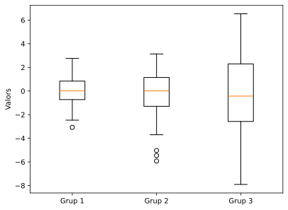

## Heatmaps

Heatmaps represent matrix data with colors, where each value is translated into a color intensity. The `cmap` parameter specifies the color scheme (like 'viridis', 'hot', 'cool'), and `aspect` controls the aspect ratio of the cells:

```python
data = np.random.rand(10, 10)

plt.imshow(data, cmap='viridis', aspect='auto')
plt.colorbar()
plt.title('Heatmap')
plt.show()
```

The resulting heatmap is this:

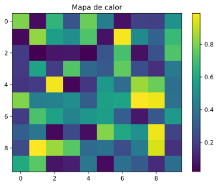

## Violin plots

Violin plots combine box plots with density estimates, showing the full distribution of the data. The options `showmeans` and `showmedians` add marks for the mean and median:

```python
data = [np.random.normal(0, std, 100) for std in range(1, 5)]

plt.violinplot(data, showmeans=True, showmedians=True)
plt.xlabel('Groups')
plt.ylabel('Values')
plt.show()
```

The resulting violin plot is this:

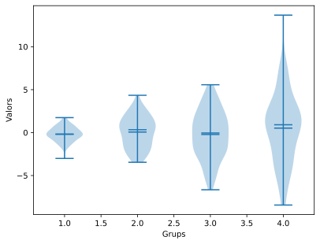

## Multiple subplots

The function `subplot(rows, columns, position)` allows creating multiple plots in the same figure. `tight_layout()` automatically adjusts the spacing between subplots to avoid overlaps:

```python
x = np.linspace(0, 10, 100)

plt.figure(figsize=(10, 4))

plt.subplot(1, 2, 1)
plt.plot(x, np.sin(x))
plt.title('sin(x)')

plt.subplot(1, 2, 2)
plt.plot(x, np.cos(x))
plt.title('cos(x)')

plt.tight_layout()
plt.show()
```

The result is this figure containing the two subplots:

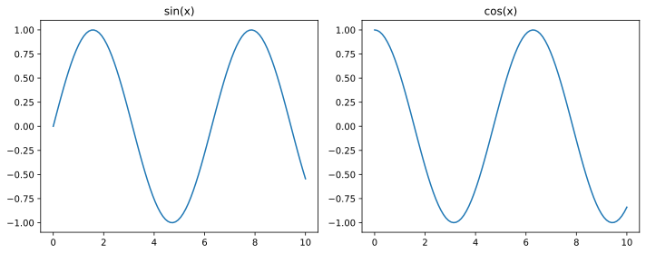

## Colors and line styles

Matplotlib allows customizing the appearance of lines with short codes. For example, `'r-'` is a solid red line, `'b--'` is a blue dashed line, and `'g:'` is a green dotted line. The `linewidth` parameter controls the thickness of the line:

```python
x = np.linspace(0, 10, 100)

plt.plot(x, x, 'r-', label='red line')
plt.plot(x, x**1.5, 'b--', label='blue dashed line')
plt.plot(x, x**2, 'g:', linewidth=3, label='green dotted line')
plt.legend()
plt.show()
```

Here we can see the different lines with their styles:

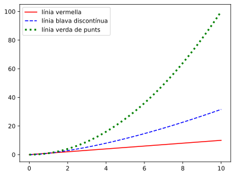

## Axis limits

With `xlim()` and `ylim()` we can control the visible range of the axes to focus on a specific region of the plot:

```python
x = np.linspace(0, 10, 100)
y = np.sin(x)

plt.plot(x, y)
plt.xlim(2, 8)
plt.ylim(-0.5, 0.5)
plt.show()
```

## Predefined styles

Matplotlib includes several predefined styles that change the overall appearance of plots (colors, fonts, grids, etc.). Some popular styles are `'seaborn-v0_8-darkgrid'`, `'ggplot'`, `'fivethirtyeight'`:

```python
plt.style.use('seaborn-v0_8-darkgrid')

x = np.linspace(0, 10, 100)
plt.plot(x, np.sin(x))
plt.show()
```

The plot with the applied style is this:

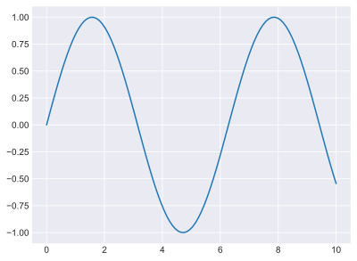

## 3D plots

To create three-dimensional plots we need the module `mpl_toolkits.mplot3d`. `meshgrid()` creates a 2D coordinate grid, and `plot_surface()` draws a 3D surface. The `cmap` parameter determines the color scheme of the surface:

```python
import matplotlib.pyplot as plt
import numpy as np
from mpl_toolkits.mplot3d import Axes3D

fig = plt.figure()
ax = fig.add_subplot(111, projection='3d')

x = np.linspace(-5, 5, 100)
y = np.linspace(-5, 5, 100)
X, Y = np.meshgrid(x, y)
Z = np.sin(np.sqrt(X**2 + Y**2))

ax.plot_surface(X, Y, Z, cmap='coolwarm')
ax.set_xlabel('X')
ax.set_ylabel('Y')
ax.set_zlabel('Z')
plt.show()
```

Look how beautiful this 3D surface is:

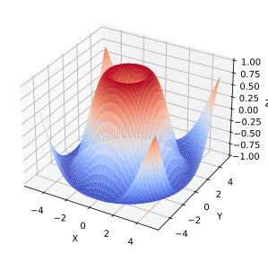

## Annotations and text

Annotations allow adding explanations to plots. `annotate()` creates an annotation with an arrow pointing to a specific point. The `xy` parameter indicates the pointed point, `xytext` the position of the text, and `arrowprops` defines the style of the arrow. `text()` simply places text at a position:

```python
x = np.linspace(0, 10, 100)
y = np.sin(x)

plt.plot(x, y)
plt.annotate('Maximum', xy=(np.pi/2, 1), xytext=(2, 1.3),
             arrowprops=dict(arrowstyle='->', color='red'))
plt.text(8, -0.5, 'y = sin(x)', fontsize=12, style='italic')
plt.show()
```

Easy, right?

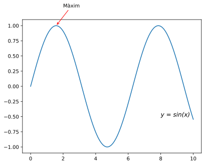

## Contour plots

Contour plots show level curves of a function of two variables. `contour()` draws the contour lines, while `contourf()` fills the space between lines with colors. The `levels` parameter controls how many contour lines are drawn:

```python
x = np.linspace(-3, 3, 100)
y = np.linspace(-3, 3, 100)
X, Y = np.meshgrid(x, y)
Z = np.sin(X) * np.cos(Y)

plt.contour(X, Y, Z, levels=10, cmap='RdBu')
plt.colorbar()
plt.contourf(X, Y, Z, levels=10, cmap='RdBu', alpha=0.3)
plt.show()
```

The resulting contour plot is this:

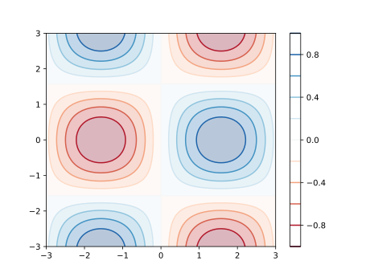

## Logarithmic scales

Logarithmic scales are useful when data covers several orders of magnitude. `loglog()` applies logarithmic scale to both axes. There are also `semilogx()` and `semilogy()` to apply logarithmic scale to only one axis:

```python
x = np.linspace(0.1, 100, 1000)
y = x**2

plt.loglog(x, y)
plt.xlabel('x (log scale)')
plt.ylabel('y (log scale)')
plt.grid(True, which='both')
plt.show()
```

## Animations

Matplotlib allows creating animations by updating plots over time. `FuncAnimation()` repeatedly calls a function that updates the data. The `frames` parameter indicates the number of iterations, `interval` the time between frames in milliseconds, and `blit=True` optimizes performance:

```python
import matplotlib.pyplot as plt
import matplotlib.animation as animation
import numpy as np

fig, ax = plt.subplots()
x = np.linspace(0, 2*np.pi, 100)
line, = ax.plot(x, np.sin(x))

def animate(i):
    line.set_ydata(np.sin(x + i/10))
    return line,

ani = animation.FuncAnimation(fig, animate, frames=100, interval=50, blit=True)
plt.show()
```

To save the animation as a video file, you can use the `save()` method of the `FuncAnimation` object, specifying the filename and desired format (such as MP4 or GIF):

```python
ani.save('animation.gif', writer='ffmpeg', dpi=150)
```

Here is the animation showing a moving sine wave:

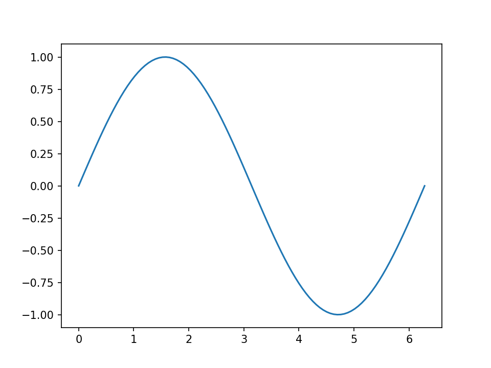

## Interactive plots with events

We can make plots respond to user actions by connecting functions to events. `mpl_connect()` links events (like mouse clicks) to custom functions. The `event` object contains information about the event, including the click coordinates:

```python
fig, ax = plt.subplots()
x = np.linspace(0, 10, 100)
line, = ax.plot(x, np.sin(x))

def onclick(event):
    if event.xdata and event.ydata:
        print(f'You clicked at ({event.xdata:.2f}, {event.ydata:.2f})')

fig.canvas.mpl_connect('button_press_event', onclick)
plt.show()
```

## Complete example

This example integrates many techniques: multiple lines with different styles, shaded area between lines with `fill_between()`, reference lines with `axhline()` and `axvline()`, font customization, and a semi-transparent grid:

```python
x = np.linspace(0, 2*np.pi, 100)
y1 = np.sin(x)
y2 = np.cos(x)

plt.figure(figsize=(10, 6))
plt.plot(x, y1, 'b-', linewidth=2, label='sin(x)')
plt.plot(x, y2, 'r--', linewidth=2, label='cos(x)')
plt.fill_between(x, y1, y2, alpha=0.3)

plt.xlabel('x (radians)', fontsize=12)
plt.ylabel('y', fontsize=12)
plt.title('Trigonometric functions', fontsize=14, fontweight='bold')
plt.legend(loc='upper right')
plt.grid(True, alpha=0.3)
plt.axhline(y=0, color='k', linewidth=0.5)
plt.axvline(x=0, color='k', linewidth=0.5)

plt.tight_layout()
plt.show()
```

The resulting plot is this:

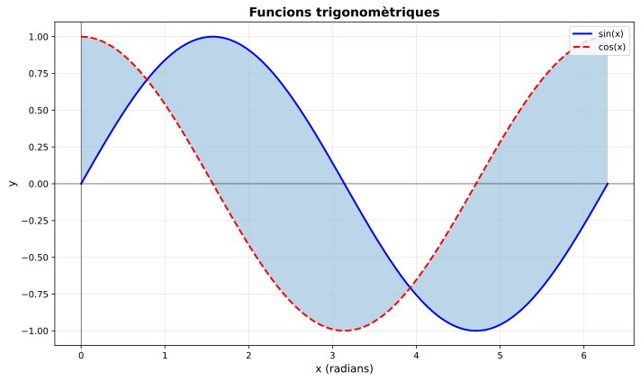

<Authors authors="jpetit"/>