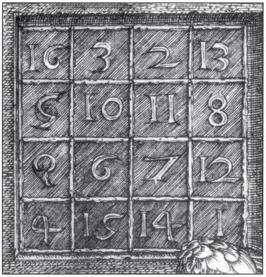
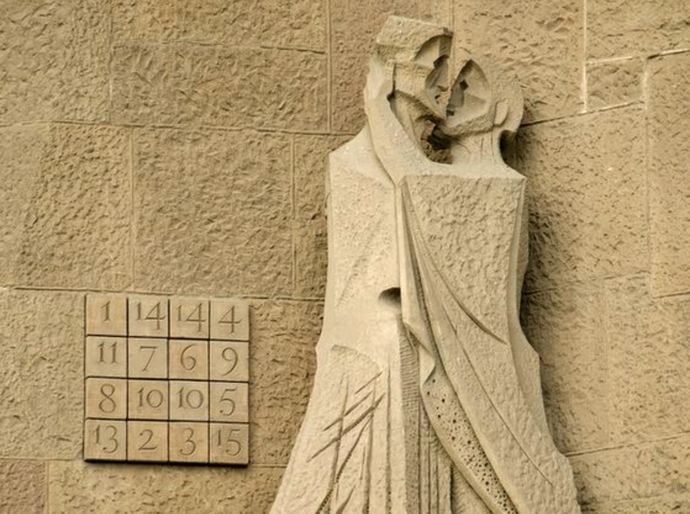

# Application: Magic Squares (P99555)



This lesson presents a solution to the problem [P99555](https://jutge.org/problems/P99555) from Jutge, which consists of determining whether certain arrangements of numbers constitute magic squares or not. The solution to this problem involves matrices and lists.

## Magic Squares

An $n \times n$ matrix of integers is called a **magic square** if all the numbers between 1 and $n^2$ appear exactly once, and if all the rows, columns, and diagonals sum to the same value. Magic squares are associated with supernatural properties and appear in some works of art. For example, there is a square that is almost magic in the Sagrada Família (but contains repeated elements):

<center>

</center>

## The Problem

The problem consists of reading a sequence of squares of variable size and stating, for each of them, whether it is magic or not.

In the input, each square starts with its number of rows and columns $n$ followed by the $n^2$ values that form it, row by row. When it is magic, you must write `yes` and when it is not, `no`.

For example, for the input

```text
3
1 6 8
5 7 3
9 2 4
4
4 5 16 9
14 11 2 7
1 8 13 12
15 10 3 6
```

the output should be

```text
no
yes
```

Check why.

## Program Structure

It is obvious that solving this problem calls for creating a function that, given a square, indicates whether it is magic or not. This function could have the following header and specification:

```python
def is_magic_square(q):
    """Indicates whether q is a magic square or not."""
```

The type `Square` will represent square matrices of numbers and is given by this type definition:

```python
Square = list[list[int]]
```

With this, we can already set up a main program that reads squares and writes whether they are magic or not:

```python
from yogi import read, tokens

def main():
    for n in tokens(int):
        q = [[read(int) for _ in range(n)] for _ in range(n)]
        print('yes' if is_magic_square(q) else 'no')
```

While values of `n` can be read with `tokens`, `n^2` integers are read and stored in a matrix `q` of size `n × n`, for which the result is printed using the function `is_magic_square`.

## Function to Determine the Property

Now we need to do the most essential part: write the function `is_magic_square` that indicates whether a square matrix of size `n × n` is magic or not. To do this, two conditions must be ensured:

1. All its values are between 1 and `n^2` and there are no repeats.
2. The sum of the values of each row, each column, and each diagonal are equal.

We could then decompose `is_magic_square` into two new functions `good_values` and `equal_sums` that indicate the result of the first and second condition respectively:

```python
def is_magic_square(q):
    """Indicates whether q is a magic square or not."""

    return good_values(q) and equal_sums(q)
```

The function `good_values` must first check that all values are between 1 and `n^2`: this can be easily done by searching for an incorrect value through all rows and columns. Then, it must check that there are no duplicates: this can be done in many ways. One of them is to create a list `seen` of `n^2 + 1` booleans, so that `seen[i]` indicates whether the number `i` is in the matrix or not (position zero is not used). At the beginning, no element is seen. Then, for each element `x` of the matrix, if it has not been seen yet, it is marked as seen. If it has already been seen, it means that element is repeated.

```python
def good_values(q):
    n = len(q)
    # check that all values are between 1 and n^2
    for i in range(n):
        for j in range(n):
            if not 1 <= q[i][j] <= n*n:
                return False
    # check that there are no repeated elements
    seen = [False for _ in range(n * n + 1)]
    for i in range(n):
        for j in range(n):
            x = q[i][j]     # we already know 1 <= x <= n*n, so the following accesses are safe
            if seen[x]:
                return False
            seen[x] = True
    # at this point, it has passed all checks
    return True
```

The function `equal_sums` must check if the sum of the values of each row, each column, and each diagonal are equal. To do this, you can first calculate the sum of the elements of the first diagonal. Then, check that the sum of the elements of the second diagonal and of each row and column match:

```python
def equal_sums(q):
    n = len(q)
    # find sum of first diagonal
    total = sum([q[i][i] for i in range(n)])
    # check sum of second diagonal
    if total != sum([q[n - i - 1][i] for i in range(n)]):
        return False
    # check sums of each row i
    for i in range(n):
        if total != sum(q[i]):
            return False
    # check sums of each column j
    for j in range(n):
        if total != sum([q[i][j] for i in range(n)]):
            return False
    # at this point, it has passed all checks
    return True
```

And the complete program is this:

```python
from yogi import read, tokens

Square = list[list[int]]

def main():
    for n in tokens(int):
        q = [[read(int) for _ in range(n)] for _ in range(n)]
        print('yes' if is_magic_square(q) else 'no')

def is_magic_square(q):
    """Indicates whether q is a magic square or not."""

    return good_values(q) and equal_sums(q)

def good_values(q):
    n = len(q)
    # check that all values are between 1 and n^2
    for i in range(n):
        for j in range(n):
            if not 1 <= q[i][j] <= n*n:
                return False
    # check that there are no repeated elements
    seen = [False for _ in range(n * n + 1)]
    for i in range(n):
        for j in range(n):
            x = q[i][j]     # we already know 1 <= x <= n*n, so the following accesses are safe
            if seen[x]:
                return False
            seen[x] = True
    # at this point, it has passed all checks
    return True

def equal_sums(q):
    n = len(q)
    # find sum of first diagonal
    total = sum([q[i][i] for i in range(n)])
    # check sum of second diagonal
    if total != sum([q[n - i - 1][i] for i in range(n)]):
        return False
    # check sums of each row i
    for i in range(n):
        if total != sum(q[i]):
            return False
    # check sums of each column j
    for j in range(n):
        if total != sum([q[i][j] for i in range(n)]):
            return False
    # at this point, it has passed all checks
    return True

if __name__ == '__main__':
    main()
```

## The `all` and `any` Functions

Given a list of booleans, the built-in function `all` indicates if all are true. Similarly, given a list of booleans, the built-in function `any` indicates if any is true. For example:

```python
>>> all([True, True, False])
False
>>> all([True, True, True])
True
>>> all([])
True
>>> any([False, False, True])
True
>>> any([])
False
```

These functions are very useful when passed a list comprehension. For example, to check that all values are between 1 and `n^2` in the function `good_values`, you could do

```python
    if not all([1 <= q[i][j] <= n*n for i in range(n) for j in range(n)]):
        return False
```

instead of

```python
    for i in range(n):
        for j in range(n):
            if not 1 <= q[i][j] <= n*n:
                return False
```

as we did before.

Similarly, to check if any of the sums of the rows is different from `total` in `equal_sums`, you could do

```python
    if any([sum(row) != total for row in q]):
        return False
```

instead of

```python
    for i in range(n):
        if total != sum(q[i]):
            return False
```

And, using the same idea, the whole function could be rewritten like this:

```python
def equal_sums(q):
    n = len(q)
    total = sum([q[i][i] for i in range(n)])  # sum of first diagonal
    return total == sum([q[n - i - 1][i] for i in range(n)]) \  # sum of second diagonal
        and all([sum(row) == total for row in q]) \    # sums of rows
        and all([sum([q[i][j] for i in range(n)]) == total for j in range(n)])  # sums of columns
```

Note: I leave it with list comprehensions and not generators to avoid complicating things further.

<Authors authors="jpetit"/>