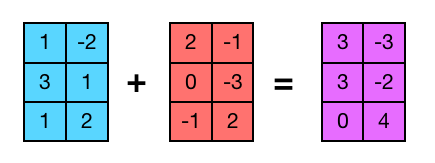
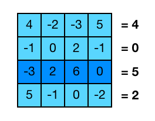
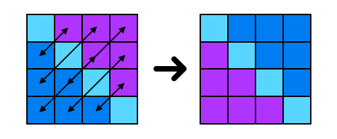
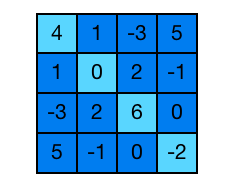
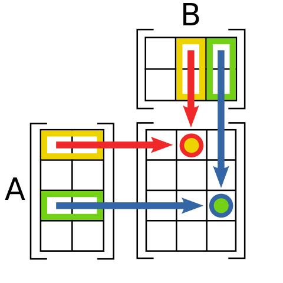

# Application: Mathematical operations on matrices


This lesson presents some examples of mathematical operations on matrices. In particular, it covers these operations:

-   Adding matrices
-   Finding the largest row sum
-   Transposing a square matrix
-   Checking if a square matrix is symmetric
-   Matrix multiplication

## Data types

Throughout this lesson, we will assume the following types are already defined:

```python
Fila = list[float]
Matriu = list[Fila]
```

All matrices in this section will be of real numbers. For simplicity, we will also assume that the matrices we work with have at least one row (even if it is empty), since otherwise it makes no sense to talk about columns and calls like `len(matrix[0])` would cause an error.

## Adding matrices



One of the most basic operations you can perform between matrices is adding them. As you know, to add two matrices, they must have the same dimensions, and the addition is done element by element. We will assume that the matrices we input have the correct dimensions.

Thus, here is a possible implementation for a function that, given two matrices, returns their sum:

```python
def add(A, B):
    """
    Returns the sum of A and B.
    Precondition: A and B are m x n matrices, with m > 0.
    """

    m = len(A)       # number of rows
    n = len(A[0])    # number of columns

    return [[A[i][j] + B[i][j] for j in range(n)] for i in range(m)]
```

Here the result is expressed with nested list comprehensions.

## Finding the largest row sum



Consider that we need to calculate the maximum of the sums of the rows of a matrix. For example, for the matrix shown, the result should be 5.

Here is a first implementation using basic matrix access operations:

```python
def max_row_sum(M):
    """Returns the maximum of the sums of the rows of a non-empty matrix M."""

    m = len(M)       # number of rows
    n = len(M[0])    # number of columns

    for i in range(m):
        # sum the elements of the current row
        current_sum = 0
        for j in range(n):
            current_sum += M[i][j]
        # if it exceeds the maximum or is the first row, update
        if i == 0 or current_sum > max_sum:
            max_sum = current_sum
    return max_sum
```

Here, to calculate the sum of certain elements, we use an auxiliary variable `current_sum` initially zero to which we add the values we want to sum. On the other hand, to find a maximum, we create another variable that at all times holds the largest element found so far and is compared with the next ones.

Now, the use of the built-in functions `max` and `sum` and list comprehensions allow us to write a second equivalent implementation much more concisely:

```python
def max_row_sum(M):
    """Returns the maximum of the sums of the rows of a non-empty matrix M."""

    return max([sum(row) for row in M])
```

## Transposing a square matrix



Now consider the problem of transposing a square matrix.

In this case, the elements we want to swap are the ones at index `[i][j]` with those at index `[j][i]` where `n` is the number of rows and columns. Here, note that the diagonal elements do not need to be touched and that only one of the two halves separated by the diagonal needs to be visited, since otherwise we would recover the original matrix by swapping each pair twice. The corresponding action would look like this:

```python
def transpose_in_place(M):
    """Transposes the square matrix M in place."""

    n = len(M)
    for i in range(n):  # for each row index
        for j in range(i + 1, n):  # for each column above the diagonal
            M[i][j], M[j][i] = M[j][i], M[i][j]
```

Note that in this case, we perform an action that transposes the matrix passed as a parameter. It would also be possible to write a function that, given a matrix, returns another matrix which is the transpose of the first:

```python
def transpose(M):
    """Returns the transpose of the square matrix M."""

    n = len(M)
    return [[M[j][i] for j in range(n)] for i in range(n)]
```

**Exercise:** Write a function that transposes rectangular matrices.

## Checking if a square matrix is symmetric



Now we want to check if a square matrix is symmetric or not.

This example is similar to the previous one, with the difference that here we do not swap elements, but compare them. The matrix will be symmetric if and only if each pair of symmetric elements are equal.

Thus, we get the following function that searches for pairs of different symmetric elements:

```python
def is_symmetric(M):
    """Indicates whether the square matrix M is symmetric or not."""

    n = len(M)
    for i in range(n):
        for j in range(i + 1):
            if M[i][j] != M[j][i]:
                return False
    return True
```

The `i` loop iterates over each row index, and the `j` loop iterates over each element of that row to the left of the diagonal. Each pair of symmetric elements is compared at most once. The diagonal elements are not checked. This avoids redundant comparisons.

## Matrix multiplication



In mathematics, given two matrices $A$ and $B$, the first thing we need to define the product $AB$ is that matrix $A$ has exactly the same number of columns as the number of rows of matrix $B$. In this case, if $A$ is an $m \times n$ matrix and $B$ is an $n \times p$ matrix, their product will be a matrix $C$ of size $m \times p$ such that its element $c_{ij}$ (the element in row $i$ and column $j$ of $C$) is calculated as

$$
c_{ij} = \sum_{k=1}^n a_{ik}b_{kj}.
$$

To start, let's focus on the product of square matrices: suppose $A$ and $B$ are $n \times n$ matrices.

Let's reproduce the previous procedure in programming language: to traverse the resulting matrix we will need two loops, and to calculate each of its elements we will need another loop to sum the corresponding elements. The resulting code would be:

```python
def multiply(A, B):
    """Returns the product of A and B, assuming both are square matrices."""

    n = len(A)
    C = [[0.0 for j in range(n)] for i in range(n)]  # n x n zero matrix
    for i in range(n):
        for j in range(n):
            for k in range(n):
                C[i][j] += A[i][k] * B[k][j]
    return C
```

Which can also be expressed through list comprehensions and using `sum`.

```python
def multiply(A, B):
    """Returns the product of A and B, assuming both are square matrices."""

    n = len(A)
    return [
        [
            sum([A[i][k] * B[k][j] for k in range(n)])
            for j in range(n)
        ]
        for i in range(n)
    ]
```

The general case when $A$ is of size $m \times n$ and $B$ is of size $n \times p$ (and therefore the result is size $m \times p$) is now easy to adapt:

```python
def multiply(A, B):
    """
    Returns the product of A and B:
    Precondition: A and B have compatible sizes for multiplication.
    """

    m = len(A)
    n = len(B)
    p = len(B[0])
    return [
        [
            sum([A[i][k] * B[k][j] for k in range(n)])
            for j in range(p)
        ]
        for i in range(m)
    ]
```

<Authors authors="jpetit rafah"/>