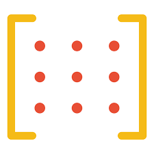
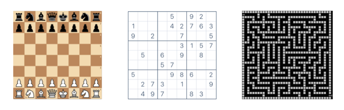
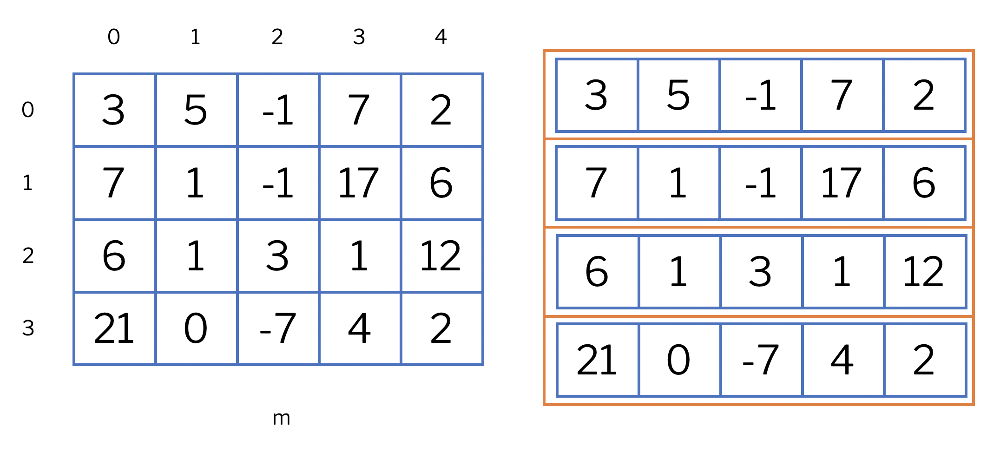
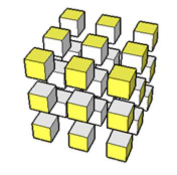

# Matrices



This lesson introduces matrices, a data structure similar to lists but with more than one dimension. In fact, matrices in Python are nothing more than lists of lists. Like lists, matrices have many applications in mathematics, but they can also represent many other concepts in computer science, such as boards, maps, patterns...

## Introduction

A matrix is a data structure that allows storing multiple data of the same type, distributed across several rows and columns. The information stored in each position of a matrix is of the same type. The use of matrices is very useful for solving many types of problems: matrices easily represent game boards, maps, tables, patterns...

<center>

</center>

In Python, a matrix is represented as a list of lists. By convention, the "outer" list represents the rows of the matrix, and the "inner" lists represent the values in each row. For example, this piece of code declares a matrix `m` of size 4×5 and initializes it with certain values.

```python
m = [
    [ 3,  5, -1,  7,  2],
    [ 7,  1, -1, 17,  6],
    [ 6,  1,  3,  1, 12],
    [21,  0, -7,  4,  2]
]
```

The following figure illustrates this: On the left, the matrix as a whole; on the right, decomposed into 4 lists of lists of 5 elements.

<center>

</center>

To access an element in the `i`-th row and the `j`-th column, you need to index the matrix twice: `m[i][j]`. This is not new: `m[i]` accesses the index `i` of the list `m`. Since `m[i]` is also a list, `m[i][j]` selects index `j` from it.

For example, `m[2][3]` equals `1` in the previous matrix. In fact, `m[2]` is a row that equals `[6,  1,  3,  1, 12]`. Obtaining the list corresponding to column `j` of a matrix is not a direct operation in Python, but it can be done with `[row[j] for row in m]`.

## Types of matrices

Remember that matrices are lists of lists. Therefore, if the type of elements inside the matrix is `T`, the type of the matrix is

```python
list[list[T]]
```

For example, in many mathematical applications, the type of matrices would be `list[list[float]]`.

## Creating matrices

To create a matrix, we do it the same way we create a list, but in this case, the element type of this list will again be a list, this time of the desired data type. The ways to initialize a matrix are exactly the same as those for a list, considering that a matrix is nothing more than a list of lists.

The simplest way to do this is by extension:

```python
m = [
    [ 3,  5, -1,  7,  2],
    [ 7,  1, -1, 17,  6],
    [ 6,  1,  3,  1, 12],
    [21,  0, -7,  4,  2]
]
```

By symmetry, Python allows putting a comma after the last element of a list:

```python
m = [
    [ 3,  5, -1,  7,  2],
    [ 7,  1, -1, 17,  6],
    [ 6,  1,  3,  1, 12],
    [21,  0, -7,  4,  2],
]
```

List comprehensions are also often a good way to create matrices. In this case, we need list comprehensions that contain list comprehensions. This code creates an `m` × `n` matrix of zeros:

```python
[[0 for j in range(n)] for i in range(m)]
```

Since the control variables `i` and `j` are not used, it is convenient to use anonymous variables instead:

```python
[[0 for _ in range(n)] for _ in range(m)]
```

Obviously, sometimes it is useful to use the control variables. For example, to create a matrix where each element is a pair containing its position:

```python
[[(i, j) for j in range(n)] for i in range(m)]
```

!!! Explain aliasing dangers

## Higher-dimensional matrices



Just as to make two-dimensional matrices we made a list contain other lists, we can make those lists contain more lists, and so on indefinitely. For example, we can create a three-dimensional matrix of `m × n × r` zeros with the following code:

```python
[[[0.0 for k in range(r)] for j in range(n)] for i in range(m)]
```

For example, this construction can be used to store data about points in space. However, its use is not very common in early programs, so we will not go into more detail.

## Type declarations with `TypeAlias`

As you may have seen, the type of matrices can become a bit cumbersome and complicated to read due to nesting. That is why alternative names are often given to these types using `TypeAlias` from the `typing` module.

The way to introduce a type name is `name: TypeAlias = type` where `type` is an existing data type (for example, `int`, `str`, or `list[int]`) and `name` is a new identifier. The purpose of this statement is to create a new type named `name` that substitutes `type`.

For example,

```python
from typing import TypeAlias

Temperatures: TypeAlias = list[float]
```

introduces a new type named `Temperatures` which is equivalent to `list[float]`. From this declaration, new variables and parameters can be declared using this new type name:

```python
def average_temperature(temperatures):
    ...
```

You can perfectly think that the system replaces all occurrences of `Temperatures` with `list[float]` and you would be right. But for human readers, providing good names to types facilitates code understanding, making programs more readable. And, in the long term, it also makes them easier to improve.

If now, moreover, we want to have a record of all temperatures throughout a year, we will need a list of 365 lists of 24 temperatures. Therefore, we could define the following types and create a matrix as follows:

```python
Temperatures = list[float]
Record = list[Temperatures]

record = [[0.0 for h in range(24)] for d in range(365)]
```

## Matrix sizes

One last comment: remember that `len` applied to a list returns its number of elements. Since matrices are lists of lists, the `len` function indicates the number of rows, not the total number of elements. If you want to find the number of columns, you can look at the `len` of the first row (if it exists). This example illustrates it with a 4×5 matrix:

```python
>>> mat = [
    [ 3,  5, -1,  7,  2],
    [ 7,  1, -1, 17,  6],
    [ 6,  1,  3,  1, 12],
    [21,  0, -7,  4,  2],
]
>>> len(mat)
4
>>> len(mat[0])
5
>>> len(mat) * len(mat[0])
20
```

<Authors authors="jpetit"/>