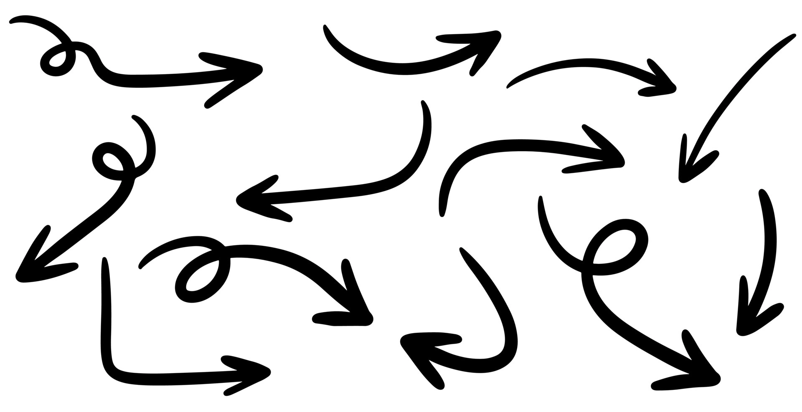

# References




This lesson continues with important details about lists and references. In particular, it considers a problem that one can frequently encounter when dealing with lists of lists and analyzes different possible solutions. In fact, there is nothing new here, but seeing it in the context of arrays reinforces the understanding of references to objects.


## The problem

First, consider this small program:

```python
row = [0, 0, 0]
matrix = [row, row, row]
print(matrix)
```

It is obvious that this program prints a 3×3 matrix of zeros ~~[[0, 0, 0], [0, 0, 0], [0, 0, 0]]~~. Perfect.

Now, to make the position 0,0 of the matrix change to 9, it seems that only a small modification is needed:

```python
row = [0, 0, 0]
matrix = [row, row, row]
matrix[0][0] = 9
print(matrix)
```

Watch out! The program should now print ~~[[9, 0, 0], [0, 0, 0], [0, 0, 0]]~~.

But no! The program prints ~~[[9, 0, 0], [9, 0, 0], [9, 0, 0]]~~ 😵‍💫. And, in fact, at the end of the program, the variable `row` is `[9, 0, 0]` 😱.

To understand what happens, execute the previous program step by step with Python Tutor:

<iframe width="800" height="500" frameborder="0" src="https://pythontutor.com/iframe-embed.html#code=row%20%3D%20%5B0,%200,%200%5D%0Amatrix%20%3D%20%5Brow,%20row,%20row%5D%0Amatrix%5B0%5D%5B0%5D%20%3D%209%0Aprint%28matrix%29&codeDivHeight=400&codeDivWidth=350&cumulative=false&curInstr=0&heapPrimitives=nevernest&origin=opt-frontend.js&py=3&rawInputLstJSON=%5B%5D&textReferences=false"> </iframe>

When `row = [0, 0, 0]` is executed, we see that a variable `row` is created and its value, as we know, is a reference to a list object with three zeros.

When `matrix = [row, row, row]` is executed, a variable `matrix` is also created and its value is a reference to a list object (because matrices are nothing but lists of lists). And now, notice this: each element of this new list is a reference to `row`. This may be surprising, but it is perfectly consistent with what we know.

Therefore, when `matrix[0][0] = 9` is done, what is modified is the list `[0, 0, 0]` which becomes `[9, 0, 0]` and, as a consequence, `row`, `matrix[0]`, `matrix[1]`, and `matrix[2]` are all modified because they all referenced it.

Tragic, right? But, in fact, predictable: Lists are manipulated through references. Therefore, lists of lists are references to lists of references to lists, as shown in the diagram.


## Possible solutions (good and bad)

The problem we encountered earlier is that `matrix` was not really a matrix with nine elements. It was a list where each element was *the same* list. Essentially, there were only three elements.

To fix this, we could consider several alternatives to the assignment `matrix = [row, row, row]`:

1. If we do `matrix = [row] * 3`, the result is the same. The list repetition operator replicates references to the lists. [See it](https://pythontutor.com/render.html#code=row%20%3D%20%5B0,%200,%200%5D%0Amatrix%20%3D%20%5Brow%5D%20*%203%0Amatrix%5B0%5D%5B0%5D%20%3D%209%0Aprint%28matrix%29&cumulative=false&curInstr=0&heapPrimitives=nevernest&mode=display&origin=opt-frontend.js&py=3&rawInputLstJSON=%5B%5D&textReferences=false) with Python Tutor.

1. If we do `matrix = [row[:]] * 3`, the result is almost the same. The copy of `row` with `row[:]` makes `matrix` and `row` independent (good!) but the list repetition operator still shares the three rows of the matrix (bad!). [See it](https://pythontutor.com/render.html#code=row%20%3D%20%5B0,%200,%200%5D%0Amatrix%20%3D%20%5Brow%5B%3A%5D%5D%20*%203%0Amatrix%5B0%5D%5B0%5D%20%3D%209%0Aprint%28matrix%29&cumulative=false&curInstr=0&heapPrimitives=nevernest&mode=display&origin=opt-frontend.js&py=3&rawInputLstJSON=%5B%5D&textReferences=false).

1. If we do `matrix = [row for _ in range(3)]`, the result is also the same as at the beginning. The list comprehension replicates references to the lists. [See it](https://pythontutor.com/render.html#code=row%20%3D%20%5B0,%200,%200%5D%0Amatrix%20%3D%20%5Brow%20for%20_%20in%20range%283%29%5D%0Amatrix%5B0%5D%5B0%5D%20%3D%209%0Aprint%28matrix%29&cumulative=false&curInstr=0&heapPrimitives=nevernest&mode=display&origin=opt-frontend.js&py=3&rawInputLstJSON=%5B%5D&textReferences=false).

1. On the other hand, if we do `matrix = [row[:] for _ in range(3)]`, the result is now the desired one 👍: The list comprehension evaluates the expression `row[:]` each time for each element of the `range` and, therefore, creates 3 independent copies. [See it](https://pythontutor.com/render.html#code=row%20%3D%20%5B0,%200,%200%5D%0Amatrix%20%3D%20%5Brow%5B%3A%5D%20for%20_%20in%20range%283%29%5D%0Amatrix%5B0%5D%5B0%5D%20%3D%209%0Aprint%28matrix%29&cumulative=false&curInstr=0&heapPrimitives=nevernest&mode=display&origin=opt-frontend.js&py=3&rawInputLstJSON=%5B%5D&textReferences=false).

1. If we omit the variable `row`, doing `matrix = [[0, 0, 0] for _ in range(3)]` also creates the desired matrix. The reason, again, is that at each iteration of the `for`, the `[0, 0, 0]` is evaluated again producing a new list each time. [See it](https://pythontutor.com/render.html#code=matrix%20%3D%20%5B%5B0,%200,%200%5D%20for%20_%20in%20range%283%29%5D%0Amatrix%5B0%5D%5B0%5D%20%3D%209%0Aprint%28matrix%29&cumulative=false&curInstr=0&heapPrimitives=nevernest&mode=display&origin=opt-frontend.js&py=3&rawInputLstJSON=%5B%5D&textReferences=false).

1. Curiously, doing `matrix = [[0] * 3 for _ in range(3)]` also produces the correct result. Since `0` is an integer and not a list, `[0] * 3` replicates the integer zero three times, not three references to the integer zero.

The differences are subtle and can easily go unnoticed. Therefore, it is important to understand them well.


## Exercise

We have a matrix `m`, like this one:

```python
matrix = [
    [1, 2, 3, 4],
    [9, 8, 7, 6],
    [1, 2, 2, 1],
]
```

Indicate which one or more of the following instructions copy the matrix `matrix` *completely* into `matrix2`. Here, "completely" means that both matrices are totally disconnected and independent: changes in one do not affect changes in the other.

- `matrix2 = matrix`

- `matrix2 = matrix[:]`

- `matrix2 = matrix[:][:]`

- `matrix2 = [row for row in matrix]`

- `matrix2 = [row[:] for row in matrix]`

- `matrix2 = [[element for element in row] for row in matrix]`

- `matrix2 = [[matrix[i][j] for j in range(len(matrix[i]))] for i in range(len(matrix))]`

Check your answer [here](https://pythontutor.com/render.html#code=matrix%20%3D%20%5B%0A%20%20%20%20%5B1,%202,%203,%204%5D,%0A%20%20%20%20%5B9,%208,%207,%206%5D,%0A%20%20%20%20%5B1,%202,%202,%201%5D,%0A%5D%0A%0Amatrix2%20%3D%20matrix%0A%23%20does%20not%20work%3A%20everything%20is%20shared%0A%0Amatrix2%20%3D%20matrix%5B%3A%5D%0A%23%20does%20not%20work%3A%20each%20row%20is%20shared%0A%0Amatrix2%20%3D%20matrix%5B%3A%5D%5B%3A%5D%0A%23%20does%20not%20work%3A%20each%20row%20is%20shared%20(makes%20a%20copy%20of%20the%20copy)%0A%0Amatrix2%20%3D%20%5Brow%20for%20row%20in%20matrix%5D%0A%23%20does%20not%20work%3A%20each%20row%20is%20shared%0A%0Amatrix2%20%3D%20%5Brow%5B%3A%5D%20for%20row%20in%20matrix%5D%0A%23%20works%3A%20both%20matrices%20do%20not%20share%20information&cumulative=false&curInstr=0&heapPrimitives=nevernest&mode=display&origin=opt-frontend.js&py=3&rawInputLstJSON=%5B%5D&textReferences=false).


## Matrices as parameters

Remember that parameter passing is equivalent to an assignment. Therefore, when a matrix is passed as a real parameter, the corresponding formal parameter is a copy of its reference, not its value (because, after all, matrices are lists).

This allows us, for example, to write an action that transposes a square matrix like this:

```python
def transpose(M):
    """Transpose the square matrix M."""

    n = len(M)
    for i in range(n):  # for each row index
        for j in range(i + 1, n):  # for each column below the diagonal
            M[i][j], M[j][i] = M[j][i], M[i][j]
```

Indeed, if we have `a = [[1, 2], [3, 4]]`, after calling `transpose(a)`, the value of `a` will be `[[1, 3], [2, 4]]`, as expected.

On the other hand, this implementation is incorrect:

```python
def transpose_kk(matrix):
    """Transpose the given square matrix. Does not work!"""

    n = len(matrix)
    matrix ❌ = [[matrix[j][i] for j in range(n)] for i in range(n)]
```

In this case, after calling `transpose_kk(a)`, the value of `a` will remain the original. This is because, although the matrix comprehension correctly calculates the transpose of `matrix`, it generates a new matrix that is stored (with the assignment operator) in the variable `matrix`. Therefore, the relationship between the formal and real parameter is broken.

Obviously, instead of doing an action that transposes the matrix received, one could decide to write a function that returns the transpose of a given matrix, without modifying the original at all:

```python
def transpose(matrix):
    """Return the transpose of a given square matrix."""

    n = len(matrix)
    return [[matrix[j][i] for j in range(n)] for i in range(n)]
```

By the way, notice that the name of the function (`transpose`) and the name of the action (`transpose`) already show the different intended effect: In the case of the function we preferred a noun, to emphasize the result obtained, while in the case of the action we preferred an infinitive (an imperative would also be fine), to emphasize the change. The function or action version will be more or less appropriate depending on the context. In general, functions, by not changing things and delivering new results, are safer. In exchange, actions, by not having to create duplicates, are more efficient.


## Exercise

Indicate which of the following actions correctly sets all values of a given (non-empty) matrix to zero:

```python
def set_to_zero(matrix):
    m, n = len(matrix), len(matrix[0])
    for i in range(m):
        for j in range(n):
            matrix[i][j] = 0
```

```python
def set_to_zero(matrix):
    for row in matrix:
        for element in row:
            element = 0
```

```python
def set_to_zero(matrix):
    for row in matrix:
        for j in range(len(row)):
            row[j] = 0
```

```python
def set_to_zero(matrix):
    m, n = len(matrix), len(matrix[0])
    matrix = [[0 for _ in range(n)] for _ in range(m)]
```

```python
def set_to_zero(matrix):
    m, n = len(matrix), len(matrix[0])
    for i in range(m):
        matrix[i] = [0] * n
```

```python
def set_to_zero(matrix):
    m, n = len(matrix), len(matrix[0])
    zeros = [0 for _ in range(n)]
    for i in range(m):
        matrix[i] = zeros
```

```python
def set_to_zero(matrix):
    m, n = len(matrix), len(matrix[0])
    zeros = [0] * n
    for i in range(m):
        matrix[i] = zeros
```

```python
def set_to_zero(matrix):
    m, n = len(matrix), len(matrix[0])
    zeros = [0] * n
    for i in range(m):
        matrix[i] = zeros[:]
```


## Summary

Since lists are objects, lists of lists are treated as references to lists of references to lists. This makes it very easy to share data, which can be very useful on some occasions, but disastrous on others.

One place where data sharing is often exploited is in actions, in order to modify the contents of the received objects. In this case, one must be careful not to assign new values to the parameters.

When you do not want to share data but have copies, working with list comprehensions and using slices `[:]` is usually a good approach.


Python was supposed to be easy. In this case, it really isn't that much. *C'est la vie!*


<Authors authors="jpetit"/>