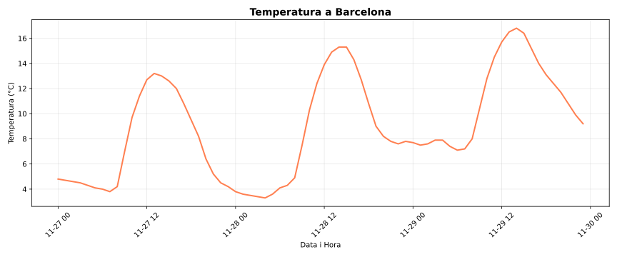

# Pandas


Pandas is a Python library for data analysis and manipulation. It provides flexible and efficient data structures to work with tabular data and time series.

Its main features include:

-   Loading and exporting data in various formats (CSV, Excel, JSON, SQL)
-   Data cleaning and preparation
-   Exploratory and statistical analysis
-   Data transformation and aggregation
-   Handling data with missing values

Pandas is widely used in data science, machine learning, finance, research, and any field that requires structured data processing.

Think of Pandas as a programmable version of a spreadsheet.

## Installation and import

To install Pandas:

```bash
python3 -m pip install pandas
```

The standard convention to import Pandas is:

```python
import pandas as pd
```

This allows you to use all Pandas functions with the prefix `pd`, which is shorter and follows community conventions.

## Relation to NumPy and other libraries

Pandas is built on top of NumPy, inheriting its efficiency in numerical operations. Pandas structures internally use NumPy arrays.

Pandas integrates easily with:

-   **NumPy**: for mathematical operations and multidimensional arrays
-   **Matplotlib**: for data visualization
-   **Scikit-learn**: for machine learning
-   **SciPy**: for scientific computing

This integration enables complete workflows, from data loading to modeling and visualization.

## First usage example

Consider that you want a program to:

1. Obtain weather forecast data for Barcelona.
2. Calculate average, maximum, and minimum.
3. Plot a graph showing the temperature evolution.

Here is the complete code with Pandas and Matplotlib:

```python
import pandas as pd
import matplotlib.pyplot as plt

# Download data from the EU open data API about temperatures
url = "https://api.open-meteo.com/v1/forecast?latitude=41.39&longitude=2.16&hourly=temperature_2m&forecast_days=3"

# Read the data directly with pandas
df = pd.read_json(url)

# Extract temperatures and times
temps = pd.DataFrame({
    'Time': pd.to_datetime(df['hourly']['time']),
    'Temperature': df['hourly']['temperature_2m']
})

# Calculate basic statistics
print("Temperatures in Barcelona (next 3 days)")
print(f"Average temperature: {temps['Temperature'].mean():.1f}°C")
print(f"Maximum temperature: {temps['Temperature'].max():.1f}°C")
print(f"Minimum temperature: {temps['Temperature'].min():.1f}°C")

# Create a plot
plt.figure(figsize=(12, 5))
plt.plot(temps['Time'], temps['Temperature'], linewidth=2, color='coral')
plt.title('Temperature in Barcelona', fontsize=14, fontweight='bold')
plt.xlabel('Date and Time')
plt.ylabel('Temperature (°C)')
plt.grid(True, alpha=0.3)
plt.xticks(rotation=45)
plt.tight_layout()
plt.show()
```

The program output is something like:

```text
Temperatures in Barcelona (next 3 days)
Average temperature: 9.0°C
Maximum temperature: 16.8°C
Minimum temperature: 3.3°C
```

And the resulting graph is:



Next, we explain step by step what each part of the code does with Pandas.

1. **Download JSON data:**

    ```python
    df = pd.read_json(url)
    ```

    Pandas can read JSON directly from a URL (specifically from the public Open-Meteo API in this case). The result is already a **DataFrame** (the main Pandas data structure, like an Excel table in memory).

2. **Create a structured DataFrame:**

    ```python
    temps = pd.DataFrame({
        'Time': pd.to_datetime(df['hourly']['time']),
        'Temperature': df['hourly']['temperature_2m']
    })
    ```

    A **DataFrame** is like a dictionary of lists, but with superpowers:

    - Each key is a **column**.
    - Pandas understands special data types like dates (`pd.to_datetime()` converts text to date objects).
    - You can access data by rows, columns, or conditions.

3. **Operations on columns:**

    ```python
    temps['Temperature'].mean()
    temps['Temperature'].max()
    temps['Temperature'].min()
    ```

    This is where Pandas shines: When accessing a column (`temps['Temperature']`), you get a **series** (like an enhanced list). Series have direct methods for statistics:

    - No need for `for` loops.
    - No need for `sum(list)/len(list)` for the average.
    - Everything is optimized internally with NumPy.

4. **Visualization:**

    Matplotlib takes columns from the DataFrame directly and plots them.

The following lessons will delve deeper into Pandas features, but this example shows how it can be used to efficiently load, manipulate, and analyze data.

<Authors authors="jpetit"/>