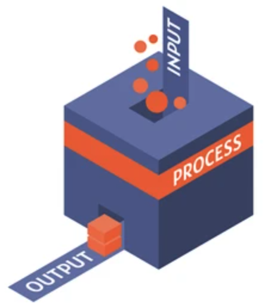

# Reading and Writing: Concepts

Computers not only perform calculations but also need to interact with users to receive input data and deliver output data. This interaction is known as input-output in computing and is a complex aspect due to the diversity of existing devices.

## Basic Input-Output

Input and output in computers is a fundamental process for interaction between the user and the machine. Input refers to receiving data or signals from external sources, such as keyboards, mice, scanners, or other peripheral devices. This data is processed and used by the computer system to perform specific tasks. On the other hand, output involves transmitting information from the computer system to the user or other output devices, such as screens, printers, or speakers. This information can take various forms, such as text, images, sound, or commands to control other devices. The input-output process is managed by hardware and software components that allow efficient and reliable data transfer between peripheral devices and the central system. This enables computers to interact with the external environment and facilitates communication and the use of their functionalities by users.

The standard input and output channels of an operating system are communication interfaces for interaction between the user and the system. The **standard input channel**, known as _stdin_, allows data entry by the user (for example, via the keyboard) or by another program or device (such as a file). On the other hand, the **standard output channel**, called _stdout_, is used to display results, messages, or data generated by the program to the user or another process. These standard channels provide a standardized way of communication between programs and the operating system, facilitating interaction and data flow.

Thanks to these channels implemented by the operating system, reading through _stdin_ and writing through _stdout_ can be done without knowing the details of the peripherals to which they are connected.

<Authors authors="jpetit"/>