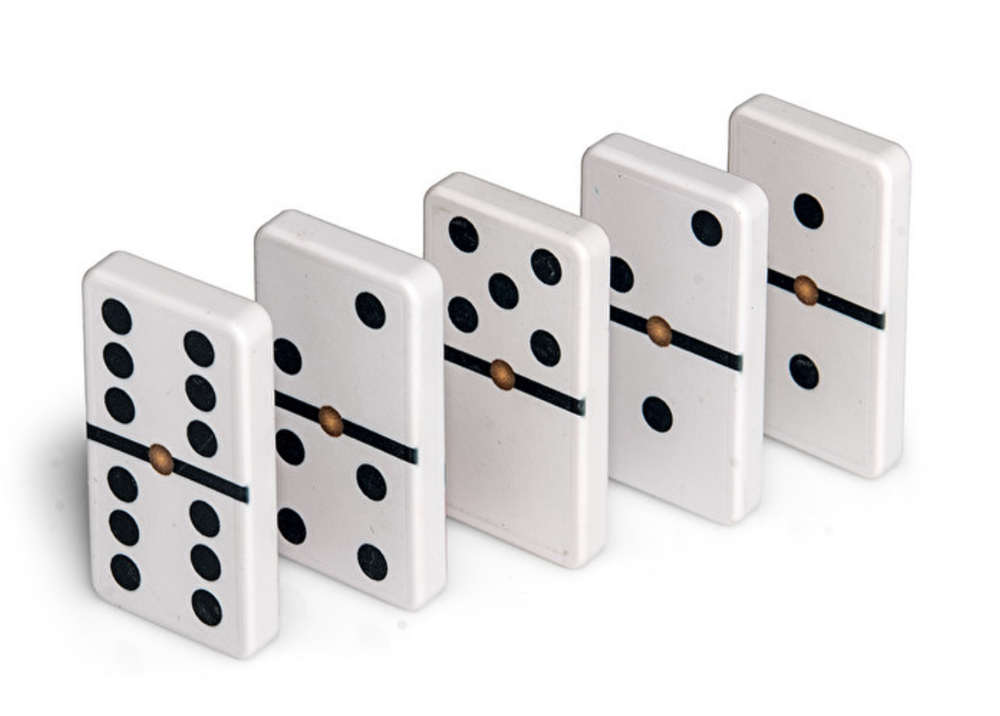

# Application: Domino Trains



This lesson shows how to process a data sequence representing a succession of domino tiles in order to count how many errors it has and to determine whether it contains any errors. The conceptual difference between the two solutions is the difference between doing a *traversal* or doing a *search*.


## Problem Description

Marta is playing alone with her older brother Arnau's domino tiles.
She has many tiles, and some may be repeated.
She likes to make long "trains",
so that the numbers on adjacent tiles match.
For example, she has just made the correct train <big>🁀🀼🁑🁒🁘🁍🀷</big>.
But sometimes, Marta makes mistakes.
For example, the train <big>🁃🁂🁈🁃🁅🁠</big> has two errors:
the first and second tiles do not match,
and neither do the fourth and fifth.

Arnau wants to make a program that counts the number of errors in a given train.
The input will consist of a sequence of pairs of numbers (between 0 and 6)
representing the tiles of the train.
For example, the train <big>🁀🀼🁑🁒🁘🁍🀷</big>
is represented by ~~2 1 1 4 4 4 4 5 5 4 4 0 0 6~~.
Here, we will assume that all trains have at least one tile.
For example, the sequence ~~3 2~~
represents the train with a single tile (and therefore correct) <big>🁈</big>.


## Interlude

Before presenting the solution, notice how with the problem description
we have converted mundane information about domino tiles
into a simple sequence of integers.
In Computer Science, it is very common to have to encode real-world information
as data of a certain type (here, integers).
In fact, it is the digitization of all kinds of information
(such as maps, songs, images, and movies...)
that has led to the digital revolution.


## Solution Approach

We know that the input sequence
represents a train composed of tiles.
For example, ~~2 3 3 4 5 4~~ represents <big>🁂🁊🁘</big>.
How do we solve this problem?
When we have the first number of each tile (except the first),
what we also need is the second number of the previous tile,
to check if they are equal or not.
Therefore, we will separate the elements of the input like this:
~~2 | 3 3 | 4 5 | 4~~.
The first and last elements of the sequence will remain unmatched,
but that does not matter, because they can never imply errors.
Each pair (that is, ~~3 3~~ and ~~4 5~~)
represents the contacting ends of two adjacent tiles.
If the two numbers are equal, the ends match;
otherwise, Marta has made an error.

Therefore, the problem reduces to ignoring the first number (and, at the end, also the last)
and traversing the rest of the input sequence two by two, counting
as errors those pairs where the two numbers differ.


## Implementations

According to the previous idea, we can write the following program:

```python
errors = 0
first = read(int)
right = read(int)
left = scan(int)
while left is not None:
    if right != left:
        errors = errors + 1
    right = read(int)
    left = scan(int)
print(errors)
```

- The variable `errors` contains the number of errors found so far.
This variable is initialized to zero,
because at the start no errors have been found yet.

- The variable `first` represents the left number of the first tile of the train.
We do not care about it, but we need to read it to move on to the next number.
In a way, we "skip" it.

- The variables `right` and `left` will hold the right value of one tile and then, perhaps, the left value of the next tile.

- To read them until the end, first the right side of the current tile is read with `read`. We can use `read` because this element will surely exist in the sequence. Then, an attempt is made to read the left side of the next tile with `scan`. We use `scan` because the tiles might be finished.

- The loop iterates while there are tiles, that is, while `left` is not `None`. Inside, if `right` and `left` are not equal, the tiles do not match and the `errors` counter must be incremented. Then the next iteration is prepared by reading new values for `right` and `left`.

- When exiting the loop, when there are no more tiles,
we just need to print the total number of errors found.

- Notice that the loop ends when it is no longer possible to read the integer corresponding to the left side of a tile.

The program is already quite good, but here we complete it while simplifying it a bit:

```python
from yogi import read, scan

def main():
    errors = 0
    read(int)
    right, left = read(int), scan(int)
    while left is not None:
        if right != left:
            errors = errors + 1
        right, left = read(int), scan(int)
    print(errors)

main()
```

- Since the variable `first` is never used, we let the result returned by the first `read(int)` be discarded. Python allows ignoring the result of a function, but it is still invoked.

- Also, the two assignments to read `right` and `left` are now done in a single assignment. Python calls functions from left to right, so the effect is the same but the program is a bit shorter without losing readability.

We can even make another version, using `tokens`:

```python
from yogi import read, tokens

def main():
    errors = 0
    read(int)
    right = read(int)
    for left in tokens():
        if right != left:
            errors = errors + 1
        right = read(int)
    print(errors)

main()
```

- Now the loop iterates while `tokens` can read the left part of the next tile. Then, we only need to read its right part at the end of the loop body.


## A Similar Problem

Suppose now we want to solve a very similar problem,
where the input is identical,
but we only want to know if the train contains any error or not.
That is, now the program should not print the total number of errors,
but either `correct` or `incorrect`.

This program (omitting the `main`), adapted from the second solution, would obviously work:

```python
errors = 0
read(int)
right, left = read(int), scan(int)
while left is not None:
    if right != left:
        errors = errors + 1
    right, left = read(int), scan(int)

if errors == 0:
    print('correct')
else:
    print('incorrect')
```

But, is this a good solution?
It depends.
If we know that the input sequences the program will receive are always short,
this code is already fine.
However, if the input can be very long,
this code is not efficient enough.
For example, consider a train with a million tiles like
~~0 1 1 2 3 4 4 4 4 4 4 4 4 4 4 4 4 4 ...~~
Since the second and third tiles do not match,
after only two iterations of the `for`
we already know the train is incorrect.
Still, the program does almost half a million more iterations
to read irrelevant data until the end,
instead of stopping and printing the result: `incorrect`.

This code implements the mentioned improvement by replacing the counter
`errors` with a boolean `correct` that allows cutting the loop condition:

```python
correct = True
read(int)
right, left = read(int), scan(int)
while correct and left is not None:
    if right != left:
        correct = False
    right, left = read(int), scan(int)

if correct:
    print('correct')
else:
    print('incorrect')
```


## Traversals and Searches

We have seen that to calculate the total number of errors in a train, we need to traverse all the elements of the sequence describing it. This is clear: one could not count all errors without reading all values: what would happen if the unread part contained some errors? This type of algorithms that read all elements of the input from start to finish are called **traversal algorithms**.

On the other hand, we have seen that to determine whether there is any error in a train, we can stop as soon as we detect the error, ignoring the rest of the sequence elements. In fact, continuing to read elements would be a waste of time. This type of algorithms that read input elements until they find that some condition holds (and until the end if it never does) are called **search algorithms**.

It is important that, for a given sequence problem, you are able to identify whether it is a search or traversal problem.


<Authors authors="jpetit roura"/>
