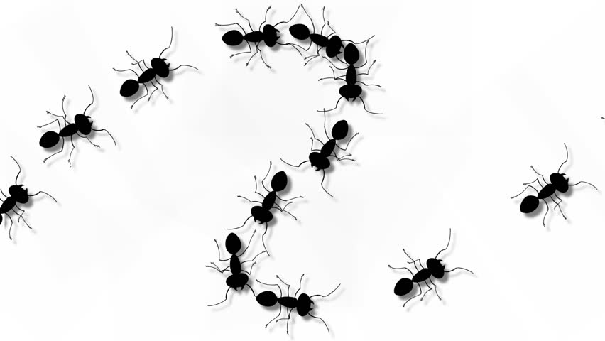

# Sequence Examples



This lesson shows new examples of processing data sequences. The example topics are calculating the sum of a sequence of integers, calculating the maximum of a sequence of integers, and counting the occurrences of a particular word in a sequence of words.


## Sum of a sequence of integers

Suppose we want to write a program that, given many integer elements, calculates their sum.

Applying the same ideas as for the average of reals, we can do it with `scan`:


```python
from yogi import scan

s = 0
x = scan(int)
while x is not None:
    s = s + x
    x = scan(int)
print(s)
```

This time I wrote the condition as `x is not None` instead of `x != None` because Python purists say it should be done this way (🧐).

Or we can do it with `tokens`:

```python
from yogi import tokens

s = 0
for x in tokens(int):
    s = s + x
print(s)
```

Note that, given an empty sequence, both programs indicate that the sum of its elements is zero, as it should be.


## Maximum of a sequence of integers

Now consider that we want to write a program that, given many elements (integers), calculates the largest one. Since the maximum of an empty sequence is not well defined, in this case we require that the sequence has at least one element.

We can solve this problem similarly to the previous one:

- We will use a `for x in tokens(int)` loop to sequentially read all the integers from the input.

- We will use a variable `m` that represents the maximum of all integers read so far.

- At each iteration, if the value of `x` exceeds that of `m`, we update the value of `m`.

This leads to this almost-solution:

```python
m = ???                # 👁
for x in tokens(int):
    if x > m: 
        m = x
print(m)
```

But... what is the appropriate value to initialize `m`?

It would be tempting to use zero as the initial value, doing `m = 0`. Unfortunately, the code would be faulty: Suppose all the integers in the input were negative, such as ~~-3 -9 -2 -5~~. In this case, the program would print ~~0~~ instead of ~~-2~~!

A better alternative would be to realize that the mathematically correct value to initialize `m` is -∞ (minus infinity). This choice would be correct from a theoretical point of view but, unfortunately, Python's `int` type cannot represent either -∞ or +∞ (values can be arbitrarily large, but not infinite).

The best solution is to use the first element of the sequence (which we know exists for sure) to initialize `m` with a `read` call. Like this:

```python
m = read(int)
for x in tokens(int):
    if x > m: 
        m = x
print(m)
```

Now the sequence is read in two different places in the program: with `read`, we read the first element, and with `tokens`, the rest. Notice then that `tokens` are not exactly all the elements of the input, but at each iteration it delivers the next element until none remain, and then the `for` ends.

And if we remember that Python already offers a predefined function `max`, we can leave the complete program like this:

```python
from yogi import read, tokens

m = read(int)
for x in tokens(int):
    m = max(m, x)
print(m)
```


## Counting cats 😸

Now let's consider the context of wanting to count how many times the word `cat` appears in a text file. For example, in the input

```text
An old cat young mouse
To the old cat no need to show the mouse
At night all cats are black
```

there are two words `cat` (and not three because `cats` is plural).

We can use the same technique of sequentially reading each word `p` from the input and counting those that are equal to the text `'cat'`:

```python
from yogi import tokens

c = 0  # cat counter
for p in tokens(str):
    if p == 'cat':
        c = c + 1
print(c)
```


<Autors autors="jpetit"/> 

