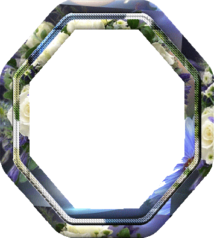

# Application: Easy Octagons



This lesson shows a possible solution for the problem
[P87198](https://jutge.org/problems/P87198) (Easy Octagons) from Jutge. The
solution uses actions and employs top-down design, a programming methodology
that breaks down a complex problem into subproblems less complex than the original.

## Exercise P87198 (Easy Octagons)

The statement is simple: You need to write a program that for each given `n` prints
"an octagon of size `n`", following the pattern shown in the examples.
For example, when `n` is 2,
you should print

```text
 XX
XXXX
XXXX
 XX
```

and when `n` is 3,
you should print

```text
  XXX
 XXXXX
XXXXXXX
XXXXXXX
XXXXXXX
 XXXXX
  XXX
```

How can we solve this?

First of all, we can write the main program directly and
without hesitation like this:

```python
from yogi import tokens

def main():
    for n in tokens(int):
        write_octagon(n)
        print()

if __name__ == '__main__':
    main()
```

Easy, right? We simply wrote the usual code to read a sequence
of integers and, for each of them, we delegated the task of printing the corresponding octagon
to an action `write_octagon` that we leave for later. We also
add a newline after each octagon, as the statement requires.

This way we have a small and simple `main`, without any complexity that
might lead us to make mistakes. Also, we have encapsulated the idea of printing
an octagon in an action, a highly recommended idea, since it provides simplicity, structure, and will allow us to reuse
the code to draw this figure if we ever need it in the future.

Now, we only have to worry about printing a single octagon, and we must do it inside
the action `write_octagon`, which receives an integer with its size. Its header
is thus:

```python
def write_octagon(n):
    """Action that prints an octagon of size n."""
```

To define the body of this action, from the pattern in the examples, we can see that
an octagon is decomposed into three parts: the upper part, the middle part, and the
lower part:

```text
  XXX      upper part
 XXXXX     upper part
XXXXXXX    upper part
XXXXXXX    middle part
XXXXXXX    lower part
 XXXXX     lower part
  XXX      lower part
```

Thus, we choose to define `write_octagon` using these three parts:

```python
def write_octagon(n):
    """Action that prints an octagon of size n."""
    write_upper_part(n)
    write_middle_part(n)
    write_lower_part(n)
```

Again, we delegate the task of printing an octagon to three other actions that we define
below:

```python
def write_upper_part(n):
    for i in range(n):
        write_line(n - i - 1, n + 2 * i)

def write_lower_part(n):
    for i in range(n - 1, 0, -1):
        write_line(n + 2 * i, n - i - 1)

def write_middle_part(n):
    for i in range(n - 2):
        write_line(0, 3 * n - 2)
```

Here, once again, we have introduced a new action `write_line` that
is used by the three actions. The purpose of `write_line(n, m)` is to print
a line with `n` spaces followed by `m` X's. We leave the choice of the precise values for
the loop starts and ends for you to think about and work on.

Finally, the code for `write_line` is this:

```python
def write_line(n, m):
    """Action that prints n spaces, m X's, and a newline."""
    print(' ' * n + 'X' * m)
```

Notice that to solve this problem we used the top-down design methodology, so we decomposed the complexity
of the problem from the most general level to the most concrete. The following diagram
shows the relationship of the actions with each other:

<noscript type="text/coffeenoscript" src="./octogons.coffee"></noscript>

<div id="div-octogons" style="height: 300px; ">
</div>

<Authors authors="jpetit roura"/>