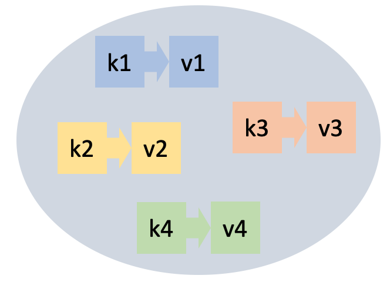
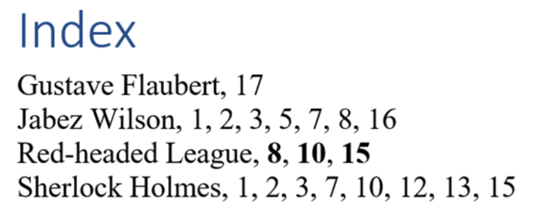

# Dictionaries



This lesson introduces another data type: dictionaries. We can think of dictionaries as a generalization of lists, where you can index by any value of (almost) any type, without the indexes needing to be consecutive integers.

Next, this lesson also presents two examples of using dictionaries: In the first example, we want to count how many times each word appears in a text. The second example shows how to build and query an index to efficiently search for documents containing a certain word.

## Introduction

A **dictionary** (or **map**) is an abstract data type that allows storing a collection of elements. Each element has two parts:

-   a **key** and
-   a **value**.

Operations are guided by the keys, which must be unique in each dictionary. The main operations are the following:

-   insert an element with key `k` and value `v`
    (when inserting an element with a key already in the dictionary,
    the previous value is lost and replaced by the new one),
-   delete an element along with its key (nothing happens if `k` was not in the dictionary),
-   find an element with key `k` (or know that it is not there), and
-   query the number of elements in the dictionary.

There are other operations, such as those that allow iterating over all elements of a dictionary or using a dictionary as if it were a generalized vector.

## Applications

Dictionaries are a recurring data type in many applications.

For example, in a text translation application from Catalan to English, somewhere you will need to store that the translation of `'casa'` is `'house'`, that of `'gos'` is `'dog'`, that of `'gat'` is `'cat'`, and so on. In this case, the Catalan words are the keys and the English words are their associated values. In this application, it will be crucial that the query operation (given a Catalan word, find its English translation) is efficient.

A contacts application for mobile phones would also be an example of a dictionary. In this case, the keys would be people's names and the values their data such as phone numbers, physical and electronic addresses, and birthdays, perhaps grouped in a structure.

## Literals

The simplest way to write dictionaries in Python is by enumerating their elements between braces and separating them with commas. Each element has two parts: the key and the value, separated by a colon. Here are two examples:

```python
>>> catalan_english = {'casa': 'house', 'gos': 'dog', 'gat': 'cat'}
catalan_english
{'casa': 'house', 'gos': 'dog', 'gat': 'cat'}
>>> numbers = {1: 'un', 2: 'dos', 3: 'tres', 4: 'quatre'}
>>> numbers
{1: 'un', 2: 'dos', 3: 'tres', 4: 'quatre'}
```

The empty dictionary is written `{}` or `dict()`.

## Built-in functions

Just like for lists and sets, Python offers some built-in functions for dictionaries. For example, the function `len`, applied to a dictionary, returns its number of elements (that is, the number of key-value pairs):

```python
>>> numbers = {1: 'un', 2: 'dos', 3: 'tres', 4: 'quatre'}
>>> len(numbers)
4
>>> len({})
0
```

The functions `min`, `max`, and `sum` applied to a dictionary return, respectively, the minimum, maximum, and sum of its keys. They are not used very often.

## Manipulating dictionaries

The operators `in` and `not in` allow checking if a key is or is not in a dictionary:

```python
>>> numbers = {1: 'un', 2: 'dos', 3: 'tres', 4: 'quatre'}
>>> 3 in numbers
True
>>> 14 in numbers
False
>>> 'dos' in numbers
False
```

Dictionaries can be indexed with `[]` to query and modify the values associated with keys.

An assignment `d[k] = v` associates the value `v` to the key `k` in the dictionary `d`. If `k` was already in `d`, the old associated value is lost and replaced by `v`. If `k` was not in the dictionary, the key `k` is inserted into the dictionary with value `v`:

```python
>>> numbers
{1: 'un', 2: 'dos', 3: 'tres', 4: 'quatre'}
>>> numbers[2] = 'two'
>>> numbers
{1: 'un', 2: 'two', 3: 'tres', 4: 'quatre'}
>>> numbers[1000] = 'thousand'
>>> numbers
{1: 'un', 2: 'two', 3: 'tres', 4: 'quatre', 1000: 'thousand'}
```

If a key `k` exists in a dictionary `d`, the expression `d[k]` returns its associated value, but if the key is not there, it raises an error:

```python
>>> print(numbers[3])
tres
>>> print(numbers[14])
KeyError: 14
```

On the other hand, `d.get(k, x)` returns `d[k]` if `k` is in `d` and `x` otherwise. It is useful for providing default values or avoiding errors:

```python
>>> notes = {'do':'C', 're':'D', 'mi':'E', 'fa':'F', 'sol':'G', 'la':'A', 'si':'B'}
>>> print(notes.get('do', None))
C
>>> print(notes.get('ut', None))
None
>>> print(notes.get('ut', 'not found'))
'not found'
```

You can delete a key `k` from a dictionary `d` with `del d[k]`, provided that `k` belongs to the dictionary:

```python
>>> numbers
{1: 'un', 2: 'dos', 3: 'tres', 4: 'quatre'}
>>> del numbers[2]
>>> numbers
{1: 'un', 3: 'tres', 4: 'quatre'}
>>> del numbers[9]
KeyError: 9
>>> numbers[2] = 'dos'
```

The method `.keys()` applied to a dictionary returns all the keys it contains. Similarly, the method `.values()` returns all the values it contains. Also, the method `.items()` returns all the tuples of key-value pairs:

```python
>>> numbers.keys()
dict_keys([1, 2, 3, 4, 5])
>>> numbers.values()
dict_values(['un', 'two', 'tres', 'quatre', 'cinc'])
>>> numbers.items()
dict_items([(1, 'un'), (2, 'two'), (3, 'tres'), (4, 'quatre'), (5, 'cinc')])
```

If you want to convert these results into lists, you need to apply a conversion (but generally it is not necessary):

```python
>>> list(numbers.keys())
[1, 2, 3, 4, 5]
```

Python's internal implementation is designed so that all these operations are very efficient.

## Iterating over all elements of a dictionary

Often, you want to iterate over all elements of a dictionary, performing some task with each of these elements. The most common way to do this is with a `for` loop and the methods `keys`, `values`, or `items`. For example:

```python
>>> numbers = {1: 'un', 2: 'dos', 3: 'tres', 4: 'quatre'}
>>> for k in numbers.keys(): print(k)
1
2
3
4
>>> for v in numbers.values(): print(v)
un
dos
tres
quatre
>>> for k, v in numbers.items(): print(k, v)
1 un
2 dos
3 tres
```

Notice how tuples are unpacked into two variables in the case of `items`.

The order in which elements are iterated is the order in which they were inserted (starting from Python 3.6). This is due to the technique Python uses internally to store sets efficiently. To write portable programs, I would not rely too much on this feature.

Modifying a dictionary while iterating over it is usually a bad idea. Don't do it.

## The dictionary type

In Python, dictionaries are of type `dict`, which we can check like this:

```python
>>> numbers = {1: 'un', 2: 'dos', 3: 'tres', 4: 'quatre'}
>>> type(numbers)
<class 'dict'>
```

To have the safety provided by type checking, from now on we will assume that all keys in a dictionary must be of the same type and all values in a dictionary must be of the same type (possibly different from the type of the keys): such dictionaries are called **homogeneous** data structures. This is not a Python requirement, but it is a good habit for beginners.

In Python's type system, `dict[K, V]` describes a new type that is a dictionary where keys are of type `K` and values of type `V`. For example, `dict[int, str]` is the type of a dictionary from integers to strings, `dict[str, str]` is a dictionary from strings to strings, and `dict[str, set[int]]` is a dictionary from strings to sets of integers.

In most cases, it is not necessary to annotate dictionaries with their type, because the system infers it from their values. Only when creating empty dictionaries is it necessary to indicate the type of the elements because, obviously, the system cannot know it:

```python
d1 = {1:1, 2:4}       # no need to annotate the type: it is inferred automatically
d2 = {}               # need to annotate the type of the empty dictionary
                      # because it cannot be inferred
```

Another place where you always need to annotate the type of dictionaries is when defining parameters:

```python
def patient_with_highest_fever(dict) -> str:
    ...
```

## Dictionary comprehensions

Dictionaries can also be written by comprehension similarly to set comprehensions. This time, however, you must separate the key from the value with a colon:

```python
>>> {n : n * n for n in range(10) if n % 2 == 0}
{0: 0, 2: 4, 4: 16, 6: 36, 8: 64}
>>> numbers = {1: 'un', 2: 'dos', 3: 'tres', 4: 'quatre'}
>>> {k : v.upper() for k, v in numbers.items()}
{1: 'UN', 2: 'DOS', 3: 'TRES', 4: 'QUATRE'}
```

## Dictionaries are objects

Like lists and sets, dictionaries are also objects and, therefore, are manipulated through references. This code demonstrates it.

```python
>>> d1 = {1:1, 2:2}
>>> d1
{1: 1, 2: 2}
>>> d2 = d1
>>> d1[3] = 3
>>> d1
{1: 1, 2: 2, 3: 3}
>>> d2
{1: 1, 2: 2, 3: 3}
```

Dictionaries can be copied easily with the `copy` method:

```python
>>> d1 = {1:1, 2:2}
>>> d2 = d1.copy()
>>> d1[3] = 3
>>> d1
{1: 1, 2: 2, 3: 3}
>>> d2
{1: 1, 2: 2}
```

But be careful, if the values are objects, the dictionary also stores a reference to them:

```python
>>> lst = [1, 2, 3]
>>> dic = {'info': lst}
>>> dic['info']
[1, 2, 3]
>>> lst.append(9)
>>> dic['info']
[1, 2, 3, 9]
```

If this makes you doubt, see it with [Python Tutor](https://pythontutor.com/render.html#code=lst%20%3D%20%5B1,%202,%203%5D%0Adic%20%3D%20%7B'info'%3A%20lst%7D%0Alst.append(9)&cumulative=false&curInstr=0&heapPrimitives=nevernest&mode=display&origin=opt-frontend.js&py=3&rawInputLstJSON=%5B%5D&textReferences=false).

## Summary of basic operations

| operation               | meaning                                                                          |
| ----------------------- | -------------------------------------------------------------------------------- |
| `{}`                    | creates an empty dictionary.                                                     |
| `{k1:v1, k2:v2, ...}`   | creates a dictionary with elements `k1`:`v1`, `k2`:`v2`, ...                    |
| `len(d)`                | returns the number of keys in dictionary `d`.                                   |
| `d[k] = v`              | assigns the value `v` to key `k` in dictionary `d`.                             |
| `d[k]`                  | queries the value of key `k` in dictionary `d` (raises error if not present).    |
| `d.get(k, x)`           | returns `d[k]` if `k` is in `d` and `x` otherwise.                              |
| `del d[k]`              | deletes key `k` and its value from dictionary `d` (does not raise error if absent). |
| `k in d` or `k not in d`| tells if `k` is or is not a key in `d`.                                         |
| `d.keys()`              | returns all keys of `d`.                                                         |
| `d.values()`            | returns all values of `d`.                                                       |
| `d.items()`             | returns all key-value pairs of `d`.                                             |

## Example: Counting all words in a text

Suppose that, given a text, we want to obtain the list of all its words (in lowercase), along with their number of occurrences.

A good way to do this is using a dictionary. The dictionary will have as keys the words of the text (in lowercase). Each word will have associated as value an integer that is the number of times that word has appeared in the text. A dictionary `occurrences` like this is declared as follows:

```python
occurrences = {}
```

Starting from an empty dictionary, we will sequentially read each word from the text. For each word `word`, if `word` was not yet in the dictionary, we will add it associating the counter 1 (because, being new, it has appeared only once). Otherwise, if `word` was already in the dictionary, we will increment its associated occurrence counter by one. Once the entire text has been read, we will iterate over all elements of the dictionary, printing each key and counter. The corresponding program is thus:

```python
from yogi import tokens

# create the empty dictionary counting word occurrences
occurrences = {}

# read each word and add it to the dictionary
for word in tokens(str):
    word = word.lower()
    if word not in occurrences:
        occurrences[word] = 1
    else:
        occurrences[word] += 1

# iterate over the dictionary elements to print them
for word, counter in occurrences.items():
    print(word, counter)
```

For example, if we run this program on this input

```text
I'm saying nothing
But I'm saying nothing with feel
```

the result is

```text
i'm 2
saying 2
nothing 2
but 1
with 1
feel 1
```

Remember that (since Python 3.6) the order in which dictionary elements are iterated is their insertion order. To have the words sorted alphabetically, you can use the built-in function `sorted` which sorts by key:

```python
for word in sorted(occurrences.keys()):
    print(word, occurrences[word])
```

Thus, the result is now:

```text
but 1
feel 1
i'm 2
nothing 2
saying 2
with 1
```

To have the words sorted by occurrences first, alphabetically second, you can pass more parameters to `sorted` indicating the tuple that determines the sorting criteria (ignore the `lambda` for now):

```python
for word, counter in sorted(occurrences.items(), key=lambda x: (x[1], x[0])):
    print(counter, word)
```

Thus, the result is now:

```text
1 but
1 feel
1 with
2 i'm
2 nothing
2 saying
```

## Example: Document indexing

Suppose we want to index different text documents so that, given a word, we can efficiently find all documents containing that word. This task is similar to what Internet search engines do, or the Finder on your computer.

To simplify, suppose the input is a sequence of document descriptions. Each document starts with its identifier, followed by its number of words, followed by its words.

For example, if these are our documents

```text
mati      8   cada dia al mati canta el gall kiririki
gegant   16   el gegant del pi ara balla ara balla el gegant del pi ara balla pel cami
nina     11   dalt del cotxe hi ha un nina que repica els picarols
balco     8   el gall i la gallina estaven al balco
```

asking for `gall` should return `mati` and `balco`, not necessarily in this order. Asking for `cotxe` should return `nina` and asking for `patata` should return nothing.



To avoid having to read all documents every time a word is requested, we will build a **document index**: An index is a data structure that indicates in which document each word appears. The idea is similar to the indexes at the end of books that tell on which pages each important term appears; see the figure on the right.

In our case, we can see that an index is a dictionary that, given words, returns sets of document identifiers (that is, strings). Therefore, our index will have this type:

```python
Document = str
Index = dict[str, set]
```

The first phase consists of building the index by reading the documents:

```python
def build_index():
    index = {}
    for doc in tokens(str):
        n = read(int)
        for _ in range(n):
            word = read(str)
            if word in index:
                index[word].add(doc)
            else:
                index[word] = {doc}
    return index
```

This function reads the input document by document. For each document, it leaves in the variable `doc` its identifier and in the variable `n` its number of words. For each of the `n` words `word`, it inserts `doc` into the entry `word` of the index (checking if it is the first time it is added). Thus, in the index returned, there is an entry for each possible word of all documents and each word contains the set of document identifiers that contain that word.

With the previous example, the returned index is this:

```python
{'al': {'balco', 'mati'},
 'ara': {'gegant'},
 'balco': {'balco'},
 'balla': {'gegant'},
 'cada': {'mati'},
 'cami': {'gegant'},
 'canta': {'mati'},
 'cotxe': {'nina'},
 'dalt': {'nina'},
 'del': {'nina', 'gegant'},
 'dia': {'mati'},
 'el': {'balco', 'mati', 'gegant'},
 'els': {'nina'},
 'estaven': {'balco'},
 'gall': {'balco', 'mati'},
 'gallina': {'balco'},
 'gegant': {'gegant'},
 'ha': {'nina'},
 'hi': {'nina'},
 'i': {'balco'},
 'kiririki': {'mati'},
 'la': {'balco'},
 'mati': {'mati'},
 'nina': {'nina'},
 'pel': {'gegant'},
 'pi': {'gegant'},
 'picarols': {'nina'},
 'que': {'nina'},
 'repica': {'nina'},
 'un': {'nina'}}
```

The second phase consists of retrieving all document identifiers that contain a given word:

```python
def print_documents(index, word):
    if word in index:
        print(f'The word {word} appears in these documents:')
        for doc in index[word]:
            print(doc)
    else:
        print(f'The word {word} does not appear in any document.')
```

First, the word is searched in the index with `in`. If the word is there, you just need to iterate over its value in `index[word]`, which is the set of document identifiers to print.

For reference, here is the complete program:

```python
from yogi import read, tokens


Document = str
Index = dict


def build_index():
    index = {}
    for doc in tokens(str):
        n = read(int)
        for i in range(n):
            word = read(str)
            if word in index:
                index[word].add(doc)
            else:
                index[word] = {doc}
    return index


def print_documents(index, word):
    if word in index:
        print(f'The word {word} appears in these documents:')
        for doc in index[word]:
            print(doc)
    else:
        print(f'The word {word} does not appear in any document.')
```

There you go! From here to building a Google is just a small step... 😏

<Autors autors="jpetit"/>