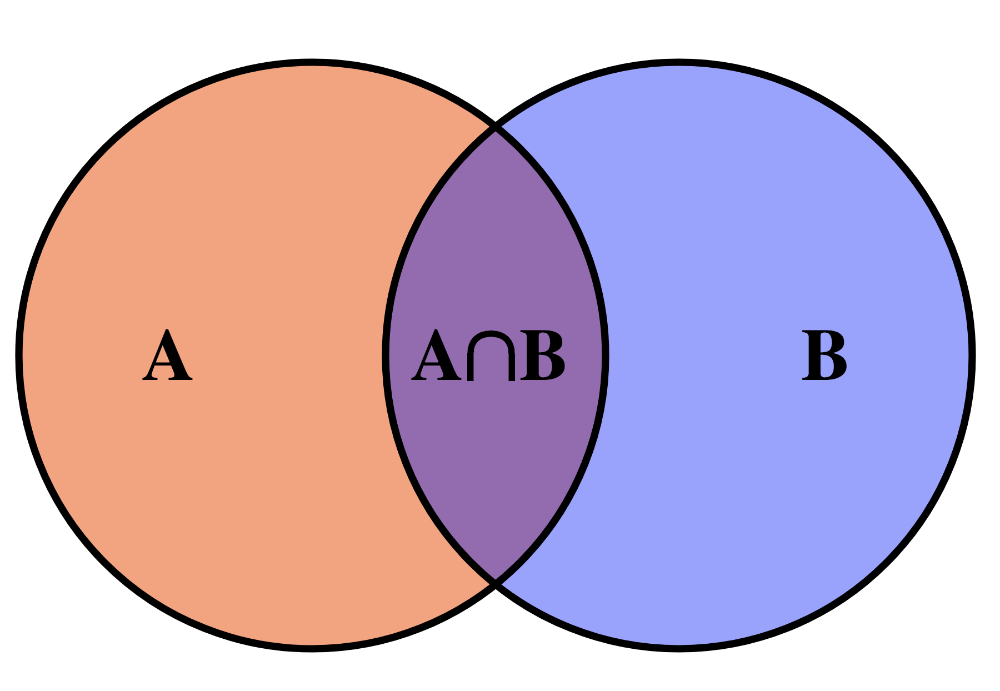

# Sets



This lesson introduces a new data type: sets. Python sets are very similar to those used in mathematics, which makes their use very simple and intuitive. Thanks to the use of sets, programs can be more expressive and efficient than their list-based alternatives.

This lesson also includes some examples of using sets. The first example consists of finding all the unique words in the input. Comparing the solution using sets with the one using lists shows the great gain in efficiency. The second example consists of finding the missing element in a list of elements with possible repetitions.

## Introduction

A set is a data type that allows storing a collection of elements without repetitions with the following main operations:

-   insert an element,
-   remove an element,
-   determine whether an element is in the set or not.

Additionally, the elements of the set can be iterated over (with a `for` loop), and unions, intersections, and differences of sets can be calculated.

The idea of the set data type is similar to that of a mathematical set: it is a collection (finite in this case) of elements without repetitions. As in mathematics, the order of elements in Python sets is not relevant.

Usually, a set starts empty and throughout the program elements are inserted and removed. At the same time, and fundamentally, it is possible to check whether any value belongs to the set or not, without modifying the set. Also, through `for` loops, all elements of a set can be traversed. And unions, intersections, and differences of sets can also be performed.

## Applications

The set is a very useful data structure in computer science: for example, a browser could have a set of potentially dangerous URLs and ask the user if they really want to enter when trying to access them. Also, a database can retrieve sets of elements and calculate their intersections, unions, differences... Often, solving a problem consists of finding a subset of elements of a set that have a certain property. Therefore, having a data structure that represents sets is always useful.

## Literals

The simplest way to write sets in Python is by listing their elements between curly braces and separating them with commas. Here are some examples:

```python
>>> vowels = {'a', 'e', 'i', 'o', 'u'}
>>> vowels
{'a', 'o', 'i', 'e', 'u'}
>>> numbers = {10, 20, 10, 30, 10, 20, 40, 50}
>>> numbers
{50, 20, 40, 10, 30}
```

Note that sets do not store repeated elements and that they are written in an arbitrary order.

The empty set, exceptionally, is not written as `{}` but as `set()` (to avoid confusion with the empty dictionary).

## Built-in functions

As with lists, Python offers some built-in functions for sets. For example, the `len` function, applied to a set, returns its number of elements (also called cardinality):

```python
>>> len({8, 3, 4, 5, 1})
5
>>> len(set())      # set() is the empty set
0
>>> len({66, 66})   # {66, 66} is the same as {66}
1
```

The functions `min`, `max`, and `sum` applied to a set return its minimum, maximum, and sum respectively:

```python
>>> min({8, 6, 3, 4, 6, 1})
1
>>> max({3.14, 2.78, 1.0})
3.14
>>> sum({3.14, 2.78, 1.0})
6.92
```

## Operators

The union of two sets is calculated with the operator `|`,
the intersection with the operator `&`, and
the difference with the operator `-`:

```python
>>> {1, 2, 3} | {2, 3, 4}
{1, 2, 3, 4}
>>> {1, 2, 3} & {2, 3, 4}
{2, 3}
>>> {1, 2, 3} - {2, 3, 4}
{1}
```

Relational operators with sets also work, where `<=` expresses ⊂:

```python
>>> {1} == {1, 1}
True
>>> {1} <= {1, 2}
True
>>> {1} >= {1, 2}
False
```

Like lists, sets have an `in` operator that indicates whether an element is inside a set or not. The `not in` operator returns the opposite:

```python
>>> "goose" in {"rabbit", "lamb", "goose", "duck"}
True
>>> "dog" not in {"rabbit", "lamb", "goose", "duck"}
True
```

All these operations on sets are designed to work efficiently, in particular, much faster than with lists.

## Adding and removing elements

Sets have specific methods to insert or remove elements: `.add()` adds an element and has no effect if it was already there. `.remove()` removes an element and raises an error if it was not there. `.discard()` removes an element but has no effect if it was not there. `.pop()` removes and returns an arbitrary element from a non-empty set.

```python
>>> c = {10, 20, 30}
>>> c.add(40)
>>> c
{40, 10, 20, 30}
>>> c.add(40)
>>> c
{40, 10, 20, 30}
>>> c.remove(10)
>>> c
{40, 20, 30}
>>> c.remove(66)
KeyError: 66
>>> c.discard(66)
>>> c
{40, 20, 30}
>>> c.pop()
40
>>> c
{20, 30}
```

Adding and removing elements with these operations is also efficient.

## Iterating over all elements of a set

Often, you want to iterate over all elements of a set, from the first to the last, performing some task with each of these elements. For example, to print each element of a set you could do:

```python
notes = {'do', 're', 'mi', 'fa', 'sol', 'la', 'si', 'do'}
for note in notes:
    print(note)
```

Here, the `for` loop indicates that the variable `note` will successively take the value of each element of the set `notes`. Inside the loop body, each value is printed. Note: while it is guaranteed that all elements will be visited, the order in which this happens is undefined. Today this program printed

```text
la
sol
mi
fa
re
do
si
```

but tomorrow it could print the same notes in any other order.

Modifying a set while iterating over it is usually a bad idea. Don't do it.

## The set type

In Python, sets are of type `set`, we can check this as follows:

```python
>>> numbers = {10, 20, 30, 40, 50}
>>> type(numbers)
<class 'set'>
```

To have the safety provided by type checking, from now on we will assume that all elements of a set must be of the same type: such sets are called **homogeneous** data structures. This is not a Python requirement, but it is a good habit for beginners.

In Python's type system, `set[T]` describes a new type that is a set where each element is of type `T`. For example, `set[int]` is the type of a set of integers and `set[str]` is a set of strings.

In most cases, it is not necessary to annotate sets with their type, because the system already determines it automatically through their values. Only when creating empty sets is it necessary to indicate the type of the elements because, obviously, the system cannot know it:

```python
c1 = {40, 20, 34, 12, 40}    # no need to annotate the type: it is inferred automatically
c2 = set()                   # must indicate the type the empty set will have
                             # because it cannot be inferred
```

Another place where it is always necessary to annotate the type of sets is when defining parameters:

```python
def return_power(player, dice):
    ...
```

## Conversions

Sometimes it is useful to convert lists to sets and vice versa:

```python
>>> set([10, 20, 10])
{10, 20}
>>> set(range(10))
{0, 1, 2, 3, 4, 5, 6, 7, 8, 9}
>>> set('do re mi fa sol la si do'.split())
{'mi', 'do', 'si', 'la', 'fa', 'sol', 're'}
>>> list({10, 20, 30, 40})
[40, 10, 20, 30]
```

## Set comprehensions

Sets can also be written using comprehensions in the same way as list comprehensions. This time, however, curly braces must be used instead of square brackets:

```python
>>> {2**n for n in range(9)}
{32, 1, 2, 64, 4, 128, 256, 8, 16}
>>> {str(i) for i in {2,3,4,5,6} if i % 2 == 0}
{'4', '6', '2'}
>>> n = 20
>>> {(a, b, c) for a in range(1, n + 1) for b in range(a, n + 1) for c in range(b, n + 1) if a**2 + b**2 == c**2}
{(6, 8, 10), (3, 4, 5), (8, 15, 17), (9, 12, 15), (5, 12, 13), (12, 16, 20)}
```

## Sets are objects

Like lists, sets are also objects and therefore are manipulated through references. This code demonstrates it.

```python
>>> c1 = {1, 2, 3}
>>> c1
{1, 2, 3}
>>> c2 = c1
>>> c2
{1, 2, 3}
>>> c1.add(4)
>>> c1
{1, 2, 3, 4}
>>> c2
{1, 2, 3, 4}
```

Sets can be copied easily with the `copy` method:

```python
>>> c1 = {1, 2, 3}
>>> c2 = c1.copy()
>>> c1.add(4)
>>> c1
{1, 2, 3, 4}
>>> c2
{1, 2, 3}
```

## Summary of basic operations

| operation               | meaning                                                                                                                                |
| ----------------------- | -------------------------------------------------------------------------------------------------------------------------------------- |
| `set()`                 | creates an empty set.                                                                                                                  |
| `{x1, x2, ...}`         | creates a set with elements `x1`, `x2`, ...                                                                                            |
| `set(L)`                | creates a set with the elements of the list `L`.                                                                                      |
| `len(s)`                | returns the cardinality of the set `s`.                                                                                               |
| `s.add(x)`              | adds the element `x` to the set `s`.                                                                                                  |
| `s.remove(x)`           | removes the element `x` from the set `s` (raises an error if not present).                                                             |
| `s.discard(x)`          | removes the element `x` from the set `s` (no error if not present).                                                                     |
| `s.pop()`               | removes and returns an arbitrary element from `s` (`s` must not be empty).                                                             |
| `s.copy()`              | returns an independent copy of `s`.                                                                                                   |
| `x in s` or `x not in s`| indicates whether `x` is or is not in `s`.                                                                                            |
| `for x in s...`         | iterates over all elements of the set (in arbitrary order). While iterating over a set, elements cannot be added or removed.           |
| `a | b`                 | returns the union of the sets.                                                                                                        |
| `a & b`                 | returns the intersection of the sets.                                                                                                |
| `a - b`                 | returns the difference of the sets.                                                                                                   |
| `a <= b`                | indicates if `a` is a subset of `b`.                                                                                                  |
| `a < b`                 | indicates if `a` is a strict subset of `b`.                                                                                           |
| `set(L)`                | returns a set with all elements of the list `L`.                                                                                      |
| `list(s)`               | returns a list with the elements of `s` in arbitrary order.                                                                           |

## Example: Find all unique words

Suppose we want to read all the words from the input and make a list of all unique words that appear (in lowercase).

This task could be solved by first reading all the words from the input while inserting them in lowercase into an initially empty set. Once done, all words in the set should be printed:

```python
from yogi import tokens

words = set()
for word in tokens(str):
    word = word.lower()  # convert word to lowercase
    words.add(word)

for word in words:
    print(word)
```

For example, if we run this program on this input

```text
I'm saying nothing
But I'm saying nothing with feel
```

the result is

```text
saying
with
i'm
but
nothing
feel
```

or any other ordering of these words. Remember that the order in which elements of a set are iterated is not defined.

To have the words sorted, we can use the built-in `sorted` function:

```python
for word in sorted(words):
    print(word)
```

Thus, the result is

```text
but
i'm
feel
nothing
saying
with
```

just as it should be! 👍

## Comparison with lists

The previous code could also have been written using lists instead of sets:

```python
from yogi import tokens

words = []
for word in tokens(str):
    word = word.lower()
    if word not in words:
        words.append(word)

for word in sorted(words):
    print(word)
```

If I run this list version on my computer over the 600 pages of the book [Moby Dick](https://www.gutenberg.org/files/2701/old/moby10b.txt) by Herman Melville, its execution takes about twelve seconds. In contrast, the set version takes about 0.19 seconds. This comparison shows how sets are much more efficient than lists when many search and insertion operations are required.

**Note:** For those curious to repeat the experiment, to make the measurements I ran these commands:

```text
> wget https://www.gutenberg.org/files/2701/old/moby10b.txt

--2022-10-11 16:19:24--  https://www.gutenberg.org/files/2701/old/moby10b.txt
Resolving www.gutenberg.org (www.gutenberg.org)… 152.19.134.47
Connecting to www.gutenberg.org (www.gutenberg.org)|152.19.134.47|:443… connected.
HTTP request sent, awaiting response… 200 OK
Length: 1256167 (1.2M) [text/plain]
Saving to: ‘moby10b.txt’

moby10b.txt         100%[===================>]   1.20M  1.34MB/s    in 0.9s

2022-10-11 16:19:26 (1.34 MB/s) - ‘moby10b.txt’ saved [1256167/1256167]

> time python3 p1.py < moby10b.txt > output1.txt

real 0m0.191s
user 0m0.154s
sys  0m0.023s

> time python3 p2.py < moby10b.txt > output2.txt

real 0m12.185s
user 0m12.037s
sys  0m0.061s

> cmp output1.txt output2.txt
```

The `wget` command downloads a file given its URL and the `cmp` command compares two files (to check that both programs produce the same output).

## Example: Find the missing element

Consider that we have to write a function that, given a list containing all numbers between 0 and `n - 1` except one, returns the missing number.

The function could have this header and specification:

```python
def find_missing(L, n):
    """Returns the unique element between 0 and n - 1 that is not in L."""
```

For example, `find_missing([3, 0, 2, 3, 0, 2], 4)` should return `1`.

A first solution would be to check, for each `i` between 0 and `n - 1`, if `i` is not in `L`:

```python
def find_missing(L, n):
    """Returns the unique element between 0 and n - 1 that is not in L."""

    for i in range(n):
        if i not in L:
            return i
    assert False  # should not reach this point in the program
```

Unfortunately, the cost of this function is $O(n^2)$ or more, since the `in` operator must perform, in the worst case, $n$ searches in a list of at least $n-1$ elements.

A better way to do it is using sets: starting with a set containing all numbers between 0 and `n - 1`, each element of the list is removed from the set. The only survivor must be the missing element:

```python
def find_missing(L, n):
    """Returns the unique element between 0 and n - 1 that is not in L."""

    s = set(range(n))
    for x in L:
        s.discard(x)
    assert len(s) == 1
    return s.pop()  # returns the only element of s
```

Another way to do it is with the difference between the set $\\{0..n-1\\}$ and the set of elements in `L`:

```python
def find_missing(L, n):
    """Returns the unique element between 0 and n - 1 that is not in L."""

    s = set(range(n)) - set(L)
    assert len(s) == 1
    return s.pop()
```

<Authors authors="jpetit"/>