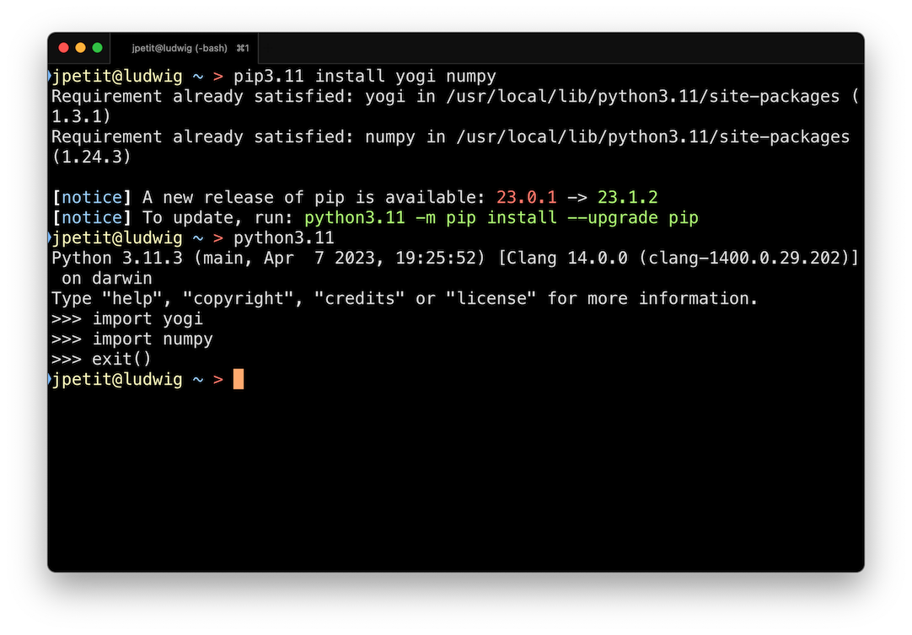

# Python Interpreter


To run your Python programs, you need a Python interpreter. There are different versions of the Python interpreter; any recent enough version will be sufficient for the purposes of this course. Just make sure to install one that is version 3.11 or higher and add some packages used during the course.


## Installing Python

The installation of Python depends slightly on your operating system:

:::tabs

== Linux

You will most likely already have it installed

== macOS

- Go to https://www.python.org/downloads/.
- Click the button to download the latest version of Python.
- Follow the installer instructions.

== Windows

- Open the Microsoft Store.
- Search for `python3`.
- Install the Python3 application.

:::

For this course, you do not need to install Python with other distributions like Anaconda or Spyder. In fact, I recommend that you do not.


Once you have Python installed, verify that it works well from your terminal application:

TODO: add link to terminal course

- Open a terminal (see the course The Terminal (/terminal/index.html) for more information).
- Run the command `python` or `python3` or something like `python3.11`.
- Verify that the command loads the version of Python you installed.
- Exit the interpreter with the command `exit()`.


## Installing additional packages

Now it is advisable to add some additional packages that we will use during the course: These are `yogi` (a package to simplify data reading), `numpy` (a package for working with vectors), and `mypy` (a tool to find errors in programs). To do this, run

```sh
pip install yogi numpy mypy
```

Instead of `pip`, you might need to use `pip3` or `pip3.11` (usually the pattern matches the `python` command).

Verify that they have been installed correctly:



If the `imports` do not complain, everything has gone well.


<Autors autors="jpetit"/>