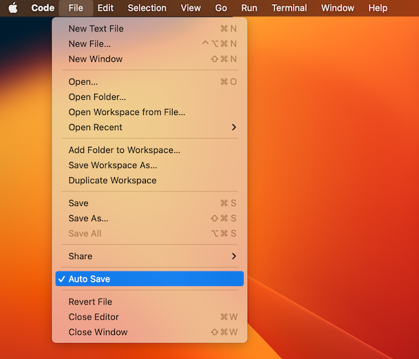
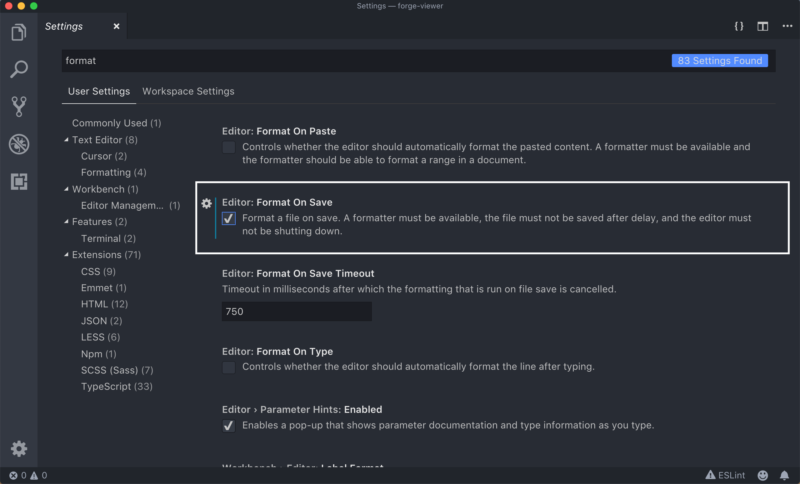
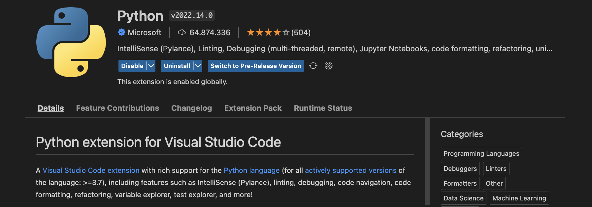
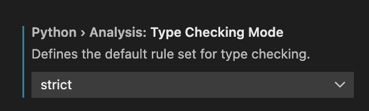

# Visual Studio Code Editor

A code editor is a software tool similar to a word processor, the difference being that a word processor is intended for writing documents and provides features for formatting text, creating indexes, adding figures, etc., while a code editor offers functionalities more specific to programming.

Visual Studio Code is the recommended code editor for following this course. This lesson describes how to install it and how to configure it to work comfortably with it.

## Installation

You can download and install Visual Studio Code on your computer from https://code.visualstudio.com/download (on Windows, you can find it in the Microsoft Store). It is very easy. Note: Visual Studio Code and Microsoft Visual Studio are different things. You want Visual Studio Code, not Microsoft Visual Studio.

Once you have installed Visual Studio Code, you can invoke it from the command line with `code` or `code .` or `code program.py`. macOS users will need to perform an extra step to use the `code` command: Open the _Command Palette_ (<kbd>⌘Cmd</kbd>+<kbd>⇧Shift</kbd>+<kbd>P</kbd>), type `shell command` and press <kbd>Enter</kbd>.

## Configuration

-   **Auto Save:** For convenience, safety, and to avoid the frustration of a program not working as expected simply because it wasn't saved, it is important to enable auto save. With auto save enabled, Visual Studio Code will automatically save our files after every change. To activate it, just click on the _Auto Save_ option in the _File_ menu:

    

-   **Auto Format:** Similarly, it is convenient to enable automatic formatting of programs when they are saved. To activate it, go to _Settings_, type `format` in the search bar, and enable the _Format On Save_ option:

    

-   **Python Tools:** Install a VSCode extension called _Python extension for Visual Studio Code_. [In fact, the first time you create a Python file, Visual Studio Code will already suggest installing this tool.] This extension provides diagnostics shown in real time in the text editor window, similar to how word processors show syntactic or spelling errors.

    

-   Although not necessary for now, take the opportunity to set `Strict` for `Type Checking Mode` in the PyLance configuration:

    

    Later, we will see how this tool helps us detect certain common errors before running programs.

<Autors autors="jpetit"/>