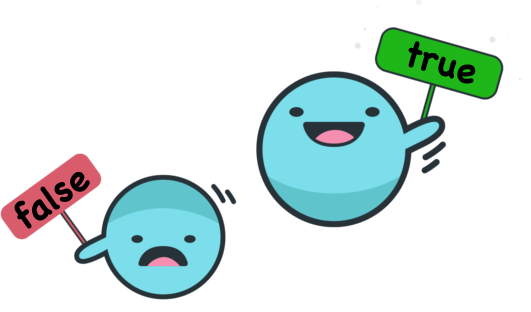

# The Boolean Type



In this lesson, the Boolean type is presented, what its use is, what values booleans can have, and what operations can be applied to them. At the end, we also consider some style issues.

## Concept

Surely, the simplest questions to answer are those that only
admit two answers: _yes_ or _no_ (of course, questions that
only have one answer are even simpler, but they are not at all
interesting). For example, the answer to _"Is the Earth a planet?"_
is _yes_, and the answer to _"Are whales fish?"_ is _"no"_ (they are
mammals!). For the question _"Is Anna pregnant?"_, we don't know
what the answer is, but at any given moment it will be _yes_ or it will be _no_, it cannot be _"a little bit"_. On the other hand, a question like _"What time is it?"_ does not have _yes_ or _no_ as an answer.

Likewise, statements can be true or false. For example, the statement _"Apples are fruits."_ is true, but the statement _"Paris is the capital of Andorra."_ is false. Moreover, statements can be combined into compound statements such as _"Apples are fruits or Paris is the capital of Andorra."_.

In programming, it is useful to have values that indicate
whether the answer to a question is _yes_ or _no_,
and to be able to combine these values with logical operators.
For this reason, **Boolean Algebra** is used
[$\small[\mathbb{W}]$](https://ca.wikipedia.org/wiki/%C3%80lgebra_de_Boole).
In Boolean Algebra there are only two values, **false** and **true**,
which can be combined with negation (**not**),
disjunction (**or**) and conjunction (**and**) operators.

## Values and Operations

In Python, logical values are represented with the `bool` type (for booleans). The false and true values are represented with the literals `False` and `True`. Watch out for the capital letter.

There is one unary operation (on a single boolean):

- **negation**, with the `not` operator.

There are also two fundamental binary operations (that is, with two operands):

- **disjunction**, with the `or` operator and
- **conjunction**, with the `and` operator.

The following truth tables show, for each operation,
the result of each possible combination of its operands.

**Truth table for negation:**

| `a`     | `not a` |
| ------- | ------- |
| `False` | `True`  |
| `True`  | `False` |

**Truth table for disjunction:**

| `a`     | `b`     | `a or b` |
| ------- | ------- | -------- |
| `False` | `False` | `False`  |
| `False` | `True`  | `True`   |
| `True`  | `False` | `True`   |
| `True`  | `True`  | `True`   |

**Truth table for conjunction:**

| `a`     | `b`     | `a and b` |
| ------- | ------- | --------- |
| `False` | `False` | `False`   |
| `False` | `True`  | `False`   |
| `True`  | `False` | `False`   |
| `True`  | `True`  | `True`    |

Thus, the disjunction of two booleans is only false if both are false, and the conjunction of two booleans is only true if both are true. And, of course, negating a boolean means choosing the other one.

You can also check whether two booleans are equal or different with the `==` and `!=` operators. They are used very rarely.

## Uses

The conditions of conditional and iterative statements are always boolean. For example, when you write

```python
if temperatura <= 0: ...  # it freezes
```

the expression `temperatura <= 0` is of boolean type.
Indeed, as we have already explained, relational operators (`==`, `!=`, `<=`, `>=`, `<` and `>`)
return a boolean value.
This is more clearly appreciated when several conditions are joined:

```python
if temperatura <= 0 and llum == 0: ...  # it freezes and it's dark
```

Moreover, if needed we can store conditions
in boolean type variables.
For example, with

```python
gela = temperatura <= 0;
```

a new boolean variable called `gela` is created,
with value `True` or `False` depending on whether the value of `temperatura` is negative or zero or strictly positive.
You can verify that the type of gela is boolean by evaluating `type(gela)` in the interpreter.
Likewise, you can create a boolean variable
to store whether it is dark or not,
and they can be combined with each other:

```python
gela = temperatura <= 0
es_fosc = llum == 0
if gela and es_fosc:
    ...
```

And, obviously, you can also create more boolean variables using their operators:

```python
gela = temperatura <= 0
es_fosc = llum == 0
anar_amb_compte = gela and es_fosc
```

## De Morgan's Laws

De Morgan's laws are a pair of logical transformations
that are essential in computer science.
Written in Python, the first law states that `not (a or b)`
is equivalent to `(not a) and (not b)`.
The second law says that `not (a and b)` is
equivalent to `(not a) or (not b)`. The proof of both laws is
quite simple using truth tables.

Thus, we can see that the opposite of _"it freezes and it's dark"_
is _"it doesn't freeze or it's not dark"_.
Beware: it is not _"it doesn't freeze and it's not dark"_,
which is a very common mistake.

Therefore, when we have a loop such as

```python
while gela and es_fosc: ...
```

we know that we will exit the loop when at least one of the variables
`gela` and `es_fosc` is false.

## Style

Usually, comparing a boolean directly with `True` or with `False` is
considered bad style. For example, if `trobat` is a boolean, the fragment

```python
if trobat == True: ...
```

is better rewritten like this:

```python
if trobat: ...
```

Similarly,

```python
if trobat == False: ...
```

is worse style than

```python
if not trobat: ...
```

Also, it is confusing to use negated identifiers
for boolean variables.
For example, it is much simpler to understand the condition `gela` than `not no_gela`.

Using conditionals to initialize booleans reveals you to be a programming _noob_ without knowledge of booleans. You should get used to not writing anything like

```python
if temperatura <= 0:         # 💩
    gela = True
else:
    gela = False
```

and, instead, write it with good style, like this:

```python
gela = temperatura <= 0      # 💜
```

Finally, if you want to avoid the wrath of the programming gods,
never write nonsense like `fals = True` 🤣.

<Autors autors="jpetit roura"/>
