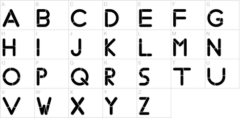

# Application: Character Classification



This lesson shows a possible solution for the exercise
[P42042](https://jutge.org/problems/P42042) (Character Classification 1) from
the Judge.

## Exercise P42042

Exercise [P42042](https://jutge.org/problems/P42042)
asks you to write a program that reads a letter and indicates whether it is
uppercase, whether it is lowercase, whether it is a vowel, and whether it is a consonant.

This is a possible solution:

```python
from yogi import read

lletra = read(str)

majuscula = lletra >= 'A' and lletra <= 'Z'

vocal = lletra == 'a' or lletra == 'e' or lletra == 'i' or lletra == 'o' or lletra == 'u' or lletra == 'A' or lletra == 'E' or lletra == 'I' or lletra == 'O' or lletra == 'U'

if majuscula:
    print("majuscula")
else:
    print("minuscula")

if vocal:
    print("vocal")
else
    print("consonant")
```

First, we read the letter from the input into a variable `lletra` of text type.
Since, according to the statement, it is a letter (uppercase or lowercase), there is no need to check it.

Next, we save in a boolean variable `majuscula`
whether or not `lletra` is an uppercase letter,
checking that `lletra` is between `'A'` and `'Z'`.

Then, we save in a boolean variable `vocal` whether or not `lletra` is a vowel.
To check this, we verify if `lletra` is one of the five
possible vowels, both uppercase and lowercase.
Since the line was getting very long, it has been separated into two lines.

Finally, we use the two booleans to write the appropriate messages to the screen.

A possible way to simplify the program is to make use of Python's `in` operator, which when applied to two texts returns a boolean that says whether or not the first text is within the second. Then, determining whether `lletra` is a vowel could be done with

```
vocal = lletra in 'AEIOUaeiou'
```

<Autors autors="jpetit"/>
