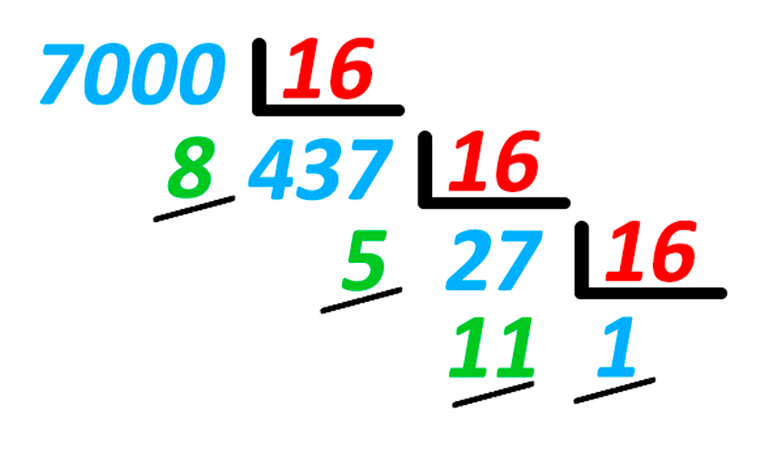

# Application: Hexadecimal Numbers



This lesson shows a possible solution for the problem
[P60816](https://jutge.org/problems/P60816) (Reversed Number in Hexadecimal).

## Exercise P60816

Exercise [P60816](https://jutge.org/problems/P60816) asks for a program that reads a number and writes its reversed hexadecimal representation. You must follow the convention of representing values between 10 and 15
with the letters from A to F.

For example, for the input ~~14~~ you must write the output ~~E~~, for the input ~~16~~ you must write the output ~~01~~, and for the input ~~7000~~ you must write the output ~~85B1~~.

This is a possible solution:

```python
from yogi import read

n = read(int)
if n == 0:  # special case
    print(0)
else:
    while n > 0:
        d = n % 16
        if d == 10:
            print('A', end='')
        elif d == 11:
            print('B', end='')
        elif d == 12:
            print('C', end='')
        elif d == 13:
            print('D', end='')
        elif d == 14:
            print('E', end='')
        elif d == 15:
            print('F', end='')
        else:
            print(d, end='')
        n = n / 16
    print()
```

The program starts by reading the number, which is stored in `n`. Then, there is a special treatment for the case where `n` is zero (otherwise the program would not write any digit), and a treatment for the general case.

In the general case, we keep dividing the number `n` by 16 until it is zero. This way all its hexadecimal digits are visited, from right to left. At each iteration, the last hexadecimal digit `d` is extracted and written. If it is a value between 0 and 9, `d` can be written directly. Otherwise, the corresponding letter is needed for each number between 10 and 15, which we do with a cascade of `if`s.

Since each hexadecimal digit must be written after the previous one, the `print` statements include an `end=''` to indicate that nothing should be written at the end (not even the line break). The last `print()` without parameters is what writes the line break.

## Remarks

- The problem asks to write the result reversed because you wouldn't know how to do it forward (yet).

- The cascade of `if`s could be avoided by using the `ord` and `chr` functions, but we haven't seen those either.

<Autors autors="jpetit"/>
