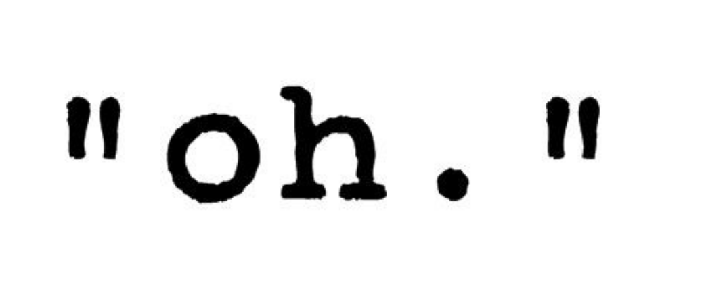

# The String Type



This lesson describes the string type. In particular, it shows how string type literals are written, what values strings can have, and some of the operations that can be applied to them. Finally, a small application involving strings is given.

## Strings

Strings are sequences of zero or more characters. The type of strings in Python is written `str`.

## Literals

The way to write strings in Python is by writing their characters one after another between quotes, single or double. For example, `'Jordi'` and `"Jordi"` represent the same string. The string `''` is the empty string, and has length zero. On the other hand, the string `' '` is a string of length 1 that only contains the space character (which is not visible). Note that `666` is an integer that represents the number 666, whereas `'666'` is a string with 3 characters that are the digit 6.

## Characters

In Python, strings are formed by characters in Unicode. **Unicode** is an international standard for character encoding for computer media. It allows storing any kind of writing currently used, many forms of writing (from Latin alphabets to Chinese writing) and symbols such as mathematical symbols, linguistic symbols, and some emoticons. Thus, `'I 🧡 E = mc² 😛!'` is a valid string in Python.

There are also some special characters called **control characters** that represent special actions when writing. For example `'\n'` is the line break, `'\a'` is a bell sound and `'\t'` is a tab. The backslash therefore introduces a special character; to write a backslash, you need to put two: `'\\'`.

## Operations

Remember that the `+` operator allows concatenating two strings and that the `*` operator allows repeating a string a certain number of times. For example, `'Black' + 'field'` gives `'Blackfield'` and `'19' * 3` gives `'191919'`.

Strings can also be compared with relational operators. The order depends on the operating system configuration but, broadly speaking, for Western localizations, the underlying order is alphabetical order (that of the dictionary). !!! Perhaps more explanation is needed?

Strings have many other operations, some of which we will see later. One that can already be useful is the `len` function, which returns the length (number of characters) of a string. For example, `len('I 💜 you')` equals 7.

## Formatted Strings

Strings also have a variant called **formatted string** (_f-string_). Formatted strings can include expressions inside them that are evaluated and converted to string, possibly applying some transformation to improve their format.

Here is a simple example:

```python
>>> nom = 'James'
>>> cognom = 'Bond'
>>> f'El meu nom és {cognom}, {nom} {cognom}'
'El meu nom és Bond, James Bond'
```

And here is another one with variables and real expressions:

```python
>>> a = 3.199
>>> b = 2.236
>>> a + b
5.4350000000000005
>>> f'La suma de {a} i {b} és {a+b}'
'La suma de 3.199 i 2.236 és 5.4350000000000005'
```

As you can see, formatted strings have the `f` prefix before the quotes and, inside them, expressions enclosed in braces are evaluated and inserted into the surrounding string. This is called **variable substitution** or **string interpolation**.

Moreover, expressions can be preceded by a colon (`:`) and a **format specification**. Format specifications allow controlling how many digits numbers are written with, how strings are aligned, what characters are used for padding... In the previous example, the numbers looked quite ugly; in a monetary application or to create tables it would be better if all values had two decimal digits. This can be achieved with the `.02f` format:

```python
>>> a = 3.199
>>> b = 2.236
>>> a + b
5.4350000000000005
>>> f'La suma de {a:.02f} i {b:.02f} és {a+b:.02f}'
'La suma de 3.20 i 2.24 és 5.44'
```

Here, the `f` means that a real number (_float_) must be formatted. The `.02` means to do it with two decimals after the comma, adding zeros if necessary.

We have extensive documentation on formats at https://docs.python.org/3/tutorial/inputoutput.html#tut-f-strings. You don't need to remember it by heart. Better that when you need it you refer to these brief examples of the existing possibilities:

```python
>>> x = 123.419
>>> f'{x:.2f}'  # two digits after the decimal point
'123.42'
>>> f'{x:08.2f}' # two digits after the decimal point, 8 characters total, zeros on the left
'00123.42'
>>> f'{x: 8.2f}' # two digits after the decimal point, 8 characters total, spaces on the left
'  123.42'
```

```python
>>> s = 'Python'
>>> f'{s:>20}'              # right alignment
'              Python'
>>> f'{s:<20}'              # left alignment
'Python              '
>>> f'{s:^20}'              # centering
'       Python       '
>>> f'{s:*>20}'             # right alignment filling with asterisks
'**************Python'
```

```python
>>> n = 123
>>> f'{n:>20}'              # right alignment
'                 123'
>>> f'{n:<20}'              # left alignment
'123                 '
>>> f'{n:0>20}'
'00000000000000000123'      # right alignment filling with zeros
```

```python
>>> x = 3
>>> f'{x = }, {2 * x = }'  # debuggers
'x = 3, 2 * x = 6'
```

## Multiline Strings

In some circumstances, it is convenient to write a string that contains multiple lines. In Python this can be done using three quotes (double or single):

```python
poema = '''
La ginesta altre vegada,
la ginesta amb tanta olor,
és la meva enamorada
que ve al temps de la calor.
Per a fer-li una abraçada
he pujat dalt del serrat:
de la primera besada
m'ha deixat tot perfumat.

            — Joan Maragall
'''
```

Inside multiline strings, spaces and line breaks are stored as they have been written.

Formats can also be used with multiline strings:

```python
nom = 'Joan Vila Capdetort'
email = 'jvila@atzucac.cat'
saldo = 0.0
contrasenya = random.randint(11111111, 99999999)
departament = "Departament d'atenció al client"

missatge = f'''
Benvolgut {nom},

Estem contents que s'hagi registrat a la nostra web.
El seu nom d'usuari és {email} i la seva contrasenya
és {contrasenya}. Quan entri per primer cop a la zona de clients
haurà de triar una nova contrasenya.

El seu saldo actual és de {saldo:.02f}€.

Atentament,
    {departament}
'''
```

Multiline strings are also used to document some parts of the code with _docstrings_, we will see this later.

<Autors autors="jpetit"/>
