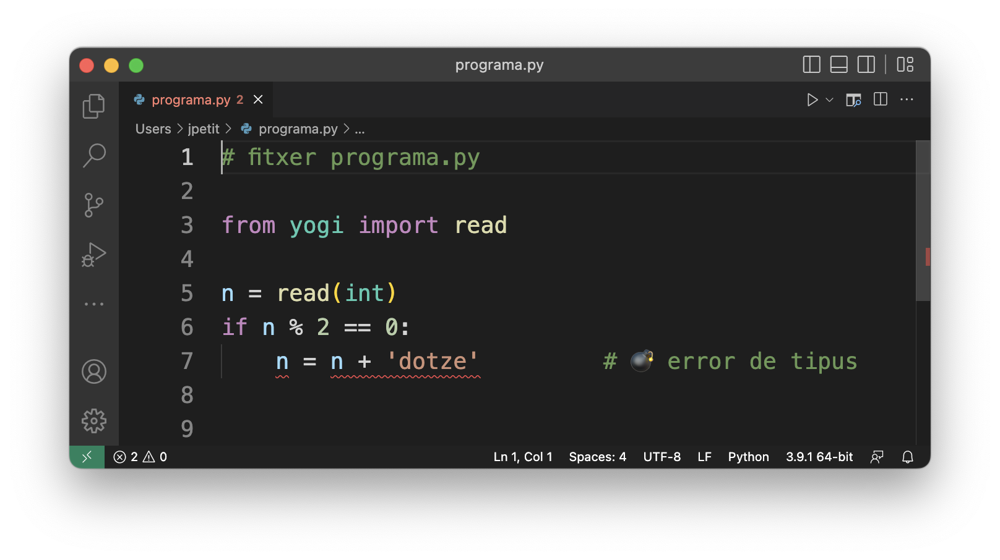

# Type Checking


This lesson introduces the concept of dynamic and static type checking and presents two possible tools for performing static type checking on Python programs.

## Dynamic and Static Type Checking

As we have already explained, all programming languages have a **type system** that indicates which operations can be applied to data based on their types. In Python, these type checks are carried out at runtime, that is, when the program is executed. Therefore, Python is said to be a language with **dynamic type checking**.

This type of typing ensures that if a program tried to execute an instruction with a type error, its execution would be aborted by the interpreter. For example, in the following program

```python
# file programa.py

from yogi import read

n = read(int)
if n % 2 == 0:
    n = n + 'dotze'         # 💣 type error
```

the type error in the last line would interrupt the program's execution with an error ~~TypeError: unsupported operand type(s) for +: 'int' and 'str'~~ when the read value of `n` is even.

Clearly, this is positive because errors (which could lead to incorrect results) are not ignored. However, errors in programs are not detected until they are executed. If the developer of the previous program has always tested the program with odd values of `n`, they may not be aware of the existence of this error. It will be the end users who encounter it (not very professional).

Therefore, many other programming languages (such as C++) perform **static type checking** where type rules are checked before executing the program. With static type checking, the system can indicate to the developer the error in the last line of the previous program before distributing it to its users.

As you can understand, static type checking provides more secure programs (but it is true that it also limits the things the programmer can do). Therefore, although Python is a programming language with dynamic type checking, it is good to use tools that also perform static type checking.

There are many tools for static type checking of Python programs. Below we present two. Use these or some similar ones.

## mypy

mypy is a tool for detecting possible type errors in a Python program. It works from the terminal, where you tell it which program to check and it issues a list of diagnostics.

To use mypy, you must first install it with `pip`:

```bash
pip3 install mypy       # or perhaps pip, or pip 3.10 or... depending on your system
```

Once installed, you just need to invoke `mypy` with the name of the Python source code file you want to check (assuming you are already in the same directory where it is saved). For example, to test the previous program you need to write

```bash
mypy programa.py
```

The output would be a list of errors like the following:

```text
programa.py:7: error: Unsupported operand types for + ("int" and "str")
Found 1 error in 1 file (checked 1 source file)
```

From this information, the programmer should fix the type error on line 7.

## Pylance

Pylance is a Visual Studio Code extension that offers static type checking where diagnostics are shown in real time in the text editor window, similar to word processors when they show syntactic or spelling errors. If you hover the mouse over the highlighted area, it will give you more information. Here it is:



In order to use Pylance in Visual Studio Code, install a plugin called _Python extension for Visual Studio Code_ that installs Pylance and other utilities you will appreciate. (In fact, the first time you create a Python file, Visual Studio Code already suggests you install this tool.)


Once the plugin is installed, remember to go to the settings and set `Strict` to `Type Checking Mode` for PyLance:


👆 Remember to do this!

## Static Type Checking on Jutge.org

If you solve problems in Python on Jutge.org, you can use the MyPy "compiler" when you submit your solution. With this compiler, Jutge.org first checks that your program has no errors with `mypy`. If it does, it will give you a "Compilation error" verdict along with the corresponding diagnostics. If it doesn't, it will execute the program with the Python interpreter as usual.

> Warning for AP1, AP2 and AP3 students: In exams, you will be required to use the MyPy compiler.

## Summary

By itself, Python only detects type errors at runtime. In order to write more secure programs, it is vital to use automated tools that detect type errors before executing programs. `mypy` and Pylance are two options you should use to prevent this type of error.

<Autors autors="jpetit"/>
