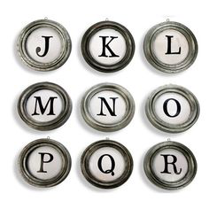

# Caràcters



Aquesta lliçó explica els valors que poden prendre les variables de
tipus caràcter (`char`), com es representen, i quines són les operacions que se'ls
pot aplicar.


## El tipus `char`

En informàtica, un _caràcter_ és una unitat d'informació que es correspon a
un símbol. Una lletra (majúscula o minúscula), un espai en blanc, un
dígit o un signe de puntuació són exemples de caràcters.

En C++ s'utilitza el tipus `char` per emmagatzemar i tractar caràcters.


## Representació

En C++, la majoria de caràcters s'escriuen entre cometes simples.
Per exemple, `'j'` representa una jota minúscula,
`'J'` una jota majúscula,
`'.'` un punt,
`'3'` un símbol amb forma de tres
(el qual no té res a veure amb l'enter 3),
i `' '` un espai en blanc
(que si convé ressaltar,
a vegades nosaltres l'escriurem `'⎵'` en aquestes lliçons).

A més, alguns caràcters especials
es representen a través de codis darrera d'una barra invertida.
Per exemple, per representar una cometa simple,
cal usar `'\''`.
També, per representar la barra invertida cal usar `'\\'`.

SRF: Jo esborraria això: Els caràcters de control també es representen així: `'\n'` representa
un salt de línia (␊) i `'\b'` representa el so de la campaneta
(␇).


Internament, els caràcters es codifiquen amb nombres. Una _taula de
caràcters_ defineix a quin nombre es correspon cada caràcter.
La majoria d'ordinadors usen la **taula de caràcters ASCII**
[$\small[\mathbb{W}]$](https://ca.wikipedia.org/wiki/ASCII),
la qual descriu 128 caràcters:

|Codi|Caràcter|Codi|Caràcter|Codi|Codi|Caràcter|Codi|
|---:|-----:|---:|------:|---:|------:|----:|------:|
|  0 | **␀** | 32 | **~~⎵~~** | 64 | **~~@~~** |  96 | **~** |
|  1 | **␁** | 33 | **~~!~~** | 65 | **~~A~~** |  97 | **~~a~~** |
|  2 | **␂** | 34 | **~~"~~** | 66 | **~~B~~** |  98 | **~~b~~** |
|  3 | **␃** | 35 | **~~#~~** | 67 | **~~C~~** |  99 | **~~c~~** |
|  4 | **␄** | 36 | **~~$~~** | 68 | **~~D~~** | 100 | **~~d~~** |
|  5 | **␅** | 37 | **~~%~~** | 69 | **~~E~~** | 101 | **~~e~~** |
|  6 | **␆** | 38 | **~~&~~** | 70 | **~~F~~** | 102 | **~~f~~** |
|  7 | **␇** | 39 | **~~'~~** | 71 | **~~G~~** | 103 | **~~g~~** |
|  8 | **␈** | 40 | **~~(~~** | 72 | **~~H~~** | 104 | **~~h~~** |
|  9 | **␉**  | 41 | **~~)~~** | 73 | **~~I~~** | 105 | **~~i~~** |
| 10 | **␊**  | 42 | **~~*~~** | 74 | **~~J~~** | 106 | **~~j~~** |
| 11 | **␋**  | 43 | **~~+~~** | 75 | **~~K~~** | 107 | **~~k~~** |
| 12 | **␌**  | 44 | **~~,~~** | 76 | **~~L~~** | 108 | **~~l~~** |
| 13 | **␍**  | 45 | **~~-~~** | 77 | **~~M~~** | 109 | **~~m~~** |
| 14 | **␎** | 46 | **~~.~~** | 78 | **~~N~~** | 110 | **~~n~~** |
| 15 | **␏** | 47 | **~~/~~** | 79 | **~~O~~** | 111 | **~~o~~** |
| 16 | **␐** | 48 | **~~0~~** | 80 | **~~P~~** | 112 | **~~p~~** |
| 17 | **␑** | 49 | **~~1~~** | 81 | **~~Q~~** | 113 | **~~q~~** |
| 18 | **␑** | 50 | **~~2~~** | 82 | **~~R~~** | 114 | **~~r~~** |
| 19 | **␓** | 51 | **~~3~~** | 83 | **~~S~~** | 115 | **~~s~~** |
| 20 | **␔** | 52 | **~~4~~** | 84 | **~~T~~** | 116 | **~~t~~** |
| 21 | **␕** | 53 | **~~5~~** | 85 | **~~U~~** | 117 | **~~u~~** |
| 22 | **␖** | 54 | **~~6~~** | 86 | **~~V~~** | 118 | **~~v~~** |
| 23 | **␗** | 55 | **~~7~~** | 87 | **~~W~~** | 119 | **~~w~~** |
| 24 | **␘** | 56 | **~~8~~** | 88 | **~~X~~** | 120 | **~~x~~** |
| 25 | **␙** | 57 | **~~9~~** | 89 | **~~Y~~** | 121 | **~~y~~** |
| 26 | **␚** | 58 | **~~:~~** | 90 | **~~Z~~** | 122 | **~~z~~** |
| 27 | **␛** | 59 | **~~;~~** | 91 | **~~[~~** | 123 | **~~{~~** |
| 28 | **␜** | 60 | **~~<~~** | 92 | **~~\~~** | 124 | **~~❘~~** |
| 29 | **␝** | 61 | **~~=~~** | 93 | **~~]~~** | 125 | **~~}~~** |
| 30 | **␞** | 62 | **~~>~~** | 94 | **~~^~~** | 126 | **~~~~~** |
| 31 | **␟** | 63 | **~~?~~** | 95 | **~~_~~** | 127 | **␡** |


És molt important no aprendre's mai aquesta taula! Només cal observar-ne
unes poques característiques fonamentals:

- Els caràcters de la primera columna (amb codis inferiors a 32) i el 127 són
**codis de control**, és a dir, produeixen efectes especials quan s'escriuen.
Per exemple, el caràcter ␇ (amb codi 7) s'anomena _bell_
i serveix per fer sonar una campaneta.
Els utilitzareu rarament o mai.

SRF: no posaria lo del line feed. Encada l'usaria algu en lloc del endl.
Això: el caràcter ␊ (amb codi 10) s'anomena _line feed_
i serveix per passar de línia.

- Alguns caràcters s'agrupen naturalment en famílies de codis consecutius:
els caràcters de la `'a'` a la `'z'` són les lletres minúscules,
els caràcters de la `'A'` a la `'Z'` són les lletres majúscules,
i els caràcters del `'0'` al `'9'` són els dígits.

- Els caràcters que representen dígits _no_ tenen com a codi el seu valor.
Per exemple, el codi del dígit `'3'` no és 3, sinó 51.
Que sigui 51 no és gens important.
Però, com veurem ben aviat,
que sigui 3 unitats més gran que el codi del `'0'`, que és 48, sí.


## Operacions

Les operacions que es poden aplicar entre caràcters són, de fet,
les mateixes que entre enters. La diferència és que són enters més petits
i sempre positius (entre 0 i 255).

Per exemple, per saber si un caràcter `c`
és o no una lletra majúscula es podria fer

```c++
char c = ...;
bool es_majuscula = c >= 'A' and c <= 'Z';
```

que correspon a mirar si el codi de `c`
es troba entre el codi de la `'A'`
i el codi de la `'Z'`,
aprofitant que entre elles hi ha totes les majúscules
i cap altre caràcter.

Similarment, si es vol saber si `c` és una lletra (majúscula o
minúscula) es pot fer amb aquesta condició:

```c++
bool es_lletra = (c >= 'A' and c <= 'Z') or (c >= 'a' and c <= 'z');
```

Només les operacions de suma i resta són útils amb els caràcters.
Per exemple, si volem convertir una lletra minúscula
en la majúscula corresponent
(per exemple, de `'d'` a `'D'`),
el que es pot fer és restar-li el codi de la `'a'`
i sumar-li el de la `'A'`:

```c++
char c = 'd';
c = c - 'a' + 'A';
// c == 'D'
```

Amb els dígits les coses són similars.
Per exemple, es pot obtenir l'enter `3` a partir del dígit `'3'`
simplement restant-li el codi del `'0'`:
```
char c = '3';
int v = c - '0';
// v == 3
```

La operació inversa és anàloga:
```
int v = 3;
char c = v + '0';
// c == '3'
```


**Observació important:** Fixeu-vos que hem estat capaços d'escriure tots
aquests fragments de programes sobre caràcters sense referenciar mai
explícitament els codis de la taula ASCII. Fer-ho seria de _loosers_!


## La llibreria `<cctype>`

El mòdul [cctype](/stl/cctype.html) de la llibreria estàndard de C++ ofereix
una sèrie de funcions sobre caràcters.


## Caràcters en Unicode

Com segurament ja haureu observat, la taula ASCII només defineix caràcters
americans. No hi ha lletres accentuades (com ara `à` o `Å`), ces trencades
(com ara `Ç`), enyes (com ara `Ñ`), ni caràcters d'alfabets més o menys exòtics
(com ara `δ`, `س`‎ o `中`)...
Per posar-hi remei, actualment s'ha estandaritzat l'ús
del **Unicode** [$\small[\mathbb{W}]$](https://ca.wikipedia.org/wiki/Unicode),
que permet l'escriptura en totes les llengües conegudes i amb símbols
especials com ara els matemàtics.
Nosaltres no utilitzarem Unicode perquè no ens aportaria res a aquest curs.


<Autors autors="jpetit roura"/>

