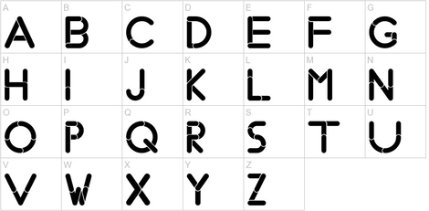

# Aplicació: Classificació de caràcters



Aquesta lliçó mostra una possible solució per a l'exercici
[P42042](https://jutge.org/problems/P42042) (Classificació de caràcters 1) del
Jutge.

## Exercici P42042

L'exercici [P42042](https://jutge.org/problems/P42042)
demana d'escriure un programa que llegeixi una lletra i que indiqui si és
una majúscula, si és una minúscula, si és una vocal, i si és una consonant.

Aquesta és una possible solució:

```c++
#include <iostream>
using namespace std;


int main() {
    char c;
    cin >> c;

    bool majuscula = c >= 'A' and c <= 'Z';

    bool vocal =    c == 'a' or c == 'e' or c == 'i' or c == 'o' or c == 'u'
                 or c == 'A' or c == 'E' or c == 'I' or c == 'O' or c == 'U';

    if (majuscula) cout << "majuscula" << endl;
    else cout << "minuscula" << endl;

    if (vocal) cout << "vocal" << endl;
    else cout << "consonant" << endl;
}
```

Primer, llegim la lletra de l'entrada en una variable `c` de tipus caràcter.
Com que, segons l'enunciat, és una lletra, no cal comprovar-ho.

A continuació, desem en una variable booleana `majuscula`
si `c` és o no una lletra majúscula,
comprovant que `c` es trobi entre la `'A'` i la `'Z'`.

Després, desem en una variable booleana `vocal` si `c` és o no una vocal.
Per mirar-ho, comprovem si `c` és una de les cinc
possibles vocals, tan en majúscula com en minúscula.
Com que la línia quedava molt llarga, s'ha separat en dues línies.

Finalment, usem els dos booleans per escriure per pantalla els missatges adequats.

Com a comentari final,
la condició per mirar si una lletra és majúscula és prou senzilla,
de manera que es podria usar directament en el `cout` corresponent,
sense cap necessitat del booleà `majuscula`:

```c++
    if (c >= 'A' and c <= 'Z') cout << "majuscula" << endl;
    else cout << "minuscula" << endl;
}
```

<Autors autors="jpetit"/>
