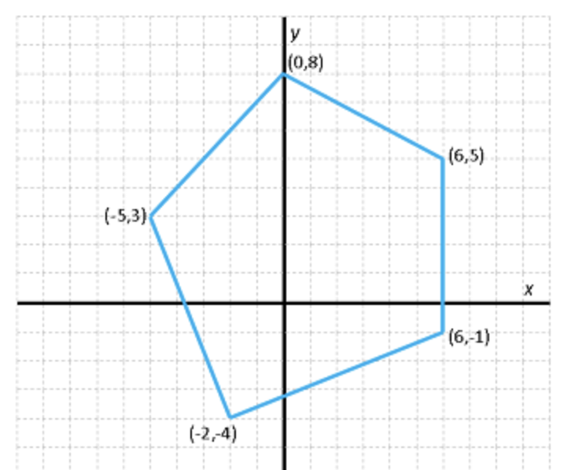

# Aplicació: Polígons simples


Un **polígon simple** és un polígon els costats no adjacents del qual no
s'intersequen. En aquesta secció voldríem definir tipus de dades per poder
manipular polígons simples i per calcular llur perímetre i àrea. De passada,
introduirem un tipus per a punts en el pla i veurem com definir
vectors d'estructures.


## Tipus punt

Per començar, veiem que un polígon ve venir donat per les posicions dels seus punts
en el pla. Per tant, necessitem alguna forma de representar punts. Donat que un punt
té dues coordenades, podem representar-los amb una estructura amb dos camps de tipus real,
un per la coordenada X, i un per la coordenada Y:

```c++
struct Punt {
    double x, y;    // coordenades del punt en el pla
};
```

Ara es podrien definir funcions útils per tractar punts en el pla, com ara obtenir
el seu mòdul o el seu argument, o aplicar-los una translació o un escalat...
Penseu com fer-les! Com a exemple, aquí teniu una funció que, donats dos punts,
retorna la seva distància:

```c++
// retorna la distància euclidiana entre dos punts
double distancia(const Punt& p, const Punt& q)
{
    return sqrt(                            // cal #include <cmath>
          (p.x - q.x) * (p.x - q.x)
        + (p.y - q.y) * (p.y - q.y)
    );
}
```

## Tipus polígon

A continuació, considerem com representar un polígon. Segurament, l'opció més senzilla
és descriure un polígon llistant els seus punts des del primer a l'últim, entenent que
hi ha una aresta entre tots els parells de punts consecutius i entre el darrer i el primer.
Com que tots els punts d'un polígon han de ser del mateix tipus (`Punt`) però el seu
nombre és indeterminat, podem utilitzar un vector per representar-los! Per tant,
podem definir un nou tipus per a polígons utilitzant vectors de punts:

```c++
using Poligon = vector<Punt>;
```



Definir vectors de estructures és molt habitual.
En aquest cas, podríem definir un polígon corresponent a la figura de la dreta
de la forma següent:

```c++
Poligon pol = {         // vector
    { 6,  5},           //     primer punt
    { 0,  8},           //     segon  punt
    {-5,  3},           //     tercer punt
    {-2, -4},           //     quart  punt
    { 6, -1},           //     cinquè punt
};
```

Fixeu-vos que la variable `pol` no és altra cosa que un vector que
conté cinc punts, i que els hem pogut llistar utilitzant la notació de vectors
i d'estructures, escrivint cada punts dins del vector. També, si mai volguéssim
accedir a la coordenada X del segon punt d'aquest polígon, hauríem d'escriure
`pol[1].x`: `pol` és un vector, per tant li podem
aplicacar l'operador `[]` per indexar-lo; i `pol[1]` és un punt,
per tant li podem aplicacar l'operador `.` per seleccionar un dels seus camps
(`x` en aquest cas). En canvi, haver intentat escriure `pol.x[1]` no
tindria sentit.


## Perímetre

Ara que podem representar polígons, podem definir una funció per obtenir-ne
el seu perímetre. Només cal sumar totes les distàncies entre parells de punts
consecutius, sense deixar-se d'afegir la distància del primer al darrer:

```c++
// retorna el perímetre d'un polígon simple
double perimetre(const Poligon& poligon)
{
    int n = poligon.size();  // nombre de punts a poligon
    double p = distancia(poligon[0], poligon[n - 1]);
    for (int i = 0; i < n - 1; ++i) {
        p += distancia(poligon[i], poligon[i + 1]);
    }
    return p;
}
```

Evidentment, aquesta funció només és correcta si el polígon és simple
i així ho hem documentat al seu comentari. Observeu com hem passat els punts
del polígon a la funció distància. Tot el puzzle lliga!


## Àrea

De forma sembant, podem calcular l'àrea d'un polígon simple utilitzant la
*fórmula de Gauss*
[$\small[\mathbb{W}]$](https://es.wikipedia.org/wiki/F%C3%B3rmula_del_%C3%A1rea_de_Gauss):

```c++
// retorna l'àrea d'un polígon simple
double area(const Poligon& poligon)
{
    int n = poligon.size();
    double s = poligon[n - 1].x * poligon[0].y - poligon[0].x * poligon[n - 1].y;
    for (int i = 0; i < n - 1; ++i) {
        s += poligon[i].x * poligon[i + 1].y - poligon[i + 1].x * poligon[i].y;
    }
    return s / 2.0;
}
```


<? author("jpetit") ?>

