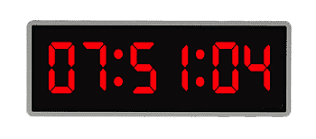

# Estructura i operacions per a un rellotge



Més rellotges! Aquesta lliçó mostra com utilitzar una estructura per reunir en
una sola variable els tres components hora, minuts, segons de l'hora del dia
d'un rellotge.

## Definició del tipus

Considereu un rellotge digital, que marca les hores, minuts i segons de l'hora
del dia. Tal vegada voldríem desar aquesta informació en un sol lloc i, fer-ho
en una estructura com la següent seria una idea ben adient:

```c++
struct Hora {
    int h;      // hora  (0..23)
    int m;      // minut (0..59)
    int s;      // segon (0..59)
};
```

És a dir, l'hora del dia té tres camps: `h`, `m` i `s` que representen,
respectivament, les seves hores, minuts i segons. Cada camps és un
enter, però als comentaris hem emfatitzat els valors legals que poden
tenir cadascun d'ells.

Fixeu-vos que també haguéssim pogut definir una `Hora` com un vector
amb tres enters, però haver-ho fet amb una estructura ho fa molt més
segur i explícit, ja que no hi haurà mai errors amb les posicions
ni dubtes sobre quin valor hi ha a cada posició.

## Operacions

Una primera operació que ens podria ser útil tenir és la d'escriure una hora
donada. Per això, escriurem una acció que, donada una `Hora`, l'escriu
en format estàndard, amb dos dígits per camp:

```c++
void escriure_hora(const Hora& hora)
{
    if (hora.h < 10) cout << 0;
    cout << hora.h << ':';
    if (hora.m < 10) cout << 0;
    cout << hora.m << ':';
    if (hora.s < 10) cout << 0;
    cout << hora.s << endl;
}
```

Fixeu-vos que, com que estem passant una estructura com a paràmetre d'entrada,
preferim passar-la per referència constant que per valor.

A continuació, podríem tenir una operació que, donada un hora, li afegís un
segon. Hi ha dues maneres de fer-ho: amb una acció que té un paràmetre
d'entrada-sortida que és modificat o amb una funció que, donada una hora, en
retorna una altra. Totes dues són opcions vàlides i la preferència de l'una
sobre l'altra depèn del context.

Comencem amb l'acció amb paràmetre d'entrada-sortida:

```c++
void incrementar_un_segon(Hora& hora)
{
    ++hora.s;
    if (hora.s == 60) {
        hora.s = 0;
        ++hora.m;
        if (hora.m == 60) {
            hora.m = 0;
            ++hora.h;
            if (hora.h == 24) {
                hora.h = 0;
            }
        }
    }
}
```

I ara, fem-ho amb una funció:

```c++
Hora increment_un_segon(Hora hora)
{
    ++hora.s;
    if (hora.s == 60) {
        hora.s = 0;
        ++hora.m;
        if (hora.m == 60) {
            hora.m = 0;
            ++hora.h;
            if (hora.h == 24) {
                hora.h = 0;
            }
        }
    }
    return hora;
}
```

Aquesta vegada, hem triat que `hora` fós un paràmetre per valor, de forma que
ja disposem d'una còpia del paràmetre real que podem modificar lliurament sense
modificar l'original. Al final, retornem l'hora incrementada.

Així, hem vist com, segons l'ús que en fem, és millor passar una `Hora` per
valor, per referència o per referència constant.

## Programa principal

Per acabar, fem un programa que simuli el rellotge, escrivint l'hora
corresponent cada segon. Per a fer-ho, utilitzarem els subprogrames anteriors i
la funció `sleep()` disponible a la llibreria `<unistd.h>` que suspèn l'execució
del programa durant tants segons com se li passi per paràmetre.

```c++
#include <unistd.h>
...

int main()
{
    Hora hora = {23, 59, 55};
    while (true) {
        escriure_hora(hora);
        sleep(1);                       // esperar un segon
        incrementar_un_segon(hora);
    }
}
```

El bucle `while (true)` és un bucle infinit: el programa no acabarà mai.
Normalment no volem programes que mai acabin, però, en aquest cas... jo no
voldria que el meu rellotge acabés! Piqueu <kbd>control</kbd>+<kbd>c</kbd> per
aturar la seva execució.

<Autors autors="jpetit"/>
