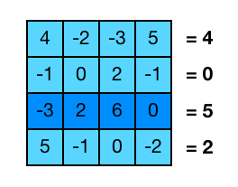

# Aplicació: Operacions comuns sobre matrius


Aquesta lliçó presenta alguns exemples d'operacions habituals sobre matrius.
En particular, aquesta lliçó considera operacions per:

- Sumar matrius
- Trobar la suma per files més gran
- Transposar una matriu quadrada
- Comprovar si una matriu quadrada és simètrica
- Producte de matrius

És molt recomanable que hagueu llegit prèviament els exemples d'operacions de
vectors abans de llegir els de matrius, ja que,  per no ser massa repetitius,
s'ometran alguns detalls ja vistos.


## Introducció

Al llarg d'aquesta lliçó suposarem que ja tenim el context següent, que inclou
les definicions necessàries i defineix un tipus per a les matrius d'enters i per les
seves files:

```c++
#include <iostream>
#include <vector>
using namespace std;

using Fila = vector<int>;
using Matriu = vector<Fila>;
```

Per simplicitat, també entendrem que les matrius amb les que treballarem tenen
com a mínim una fila (encara que sigui buida), ja que si no no té sentit parlar
de columnes i les crides del tipus `M[0].size()` provocarien un error.


## Suma de matrius


Una de les operacions més bàsiques que es poden fer entre matrius és
sumarles. Com sabreu, per poder sumar dues matrius cal que aquestes
tinguin les mateixes dimensions, i la suma es realitza element a element.
Per comprovar que les dimensions coincideixen, podem fer ús d'asserts,
com ja es va explicar a la lliçó del producte escalar, però ara no entrarem
en aquest tema i suposarem que les matrius que entrem tenen les dimensions
correctes.

Així, una funció que retorna la matriu resultat de sumar dues matrius
donades tindria l'aspecte següent:

```c++
// retorna la suma de A i B, suposant que tenen la mateixa mida
Matriu suma(const Matriu& A, const Matriu& B)
{
    int n = A.size();       // nombre de files
    int m = A[0].size();    // nombre de columnes
    Matriu C(n, Fila(m));   // resultat

    // suma element a element
    for (int i = 0; i < n; ++i) {
        for (int j = 0; j < m; ++j) {
            C[i][j] = A[i][j] + B[i][j];
        }
    }

    return C;
}
```

Com ja s'ha explicat a la lliçó de matrius, ens interessa passar les matrius
d'entrada per referència constant, per millorar l'eficiència del programa.


## Trobar la suma per files més gran



Hi ha molts exemples bàsics d'operacions amb matrius com trobar la suma
dels seus elements, la mitjana, el valor i la posició de l'element més gran, etc.
Però la majoria d'aquestes són exactament les mateixes que hem fet ja amb
vectors, així que les ometrem i presentarem un exemple una mica diferent però
senzill que barreja sumes i màxims.

En general, per calcular la suma de certs element donats creem una variable
auxiliar inicialment nul·la a la que anem afegint els valors que volem sumar. Per
altra banda, per trobar un màxim, creem una altra variable que en tot moment
guarda l'element més gran que s'ha trobat fins ara i es va comparant amb els
següents. Combinant ambdues estratègies, la nostra funció quedaria així:

```c++
// retorna el màxim de les sumes de les files de M
int maxima_suma_fila(const Matriu& M)
{
    int n = M.size();
    int m = M[0].size();

    int suma_max;                 
    for (int i = 0; i < n; ++i) {
        // sumar els elements de la fila actual
        int suma_act = 0;
        for (int j = 0; j < m; ++j) {
            suma_act += M[i][j];    
        }
        // si es supera el màxim o és la 1a fila, actualitzem
        if (i == 0 or suma_act > suma_max) {
            suma_max = suma_act;  
        }
    }
    return suma_max;
}
```


## Transposar una matriu quadrada


Considerem ara el problema de transposar una matriu quadrada.

Aquest és molt semblant a l'exemple de girar un vector. En aquest cas, els
elements que voldrem intercanviar són el d'índex `[i][j]` amb el
d'índex `[n - 1 - i][n - 1 - j]` on `n` és el nombre de files i columnes. En aquest cas, el que
hem de tenir en compte és que els elements de la diagonal no cal tocar-los i que
només cal visitar una de les dues meitats separades per la diagonal, ja que en
cas contrari recuperarem la matriu inicial perquè farem cada intercanvi dos
cops. L'acció quedaria així:

```c++
// transposa la matriu quadrada M
void transposar(Matriu& M)
{
    int n = M.size();
    for (int i = 1; i < n; ++i) {          // per cada índex fila
        for (int j = 0; j < i; ++j) {      // per cada columna per sota de la diagonal
            intercanvia(M[i][j], M[n - 1 - i][n - 1 - j]);
        }
    }
}
```


## Comprovar si una matriu quadrada és simètrica


Ara volem comprovar si una matriu quadrada és simètrica o no.

Aquest exemple és pràcticament igual a l'exemple anterior, amb la diferència que
en aquest cas no s'han de permutar els elements, sinó que s'han de comparar. La
matriu serà simètrica si cada parella d'elements oposats són iguals, o dit d'una
altra manera, si hi ha dos elements oposats diferents no serà una matriu
simètrica.

Ens quedarà doncs la funció següent que realitza una cerca d'elements simètrics
diferents:

```c++
bool es_simetrica(const Matriu& M)
{
    int n = M.size();
    for (int i = 1; i < n; ++i) {          // per cada índex fila
        for (int j = 0; j < i; ++j) {      // per cada columna per sota de la diagonal
            if (M[i][j] != M[n - 1 - i][n - 1 - j]) {
                return false;              // si hi ha 2 diferents no és simètrica
            }
        }
    }
    return true;                           // si no hi ha cap parella diferent és simètrica
}
```


## Producte de matrius


En matemàtiques, donades dues matrius $A$ i $B$, el primer que necessitem
per definir el producte $AB$ és que la matriu $A$ tingui exactament el mateix
nombre de columnes que el nombre de files de la matriu $B$. En aquest cas,
si $A$ és una matriu $n \times m$ i $B$ una matriu $m \times r$,
el seu producte serà una matriu $C$ de mida $n \times r$
tal que el seu element $c_{ij}$ (element que
es troba a la fila $i$ i columna $j$) es calcula com:

$$
c_{ij} = \sum_{k=1}^m a_{ik}b_{kj}
$$


Reproduim ara el procediment anterior amb llenguatge informàtic: Pensem ara quina
forma haurà de tenir el codi d'aquesta funció. Si anomenem les dimensions
de les matrius com ho hem fet a l'apartat anterior, per recórrer la matriu resultat
necessitarem dos bucles (de `n` i `r` iteracions, respectivament), i per calcular
cadascun dels seus elements haurem de fer un altra bucle per calcular la suma
dels `m` elements corresponents. El codi resultant seria aquest:

```c++
// retorna el producte de dues matrius A i B de mides compatibles
Matriu producte(const Matriu& A, const Matriu& B)
{
    int n = A.size();
    int m = B.size();                       // o també m = A[0].size()
    int r = B[0].size();

    Matriu C(n, vectorD(r));                // inicialitzar C a tot zeros

    for (int i = 0; i < n; ++i) {           // files de C i files de A
        for (int j = 0; j < r; ++j) {       // columnes de C i columnes de B
            for (int k = 0; k < m; ++k) {   // columnes de A i files de B
                C[i][j] += A[i][k] * B[k][j];
            }
        }
    }

    return C;
}
```


<? author("rafah jpetit") ?>

