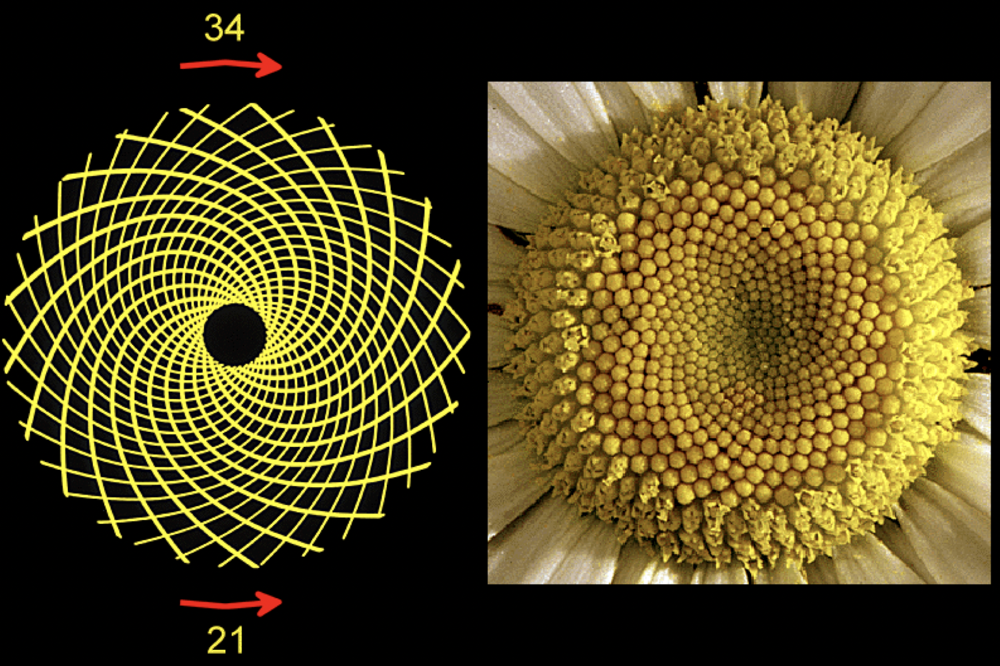

# Recursivitat 🏗️


Aquesta lliçó introdueix la tècnica de la recursivitat, on una funció o una
acció realitza una tasca repetitiva tot invocant-se a sí mateixa, sense
necessitat d'utilitzar bucles. La recursivitat és una tècnica molt potent que
es basa en reduïr un problema complex en un o més problemes  del mateix tipus,
però més senzills. Al llarg del curs anirem comprovant el seu poder, ara
mateix només presentar-ne una breu introducció.


## Factorial recursiu

[Recordeu](factorial.html) que el factorial d'un nombre $n$, escrit $n!$,
representa el nombre de permutacions d'$n$ objectes i és el producte
dels primers $n$ naturals començant des d'1.
Així,

$$n! = \underbrace{1 · 2 ·\ldots· n}_{\text{$n$ cops}}.$$

Ja havíem escrit una funció iterativa que calcula el factorial d'un nombre donat.
Era quelcom així:

```c++
// Retorna el factorial d'un natural n.
int factorial_iteratiu(int n) {
    int f = 1;
    for (int i = 1; i <= n; ++i) f = f * i;
    return f;
}
```

Anem a explorar una altra manera de fer-ho: amb [recursivitat](recursivitat.html)!

Comencem primer per les matemàtiques:

- Ja sabem que el factorial de 0 és 1:

    $$0! = 1.$$

- Si tenim un nombre natural $n>0$, també tenim la propietat següent:

    $$n! = (n-1)! · n.$$

    La raó és que $n! = 1 · 2 ·\ldots· n = (1 · 2 ·\ldots· n-1)· n = (n-1)! · n$.


En definitiva, hem establert que

$$n! = \begin{cases} 1 & \text{si}\ n=0, \\\ (n-1)! · n & \text{altrament.}\end{cases}$$

Aquest tipus d'indentitat s'anomena **recurrència**, ja que defineix cada
terme de la seqüència en funció de termes anteriors. La recurrència està ben definida
perquè el primer valor ($n=0$) és un cas no recursiu.

El nostre objectiu és definir una funció, diguem-ne `factorial`, que, donat un natural
`n`, retorni el factorial de `n`:

```c++
// Retorna el factorial d'un natural n.
int factorial(int n) {
    ⋮
}
```

Per programar el cos d'aquesta funció, utilitzem la recurrència que hem obtingut
anteriorment. Primer, establim el cas base:

```c++
// Retorna el factorial d'un natural n.
int factorial(int n) {
    if (n == 0) return 1;
    ⋮
}
```

Comença bé! Quan $n$ val 0, cal retornar 1. Ningú pot dir que ho estem fent malament.

I si no és el cas base? Doncs llavors hi afegim el cas recursiu:

```c++
// Retorna el factorial d'un natural n.
int factorial(int n) {
    if (n == 0) return 1;
    else return factorial(n - 1) * n;           // el else no és necessari
}
```

És clar, la recurrència ens diu que quan el natural $n$ no és 0, cal retornar
el factorial d'$n-1$ multiplicat per $n$. I justament hem fet això: invocar la
funció `factorial` sobre el paràmetre $n - 1$ i multiplicar el resultat per
$n$. Per calcular $(n - 1)!$ hem cridat a `factorial(n - 1)` perquè justament
l'especificació de `factorial` diu que ens retorna el factorial del natural que
se li passa com a paràmetre. I, quan $n\neq0$, $n-1$ és un natural i, per tant,
complim la precondició.

Algú pot creure que la funció `factorial` no pot invocar la pròpia funció
`factorial` però... perquè no? No hi ha cap raó que ho prohibeixi. De fet,
quan tenim una funció que es crida a ella mateixa, diem que tenim una **funció
recursiva** i la tècnica de la recursivat consisteix justament en escriure
funcions o accions recursives. En aquest cas hem obtingut una solució recursiva
per calcular el factorial. Aquest exemple mostra que els bucles no són
estrictament necessaris: podem descriure repeticions amb recursivitat.

A l'animació interactiva següent, feu clic per anar vient com
l'ordinador calcula recursivament el factorial d'un nombre.

<svg id='svg-animacio-factorial' class='figura' style='width: 100%; height: 400px; margin-bottom: 2em;'>
</svg>
<script type="text/coffeescript" src="animacio-factorial.coffee"></script>


## Escriptura recursiva

Suposeu que voleu escriure `n` cops seguits el caràcter `c` amb una acció
`escriure(int n, char c);`. Per exemple, `escriure(8, 'o');` hauria d'escriure
~~ooooooo~~.

Segur que sabeu implementar l'acció `escriu` iterativament (amb un bucle
`while` o un bucle `for`), però ara mirarem com implementar-la recursivament.

Comencem especificant la nostra acció:

```c++
// Escriu n ≥ 0 cops seguits c.
void escriure(int n, char c)
```

Quan volem fer recursivitat ens cal sempre pensar en dos casos:

- **El cas base**: Explicar!!!

- **El cas recursiu**: Explicar!!!

En el cas d'`escriu`, el cas base és quan `n` és tant simple que la solució és
directa. Aquest cas és quan `n == 0`: en aquest cas no cal fer res de res!

El cas recursiu és doncs quan `n > 0`, és a dir, quan cal escriure un caràcter
com a mínim. Ara, ens cal pensar com podem escriure `n > 0` caràcters recursivament.
Una primera manera de fer-ho, seria escriure una primer caràcter i, després,
escriure els `n - 1` restants. Com que `n > 0`, `n - 1 ≥ 0` i, per tant,
aquests `n - 1` caràcters `c` es poden escriure cridant a `escriure(n - 1, c)`, és
a dir, fent una crida recursiva.

Això dóna lloc a la implementació següent

```c++
// Escriu n ≥ 0 cops seguits c.
void escriure(int n, char c) {
    if (n == 0) {
        // res
    } else {
        cout << c;              // escriu un cop el caràcter c
        escriure(n - 1, c);     // escriu n - 1 cops el caràcter c
    }
}
```

que podem compactar així:


```c++
// Escriu n ≥ 0 cops seguits c.
void escriure(int n, char c) {
    if (n > 0) {
        cout << c;              // escriu un cop el caràcter c
        escriure(n - 1, c);     // escriu n - 1 cops el caràcter c
    }
}
```

Una segona manera de tractar el cas recursiu seria escriure primer
`n - 1` cops el caràcter `c` (recursivament) i, després,
escriure un cop el caràcter `c`:

```c++
// Escriu n ≥ 0 cops seguits c.
void escriure(int n, char c) {
    if (n > 0) {
        escriure(n - 1, c);     // escriu n - 1 cops el caràcter c
        cout << c;              // escriu un cop el caràcter c
    }
}
```

La solució és diferent però la funcionalitat (el què fa) és la mateixa.

*Avançat:* Quan la crida recursiva és la darrera cosa que fa una acció o una
funció recursiva, es diu que és **recursiva per la cua**. Els compiladors són
capaços d'optimitzar les funcions i accions recursives per la cua de forma que
són igual d'eficients que les seves version iteratives. Per tant, de les dues
darreres implementacions, la primera és preferible a la segona.

Hi ha més maneres d'escriure recursivament aquesta funció. La nostra tercera
solució es basarà en el fet que, per escriure `n` cops `c`, també
podem escriure primer la meitat dels `n` caràcters recursivament i
escriure després la meitat dels `n` caràcters recursivament. Però cal anar
en compte amb la paritat de `n`:

- Si `n` és parell, podem escriure `n` cops el caràcter `c` cridant
  dos cops a escriure `n/2` cops el caràcter `c` recursivament.

- Si `n` és senar, podem escriure `n` cops el caràcter `c` cridant   dos cops
  a escriure `n/2` cops el caràcter `c` recursivament i   escrivint
  addicionalment un cop el caràcter `c` (perquè a causa de la divisió entera
  entre 2, a la primera crida se'n perd "mig" i la segona "mig" més).

Aquesta idea dóna lloc en aquesta nova implementació:

```c++
// Escriu n ≥ 0 cops seguits c.
void escriure(int n, char c) {
    if (n > 0) {
        if (n%2 == 0) {
            escriure(n/2, c);
            escriure(n/2, c);
        } else {
            escriure(n/2, c);
            cout << c;
            escriure(n/2, c);
        }
    }
}
```

que podem compactar així:

```c++
// Escriu n ≥ 0 cops seguits c.
void escriure(int n, char c) {
    if (n > 0) {
        escriure(n/2, c);
        if (n%2 != 0) cout << c;
        escriure(n/2, c);
    }
}
```

De fet, la escriptura condicional de `c` es pot fer  abans de la primera crida
recursiva, entre la primera crida i la segona recursiva (com s'ha fet), o
després de la segona crida recursiva. Tant és.


## Màxim comú divisor recursiu

@Salvador: Acaba aquesta secció!!!

[Recordeu](maxim-comu-divisor.html) que, donats dos nombres naturals $x$ i
$y$, el seu màxim comú divisor $\mcd(x, y)$ és el nombre
més gran que divideix exactament tant a $x$ com a $y$.
[Recordeu també](mcd-mcm.html) que ja havíem estudiat com calcular eficientment
el màxim comú divisor de dos nombres amb l'algorisme d'Euclides i com
com encapsular-lo dins d'una funció:

```c++
// Retorna el màxim comú divisor de dos enters x i y, amb x ≥ 0 i y ≥ 0.
int mcd_iteratiu(int x, int y) {
    while (y != 0) {
        int r = x%y;
        x = y;
        y = r;
    }
    return x;
}
```

La solució recursiva és:

```c++
// Retorna el màxim comú divisor de dos enters x i y, amb x ≥ 0 i y ≥ 0.
int mcd(int x, int y) {
    if (y != 0) return mcd(y, x%y);
    else return x;
}
```


## Nombres de Fibonacci

La seqüència de Fibonacci es defineix de la forma següent:

0, 1, 1, 2, 3, 5, 8, 13, 21, 34, 55, 89, 144, 233, 377, ...

És a dir, cada element és la suma dels dos anteriors. En termes matemàtics, la
seqüència de Fibonacci es troba definida per la recurrència següent:

$$F(n) = \begin{cases} n & \text{si}\ n\le 1, \\\ F(n-1)+F(n-2) & \text{altrament.}\end{cases}$$

Aquesta seqüència se li va acudir a Leonardo de Pisa Fibonacci (1175-1250)
quan estudiava els patrons reproductius dels conills i apareix sovint a la
natura. Per exemple, els gira-sols tenen 21 espirals de pipes en un sentit i
34 en l’altre, i ambdós són nombres consecutius de Fibonacci. També, la
majoria de plantes tenen un nombre de pètals que és un nombre de Fibonacci.





Independentment d'això, voldríem una funció que calculés l'`n`-èsim nombre de
Fibonacci. Com que som al tema de recursivitat i som valents, provarem
d'implementar la recurrència en C++, cosa que no ens hauria de costar gens:

```c++
// Retorna l'n-èsim nombre de Fibonacci d'un natural n.
int fibonacci(int n) {
    if (n <= 1) return n;
    return fibonacci(n - 1) + fibonacci(n - 2);
}
```

Realment, la funció no és altra cosa que una transcripció a C++ de la
recurrència matemàtica. Això ens dóna la seguretat de que la funció és
correcta. Ara bé, aquesta implementació té un greu problema d'eficiència ja
que recalcula molts càlculs que ja ha calculat prèviament. Proveu de mesurar
quan triga `fibonacci(35)` al vostre ordinador!

Per tal d'obtenir una solució recursiva més eficient, podem pensar en crear
una funció recursiva que, donat un natural $n$, no només retorni $F(n)$ sinó
que també retorni $F(n-1)$. Com que en C++ les funcions només poden retornar
un valor, haurem de simular aquesta funció amb una acció recursiva que tingui
dos paràmetres de sortida que es corresponen als dos resultats:

```c++
// Donat un natural n, deixa en ultim F(n) i en penultim F(n-1).
// Quan n = 0, penultim no està definit.
void fibo_aux(int n, int& ultim, int& penultim)
```

La seva implementació és la següent:

```c++
// Donat un natural n, desa F(n) en ultim i F(n-1) en penultim.
// Quan n = 0, penultim no està definit.
void fibo_aux(int n, int& ultim, int& penultim) {
    if (n == 0) {
        ultim = 0;
    } else if (n == 1) {
        ultim = 1;
        penultim = 0;
    } else {
        int abantpenultim;
        fibo_aux(n - 1, penultim, abantpenultim);
        ultim = abantpenultim + ultim;
    }
}
```
 Altrament dit:

 - Quan `n` val 0, el valor d'`ultim` és
 $F(0)=0$, tal com cal. El valor de `penultim` no existeix en aquest cas.

- Quan `n` val 1, `ultim` val 0 i `penultim` val 1. El valor d'`ultim` és
 $F(1)=1$, tal com cal. El valor de `penultim` és
 $F(0)=0$, també tal com cal.

- Quan `n` no és 0 ni 1, la funció `fibo_aux` crida a
  `fibo_aux` amb `n - 1` per obtenir $F(n-1)$ i $F(n-2)$. El primer
  el desa en `penultim` i el segon en `abantpenultim`. D'aquesta forma,
  `penultim` ja val $F(n-1)$ que és el que cal. Després, desa el valor
  de $F(n-1) +  F(n-2)$ a `ultim` perquè valgui $F(n)$, tal com cal.

Evidentment, el nostre propòsit original era escriure una funció que calculés
l'`n`-èsim nombre de Fibonacci, no aquesta acció auxiliar. Però ara ja podem
definir fàcilment la funció principal posant en marxa l'acció auxiliar
recursiva:

```c++
// Retorna l'n-èsim nombre de Fibonacci d'un natural n.
int fibonacci(int n) {
    int ultim, penultim;
    fibo_aux(n, ultim, penultim);
    return ultim;
}
```

Si ara mesureu quan triga `fibonacci(35)` al vostre ordinador veureu que
aquesta versió és *molt* més ràpida que l'anterior.


<Autors autors="jpetit roura"/>

