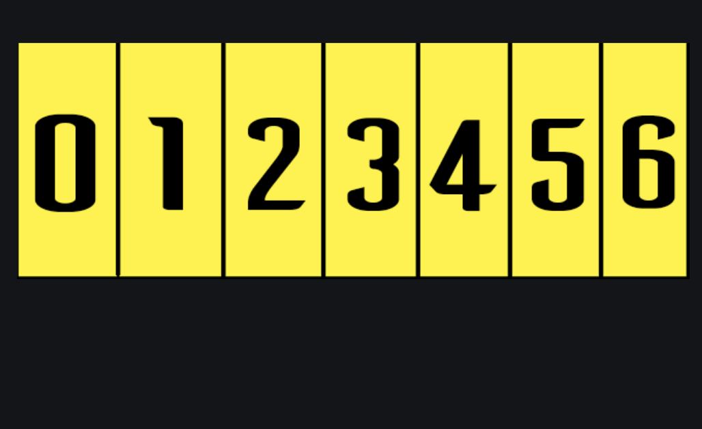

# Aplicació: Operacions comuns sobre vectors



Aquesta lliçó mostra com dur a terme algunes operacions comuns sobre vectors. En
particular veurem com escriure i llegir vectors i com calcular algunes
estadístiques sobre ells, com ara, la suma, la mitjana, el màxim..., com comptar
la freqüència d'un elements donats o saber si un element hi és o no, rotar un
vector, comprovar si un vector és una permutació o no...


## Escriptura de vectors

C++ no ofereix operacions predefinides per escriure o llegir vectors. Per tant,
les haurem d'implementar nosaltres.

Imagineu que voleu escriure un vector d'enters 'v = {7, 12, 5, 5, 6}',
amb un element per línia. Aleshores, la solució és ben simple:

```c++
for (int x : v) {
    cout << x << endl;
}
```

escriu

```text
7
12
5
5
6
```

Imagineu, però, que volem escriure els elements en una sola línia. Si fem


```c++
for (int x : v) {
    cout << x;
}
```

escriurem `712556`, quin xurro! Segurament caldria separar els elements amb blancs...
Què tal així?


```c++
for (int x : v) {
    cout << x << ' ';
}
```

D'aquesta forma, obtenim `7␣12␣5␣5␣6␣` (on ␣ representa un espai en blanc, però
de forma "visible"). Això ja és millor, però no perfecte: ens sobra un blanc al final!
Potser és que calia posar el blanc davant?

```c++
for (int x : v) {
    cout << ' ' << x;
}
```

D'aquesta forma, obtenim `␣7␣12␣5␣5␣6`. Tampoc està bé: ara ens sobra un
blanc al principi!

Ara ja és evident que si volem escriure `n` valors, només hem d'escriure `n - 1`
blancs, per tant hem d'introduir alguna lògica al programa per escriure
un blanc menys que elements. Una manera habitual de fer-ho és utilitzar una variable
booleana  que indiqui si ens trobem o no a la primera iteració del bucle:

```c++
bool primera = true;
for (int x : v) {
    if (primera) {
        primera = false;
    } else {
        cout << ' ';
    }
    cout << x;
}
```

En aquest programa, `primera` indica si ens trobem o no a la primera iteració del bucle.
Al principi, s'inicialitza a `true` i, per tant, a la primera iteració
s'executa la primera branca del condicional i es posa
a `false` (per tal de reflectir que totes les iteracions següents ja no són la primera).
Llavors, a la resta d'iteracions, el condicional executarà la segona branca, escrivint
el separador abans de l'element.

Per tant, aquest programa escriu un blanc davant de tots els elements excepte
el primer i produeix doncs `7␣12␣5␣5␣6`, tal com cal.

Aquest truc és particularment important als exercicis del Jutge, on mai hi ha
blancs al final de les línies.


## Lectura de vectors

Considerem ara la lectura de vectors: Hi ha dues maneres principals de
fer que un programa llegeixi un vector, depenent de si coneixem prèviament o no
la talla d'aquest.

### Talla coneguda

Si sabem que al programa li entrarem un vector de `n`
reals, la forma habitual en la que llegirem aquestes dades serà així:

```c++
int n;
cin >> n;                          // llegim el nombre d'elements n

vector<double> v(n);               // declarem vector per a n elements
for (int i = 0; i < n; ++i) {
    cin >> v[i];                   // llegim l'element i-èsim
}
```

També podríem fer servir un bucle de referències als elements del vector:

```c++
int n;
cin >> n;                          // llegim el nombre d'elements n

vector<double> v(n);               // declarem vector per a n elements
for (int& x : v) {
    cin >> x;                      // llegim l'element següent
}
```

### Talla desconeguda

Quan volem entrar un nombre desconegut de dades al
programa i que aquest les emmagatzemi en un vector, podem crear un
vector buit i fer servir la funció `push_back()`.
Per exemple:

```c++
vector <double> v;         // vector inicialment buit

double x;
while (cin >> x) {         // per cada element x del canal d'entrada
    v.push_back(x);        // desem x al final de v
}
```

Cal anar en compte de no barrejar les dues tècniques!


## Calcular la suma dels elements d'un vector

Considerem ara el problema de trobar la suma dels elements d'un vector
de reals. Per exemple, la suma de `{1, 5, -2, 7.5}` és `11.5`.

La funció següent ho fa, utilitzant un bucle que itera sobre tots els elements
`x` d'un vector `v`, tot desant la seva suma parcial en `s`. Quan s'hagin
iterat tots els elements del vector, `s` serà la seva suma total.

```c++
// calcula la suma dels elements d'un vector
double suma(const vector<double>& v)
{
    double s = 0;
    for (double x : v) {
        s += x;
    }
    return s;
}
```

Fixeu-vos que el vector `v` es passa per referència constant, perquè és un
paràmetre d'entrada potencialment gran, la còpia del qual es vol evitar.

La funció següent també ho fa, aquest cop utilitzant un bucle que descriu
els índexs del vector, de petit a gran:

```c++
// calcula la suma dels elements d'un vector
double suma(const vector<double>& v)
{
    int n = v.size();
    double s = 0;
    for (int i = 0; i < n; ++i) {
        s += v[i];
    }
    return s;
}
```

I també ho la funció següent,
utilitzant un bucle que descriu
els índexs del vector, de gran a petit:

```c++
// calcula la suma dels elements d'un vector
double suma(const vector<double>& v)
{
    int n = v.size();
    double s = 0;
    for (int i = n - 1; i >= 0; --i) {
        s += v[i];
    }
    return s;
}
```

No hi ha res de dolent en aquesta darrera versió però, és poc usual. Si és
possible, és convencional i més eficient recórrer els vectors del principi al
final. En tot cas, observeu que a totes les versions, la suma `s` és,
necessariament, de tipus real. En canvi, els índexs `i` i talles `n` són enters.
No useu reals quan pugueu usar enters, us acabareu picant els dits!


## Calcular la mitjana dels elements d'un vector

Considerem ara el problema de trobar la mitjana dels elements d'un vector
de reals. Per exemple, la mitajana de `{1.5, 5, 2.5}` és `3.0`. La mitjana no
està definida per a vectors buits.

La funció següent calcula la mitjana d'un vector utilitzant la funció
anterior que calcula la seva suma.

```c++
// calcula la mitjana d'un vector
// precondició: v no és buit
double mitjana(const vector<double>& v)
{
    return suma(v) / v.size();
}
```

Només cal sumar els elements i dividir-los pel seu
nombre. Oli en un llum!

Fixeu-vos que `suma(v)` és un real, però que `v.size()` és un enter. La divisió
de real entre enter és real, per tant ja va bé. Si el vector hagués estat
d'enters i la funció `suma()` també retornés un enter, caldria anar en compte
de forçar una divisió real amb una conversió de tipus.


## Trobar l'element més gran d'un vector

Suposem que tenim un vector `v` no buit. Si volem
trobar el seu element més gran (el seu màxim), haurem de recórrer tot el vector i
mantenir en tot moment l'element més gran que hem trobat fins el moment,
que començarà sent el valor del primer element. Això es pot fer
de la manera següent:

```c++
// calcula l'element màxim d'un vector
// precondició: v no és buit
double maxim(const vector<double>& v)
{
    int n = v.size();
    double max = v[0];              // inicialitzem el màxim al primer element del vector
    for (int i = 1; i < n; ++i) {   // iterem per la resta d'índexos
        if (v[i] > max) {           // si trobem un element més gran,
            max = v[i];             // actualitzem el valor maxim
        }
    }
    return max;
}
```

També podríem fer servir l'altre tipus de bucle que hem vist, i de
fet seria més senzill, però aquesta implementació ens servirà pel
següent exemple.


## Trobar la posició de l'element més gran

Si el que ens interessa és trobar la posició de l'element màxim (i, en cas que
estigui repetit, la de la seva primera aparició) la única diferència ara és que enlloc
de la variable amb el valor màxim que hem trobat fins el moment, tindrem una
variable amb la posició del màxim que hem trobat fins el moment. Així,
modificant lleugrament el fragment de programa anterior, quedaria

```c++
// calcula la (primera) posició de l'element màxim d'un vector
// precondició: v no és buit
int posicio_maxim(const vector<double>& v)
{
    int n = v.size();
    int pos = 0;        // posició de l'element més gran trobat fins al moment   
    for (int i = 1; i < n; ++i) {
        if (v[i] > v[pos]) {
            pos = i;    
        }
    }
    return pos;
}    
```


## Comptar quants cops apareix un element en un vector

Suposem que tenim les paraules d'un document en un vector de paraules i volem
saber quantes vegades apareix una paraula donada (és a dir, quina és la seva
freqüència).

Per solucionar aquest problema, podríem procedir a recórrer totes les
paraules `p` del document i comptar quantes d'elles són iguals a la paraula donada:

```c++
// compta el nombre d'aparicions de paraula en un vector de paraules
int frequencia(const vector<string>& document, string paraula)
{
    int c = 0;
    for (string p : document) {
        if (p == paraula) {
            ++c;
        }
    }
    return c;
}    
```


## Determinar si un element apareix o no en un vector

Suposem ara que només en cal saber si una paraula donada apareix o no
en un document (vector de paraules).

De seguida podríem pensar en utilitzar la funció anterior per obtenir una solució
ben senzilla:

```c++
// diu si paraula apareix en un vector de paraules
bool hi_es(const vector<string>& document, string paraula)
{
    return frequencia(document, paraula) > 0;
}    
```

Però aquesta solució és ineficient perquè no cal continuar comptant un cop s'ha
trobat l'existència d'una paraula. En aquest cas és doncs millor utilitzar una cerca
i parar tant bon punt és possible:

```c++
// diu si paraula apareix en un vector de paraules
bool hi_es(const vector<string>& document, string paraula)
{
    for (string p : document) {
        if (p == paraula) {
            return true;
        }
    }
    return false;
}    
```


## Rotar un vector

Considerem la rotació cíclica cap a l'esquerra dels elements d'un vector.
Per exemple, rotar cíclicament cap a l'esquerra el vector `{10, 20, 30, 40}`
genera el vector `{20, 30, 40, 10}`: tots els elements del vector s'han desplaçat
una posició cap a l'esquerra, menys el primer, que s'ha desplaçat al final.

Si el vector és buit, rotar-lo no el canvia. Per fer-ho en un vector de talla
`n` diferent de zero, cal moure tots els elements de les posicions  `1` a `n -
1` a la seva posició anterior. Però cal anar en compte de recordar el valor
inicial de la primer posició, per tal de col·locar-lo al final a la darrera
posició.

Aquesta és la implementació corresponent a l'algorisme anterior encapsulada en
una acció on el vector a rotar es passa per referència ja que és un paràmetre
d'entrada-sortida:

```c++
// aplica una rotació cíclica cap a l'esquerra al vector v
void rotacio_ciclica_esquerra(vector<int>& v)
{
    int n = v.size();
    if (n != 0) {
        int x = v[0];                       
        for (int i = 1; i < n; ++i) {
            v[i - 1] = v[i];
        }
        v[n - 1] = x;                       
    }
}    
```

Penseu perquè en cap cas s'accedeix a una posició fora del vector.


## Determinar si un vector és una permutació

Com podem saber si un vector de `n` enters és una permutació de
`{0 ... n - 1}`? Per exemple, `{4, 2, 1, 3, 0}` descriu una permutació
però `{4, 6, 1, 3, 0}` i  `{4, 2, 4, 3, 0}` no.

Per tal que un vector `v` de `n` eneters descrigui una permutació,
cal comprovar dues condicions:

1. Que tots els elements es trobin entre `0` i `n - 1` (ambdós inclosos).

2. Que cap element es trobi repetit.

La comprovació de la primera condició és fàcil d'aconseguir amb una cerca.
La comprovació de la segona es podria aconseguir tot cercant cada element en el vector.
Però això conduiria a un algorisme lent.

Per comprovar més eficientment la segona condició, ens podem valer d'un vector
de booleans `r`. Aquest vector `r` té `n` posicions i a la posició `x` indica si
l'element `x` ja ha aparegut o no. Al començar, no s'ha comprovat que cap
element ha aparegut, per tant cal inicialitzar `r` tot a fals. Després, per cada
element `x`,  si es comprova que ja havia aparegut, és a dir, que està repetit
perquè `r[x]` és cert, ja se sap que `v` no descriu una permutació.  Sinó, cal
marcar que `x` ja ha aparegut, fent que  `r[x]` (que era fals) passi a ser cert.
Si, al final, cap element és repetit, sí que  `v` descriu una permutació.

Aquesta és la implementació d'aquest algorisme en C++:

```c++
// indica si un vector de n enters és permutació de {0 ... n - 1}
bool es_permutacio(const vector<int>& v)
{
    int n = v.size();

    // primera comprovació
    for (int x : v) {
        if (x < 0 or x >= n) {
            return false;
        }
    }

    // segona comprovació
    vector<bool> r(n, false);
    for (int x : v) {
        if (r[x]) {
            return false;
        }
        r[x] = true;
    }

    // tot bé
    return true;
}
```

Aquest exemple és interessant, perquè s'ha utilitzat un vector auxiliar per
resoldre el problema.

Una millora: ambdues comprovacions ens poden fer durant la mateixa iteració, tal mostra la funció
següent:

```c++
// indica si un vector de n enters és permutació de {0 ... n - 1}
bool es_permutacio(const vector<int>& v)
{
    int n = v.size();
    vector<bool> r(n, false);
    for (int x : v) {
        if (x < 0 or x >= n or r[x]) {
            return false;
        }
        r[x] = true;
    }
    return true;
}
```

Una observació important: Fixeu-vos que cal condició `x < 0 or x >= n or r[x]` no
accedeix mai a posicions fora de `r`. La raó és que les posicions `x` fora de
`r` són justament les `x < 0` o les  `x >= n`.  Però si una de les dues es compleix,
llavors  `r[x]` ja no s'executa, perquè l'operador `or` té curt-circuit:

- Quan s'avalua `A or B` i es troba que `A` és cert, ja se sap que el resultat
de  `A or B` és cert, independentment del valor de `B`. Per tant, C++ ja no avalua
`B`.

- L'operador `and` es comporta anàlopgament:
Quan s'avalua `A and B` i es troba que `A` és fals, ja se sap que el resultat
de  `A and B` és fals, independentment del valor de `B`, que no s'avaluarà.

Fixeu-vos que si haguéssim escrit la condició com a `r[x] or x < 0 or x >= n`  enlloc
de `x < 0 or x >= n or r[x]`, hauríem tingut un error de programació, malgrat
que les dues condicions són lògicament equivalents: l'ordre dels operadors lògics
és important i ens en podem aprofitar per fer els programes més senzills.


## Determinar si un text és un pangrama

Ara volem determinar si un text és un pangrama o no.
Un pangrama és un text que conté totes les lletres. Per exemple,
`"jove xef, porti whisky amb quinze glacons d'hidrogen"` és un pangrama.

Aquesta és una possible solució:

```c++
// indica si un text s és un pangrama (conté totes les lletres minúscules) o no
bool es_pangrama(string s)
{
    int N = 'z' - 'a' + 1;          // nombre de lletres diferents    
    vector<bool> v(N, false);       // indica si cada lletra ha aparegut o no    
    int n = 0;                      // compta quantes lletres noves han aparagut

    for (char c : s) {
        if (c >= 'a' and c <= 'z') {
            if (not v[c - 'a']) {            
                ++n;
                if (n == N) {
                    return true;
                }
                v[c - 'a'] = true;
            }            
        }
    }
    return false;
}
```

Fixeu-vos com s'ha utilitzat un vector de booleans per indicar si cada lletra
ja ha aparegut o no. La lletra `'a'` es desa a la posició `0`,
la lletra `'b'` es desa a la posició `1`, etc.


<? author("rafah jpetit") ?>

