<!-- Posar aquesta imatge al començament de cada lliçó -->

 

# Aritmètica de 4 bits

A continuació tractarem els circuits aritmètics que efectuen operacions amb 4 bits. Veurem exemples de sumadors i restadors de 4 bits i una UAL (ALU) molt simple.

## EXEMPLE: Suma de nombres de 4 bits

En aquest exemple veurem com podem sumar dos nombres binaris de 4 bits.
Els sumadors binaris (o **ripple-carry adders**) es poden construir amb sumadors complets (**full adders**) i un semisumador (**half adder**). Al tractar-se d’una suma de 4 bits, haurem d'encadenar 3 sumadors complets i un semisumador, o bé 4 sumadors complets si configurem el primer sumador complet com a semisumador.

CircuitVerse té un objecte anomenat **adder** que implementa un sumador.

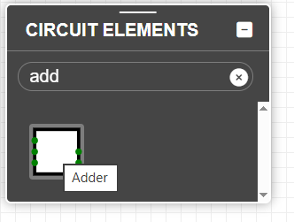

Les entrades $A$ i $B$ són les variables que es sumen i $C_{in}$ és el bit de carry d'entrada. Les sortides són $Sum$ amb el resultat i $C_{out}$ amb el *carry* de sortida. Si passem el ratolí per les entrades i sortides de l'objecte podem veure el seu nom:

    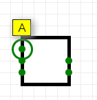
    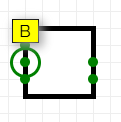
    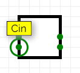
    
    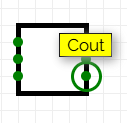

El circuit que efectua la suma concatena 3 sumadors complets i un semisumador:

<i>Sumador de 4 bits</i>

Si convé, podem implementar el mateix circuit amb 4 sumadors complets. La funció del semisumador la pot fer un sumador complet si hi introduim una constant '0' a la seva entrada $C_{in}$.

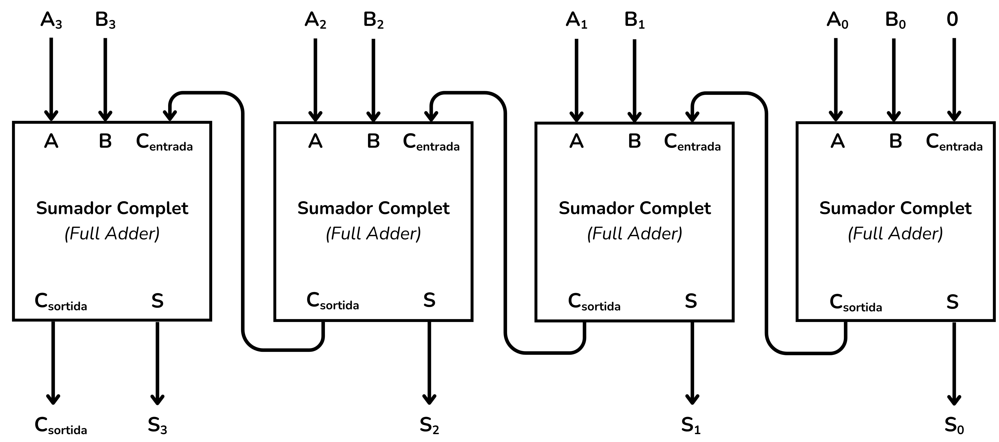

<i>Sumador de 4 bits</i>

Implementem-ho doncs a CircuitVerse amb els següents valors d'exemple:

* Entrada $A = 0010$
* Entrada $B = 0001$
* Sortida $S = A+B$
* Sortida $C_{out}=$ Carry de sortida

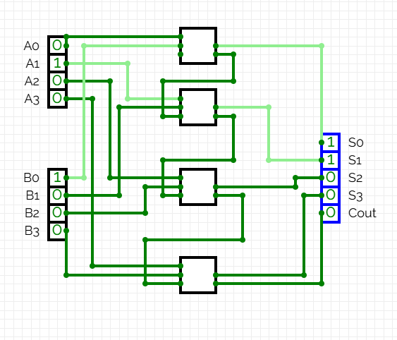

<i>Sumador de 4 bits</i>

A Jutge.org els exercicis d'àlgebra de 4 bits i àlgebra de n bits utilitzen una nomenclatura de busos $A [3:0]$ (que ja varem definir a [Busos](../CircCombin/busos#exemple-disseny-d-un-circuit-desplacador-de-bus-a-l-esquerra-n-bits)) i unes entrades i sortides de 4 o $n$ bits. Per tal que Jutge pugui validar correctament el circuit que hem dissenyat, haurem de fer ús de la proprietat *BitWidth* de les entrades, sortides i *adders*. Aquest paràmetre es pot veure al menú *properties*:

    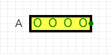
    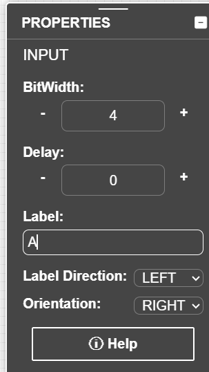

Una vegada hem canviat el *BitWidth* a 4 podem fer la suma amb un únic *adder* i simplificar el circuit.

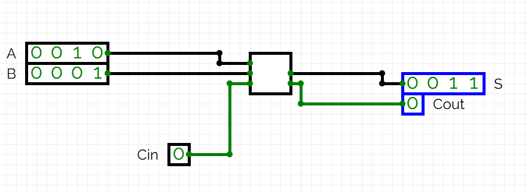

Fixa’t que a CircuitVerse les entrades i sortides, al ser de 4 bits, tenen un color de cable negre mentre que $Cin$ i $Cout$, de només 1 bit, són de color verd .

## EXEMPLE: Resta de nombres de 4 bits

En aquest exemple veurem com es realitza una resta de 4 bits. Considerem les següents variables:

* Entrada $A=1100$ (o 12​ en decimal)
* Entrada $B=0101$​ (o 5 en decimal​)
* Sortida $S=A-B$ (de 4 bits)
* Sortida $C_{out}=$ Carry de sortida

Per tal de restar 2 nombres binaris hem d’utilitzar la següent fórmula:

$S= A-B = A+(\bar{B}+1)$

Primer cal negar $B$:

$B= 0101   \rightarrow   \bar{B}=1010$

Després podem realitzar la suma:

$S= A+ \bar{B} +1 = 1100+ 1010+1= 1100 + 1011= 0111$ (7 en decimal)

La taula següent especifica aquesta operació bit a bit.

| bit | $A_i$ | $\bar{B_i}$ | $C_i$ | $S_i$ | $C_{out}$ |
|:---:|:---:|:---:|:---:|:---:|:---:|
| 0 (LSB)| 0 | 0 | 1 | 1 | 0 |
| 1 | 0 | 1 | 0 | 1 | 0 |
| 2 | 1 | 0 | 0 | 1 | 0 |
| 3 (MSB) | 1 | 1 | 0 | 0 | 1 |

El circuit que efectua la resta també concatena 4 sumadors:
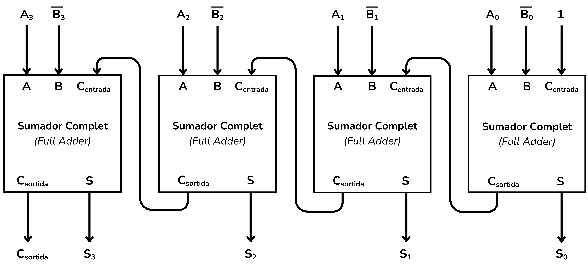

<i>Restador de 4 bits</i>

Aquest circuit a CircuitVerse és:

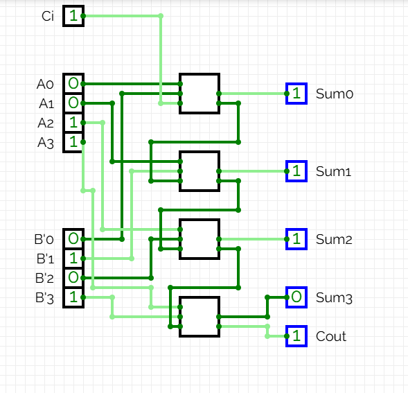

<i>Restador de 4 bits</i>

Utilitzant un *BitWidth* de 4 simplifiquem el circuit:

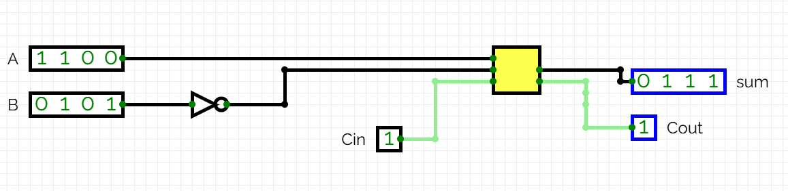

## EXEMPLE: Triar operacions

A més d'efectuar operacions aritmètiques, els circuits aritmètics també poden implementar un circuit que  tria una operació en particular. Les UAL (**ALU**) són circuits que permeten triar entre diferents operacions en funció d'una variable. Aquest exemple explora aquesta funció.

Volem implementar un circuit que triï entre una suma i una resta en funció d’una variable $op$. Si $op=0$ es farà una suma i si $op=1$ una resta.

Per realitzar la suma de 4 bits de  $A+B$ farem servir un *Adder* amb un *BitWidth* 4. 
El *carry* d'entrada $Cin$ de l’*adder* a de ser 0, per tant hi connectarem un terra o *ground*.

La part del circuit que fa la suma és el següent:

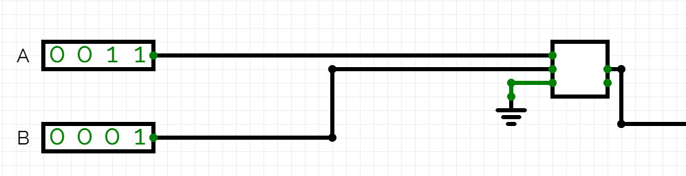

Per fer la resta sabem que fer l'operació $S= A-B = A+ \bar{B} +1$. 
Per negar la variable $B$ farem servir una porta NOT de 4 bits. El carry ha de ser igual a 1, $C_{in}=1$, per tant utilitzarem una font o *power*.

Afegint la peça del circuit que fa la resta obtenim:
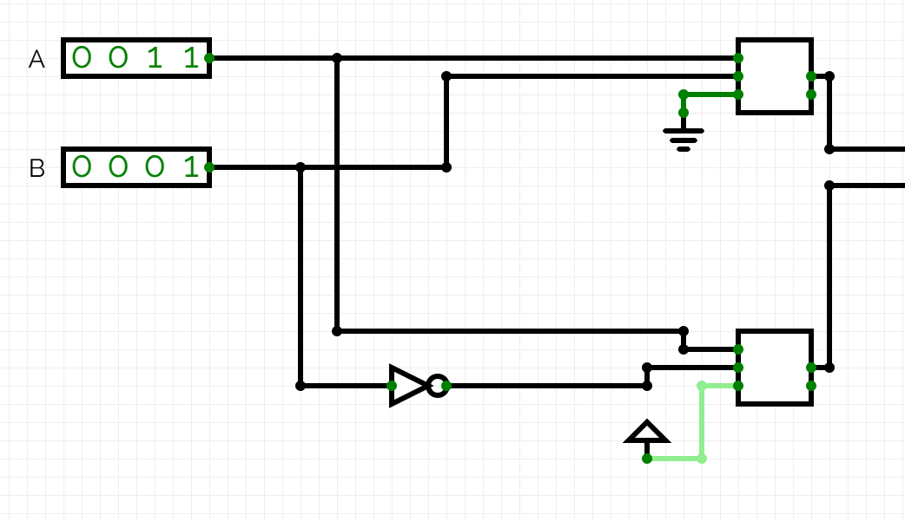

Tant *Power* com *Ground* es poden localitzar al menú d’inputs de CircuitVerse. Totes dues funcionen com a una constant. *Power* sempre té el valor 1 i *Ground* sempre té valor 0.

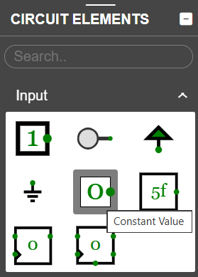

Ara cal afegir la part del circuit capaç de triar entre una operació o l’altre a partir de la variable $op$. Utilitzarem un multiplexor, com el que vàrem veure a l’apartat [Multiplexors](../CircCombin/multiplexors.md) dels circuits combinacionals. Els multiplexors deixen passar un senyal o un altre en funció d'una variable selectora i és això el que ens cal en aquest cas.

El circuit complet, afegint aquest darrer element, és el següent:
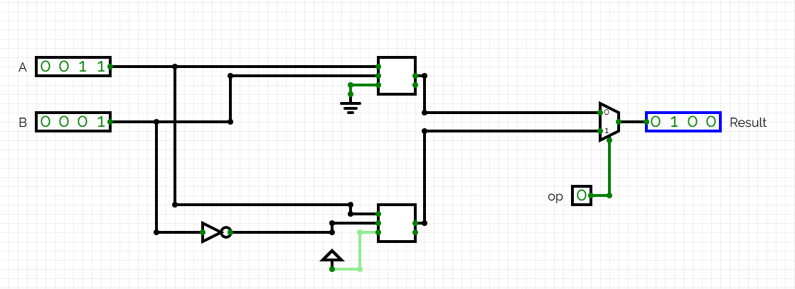

<i>Suma seleccionada</i>

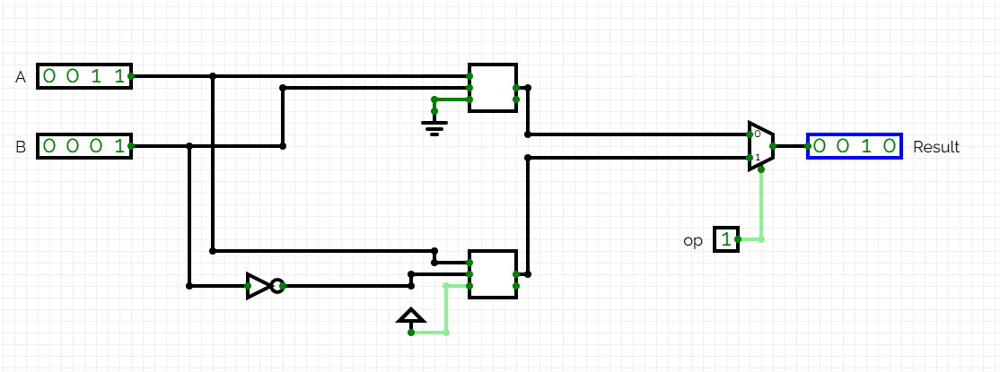

<i>Resta seleccionada</i>

Podem emprar un multiplexor amb més de dues entrades per gestionar més de dues operacions possibles.
Dins del menú de propietats del multiplexor a CircuitVerse es pot modificar el nombre d’entrades amb la propietat *control signal size*.

Les UALs (*ALU*) normalment trien entre 4 operacions (multiplexors de 4 entrades) amb un selector $op$ de 2 bits.

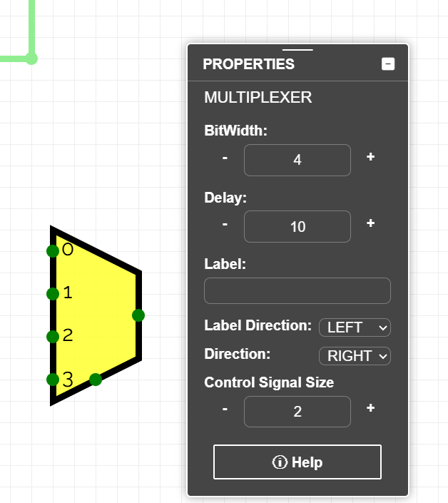

## Exercicis a Jutge.org: [Introduction to Digital Circuit Design](https://jutge.org/courses/JordiCortadella:IntroCircuits)

[X64833   4-bit adder](https://jutge.org/problems/X64833_en)

[X58456   4-bit incrementer](https://jutge.org/problems/X58456_en)

[X42916   4-bit adder/subtractor](https://jutge.org/problems/X42916_en)

[X61860   4-bit comparator](https://jutge.org/problems/X61860_en)

[X35448   4-bit ALU](https://jutge.org/problems/X35448_en)

<small>*Recorda que per accedir als exercicis i que el **Jutge** valori les teves solucions has d'estar inscrit al [curs](https://jutge.org/courses/JordiCortadella:IntroCircuits)*. Troba totes les instruccions [aqui](../Inici/instruccions.md)</small>

<!-- Aquesta imatge ha d'anar al final de cada lliçó, ja sigui amb aquesta línia o dins la signatura. Deixar comentat si ja està a la signatura-->
 
 

<Autors autors="xcasas fmadrid"/>