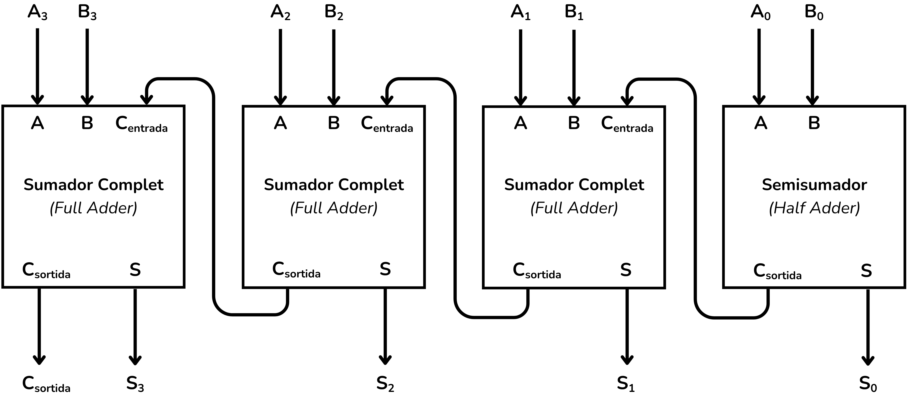

<!-- Posar aquesta imatge al començament de cada lliçó -->

 

# Aritmètica de 4 bits

A continuació tractarem alguns circuits aritmètics que efectuen operacions amb 4 bits. Veurem exemples de sumadors i restadors de 4 bits i una UAL (ALU) molt simple.

## EXEMPLE: Suma de nombres de 4 bits

En aquest exemple veurem com podem sumar dos nombres binaris de 4 bits.
Els sumadors binaris (*ripple-carry adders*) es poden construir amb sumadors complets (*full adders*) i un semisumador (*half adder*). En tractar-se d’una suma de 4 bits, haurem d'encadenar 3 sumadors complets i un semisumador, o bé 4 sumadors complets si configurem el primer sumador complet com a semisumador.

[CircuitVerse](https://circuitverse.org/simulator) té un objecte anomenat *adder* que implementa un sumador.

 

  
  
  
  
  

Les entrades **A** i **B** són les variables que es sumen i **Cin** és el bit de *carry* d'entrada. Les sortides són **Sum** amb el resultat i **Cout** amb el **carry** de sortida. Si passem el ratolí per les entrades i sortides de l'objecte podem veure el seu nom.

El circuit que efectua la suma concatena 3 sumadors complets i un semisumador:

<i>Sumador de 4 bits</i>

Si convé, podem implementar el mateix circuit amb 4 sumadors complets. La funció del semisumador la pot fer un sumador complet si hi introduïm una constant $0$ a la seva entrada $C_{entrada}$.

<i>Sumador de 4 bits (alternatiu)</i>

Implementem-ho a CircuitVerse:

<i>Sumador de 4 bits a CircuitVerse</i>

En aquest exemple els valors d'entrada són:

* Entrada **A** = 0010
* Entrada **B** = 0001

I les sortides:

* Sortida **S = A + B**
* Sortida **Cout** = Carry de sortida

A Jutge.org, els exercicis d'àlgebra de 4 bits i àlgebra de $n$ bits utilitzen la nomenclatura de busos $A[3:0]$ (definida a [Busos](../CircCombin/busos#notacio)) i entrades/sortides de 4 o $n$ bits.
Per tal que Jutge pugui validar correctament el circuit, cal utilitzar la propietat *BitWidth* de les entrades, sortides i *adders*. Aquest paràmetre es pot veure al menú *Properties*:

  
  

Un cop canviat el *BitWidth* a 4 podem fer la suma amb un únic *adder* i simplificar el circuit:

A CircuitVerse, les entrades i sortides de 4 bits tenen cable de color negre, mentre que **Cin** i **Cout**, de només 1 bit, són de color verd.

## EXEMPLE: Resta de nombres de 4 bits

Per tal de restar dos nombres binaris emprarem la fórmula:

$$S = A - B = A + (\bar{B} + 1)$$

En aquest exemple realitzarem una resta de 4 bits. Considerem:

* Entrada **A** = 1100 (12 en decimal)
* Entrada **B** = 0101 (5 en decimal)
* Sortida **S = A - B** (4 bits)
* Sortida **Cout** = Carry de sortida

Primer neguem $B$:

$$B = 0101  \Rightarrow  \bar{B} = 1010$$

Després fem la suma:

$$S = A + \bar{B} + 1 = 1100 + 1010 + 1 = 1100 + 1011 = 0111$$

La següent taula especifica aquesta operació bit a bit (no és una taula de veritat):

|   bit   | $A_i$ | $\bar{B_i}$ | $C_i$ | $S_i$ | $C_{sortida}$ |
| :-----: | :---: | :---------: | :---: | :---: | :-----------: |
| 0 (LSB) |   0   |      0      |   1   |   1   |       0       |
|    1    |   0   |      1      |   0   |   1   |       0       |
|    2    |   1   |      0      |   0   |   1   |       0       |
| 3 (MSB) |   1   |      1      |   0   |   0   |       1       |

El circuit que efectua la resta concatena 4 sumadors, amb $\bar{B}$ i $C_{entrada} = 1$:

<i>Restador de 4 bits</i>

A CircuitVerse es representa així:

<i>Restador de 4 bits</i>

Amb *BitWidth = 4* simplifiquem el circuit:

## EXEMPLE: Triar operacions

A més d'efectuar operacions aritmètiques, els circuits aritmètics també poden implementar la selecció d'una operació. Les UAL (ALU) permeten triar entre operacions en funció d'una variable. Aquest exemple explora aquesta funcionalitat.

Volem implementar un circuit que triï entre una suma i una resta en funció de la variable d'entrada $op$.

* Si $op = 0$, es fa una suma.
* Si $op = 1$, es fa una resta.

Per realitzar la suma de 4 bits $A + B$ farem servir un *Adder* de *BitWidth = 4*. El *carry* d'entrada (**Cin**) ha de ser 0, així que hi connectarem un terra (*ground*).

Per fer la resta emprarem:

$$S = A - B = A + \bar{B} + 1$$

Per negar $B$ utilitzarem una porta NOT de 4 bits. El *carry* d'entrada (**Cin**) ha de ser 1, així que utilitzarem una font (*power*).

Afegint la peça del circuit que fa la resta obtenim:

Tant *Power* com *Ground* es poden localitzar al menú d’inputs de CircuitVerse. Totes dues funcionen com a una constant. *Power* sempre té el valor 1 i *Ground* sempre té valor 0.

Ara cal afegir la part del circuit capaç de triar entre una operació i l’altra a partir de la variable d'entrada $op$. Utilitzarem un multiplexor, com el que es mostra a l'apartat de [Multiplexors](../CircCombin/multiplexors.md) dels circuits combinacionals. Els multiplexors deixen passar un senyal o un altre en funció d'una variable selectora i això és el que ens cal en aquest cas.

El circuit complet, afegint aquest darrer element, és el següent:

<i>Suma seleccionada</i>

<i>Resta seleccionada</i>

Podem emprar un multiplexor amb més de dues entrades per gestionar més operacions possibles.  
Dins del menú de propietats del multiplexor a CircuitVerse es pot modificar el nombre d’entrades amb la propietat *control signal size*.

Les UALs (*ALU*) normalment trien entre 4 operacions (multiplexors de 4 entrades) amb un selector $op$ de 2 bits.

## Exercicis a Jutge.org: [Introduction to Digital Circuit Design](https://jutge.org/courses/JordiCortadella:IntroCircuits)

- [4-bit adder](https://jutge.org/problems/X64833_en)  
- [4-bit incrementer](https://jutge.org/problems/X58456_en)  
- [4-bit adder/subtractor](https://jutge.org/problems/X42916_en)  
- [4-bit comparator](https://jutge.org/problems/X61860_en)  
- [4-bit ALU](https://jutge.org/problems/X35448_en)

<small>*Recorda que per accedir als exercicis i que el **Jutge** valori les teves solucions has d'estar inscrit al [curs](https://jutge.org/courses/JordiCortadella:IntroCircuits)*. Troba totes les instruccions [aqui](../Inici/instruccions.md)</small>

<!-- Aquesta imatge ha d'anar al final de cada lliçó, ja sigui amb aquesta línia o dins la signatura. Deixar comentat si ja està a la signatura-->
 
 

<Autors autors="xcasas fmadrid"/>